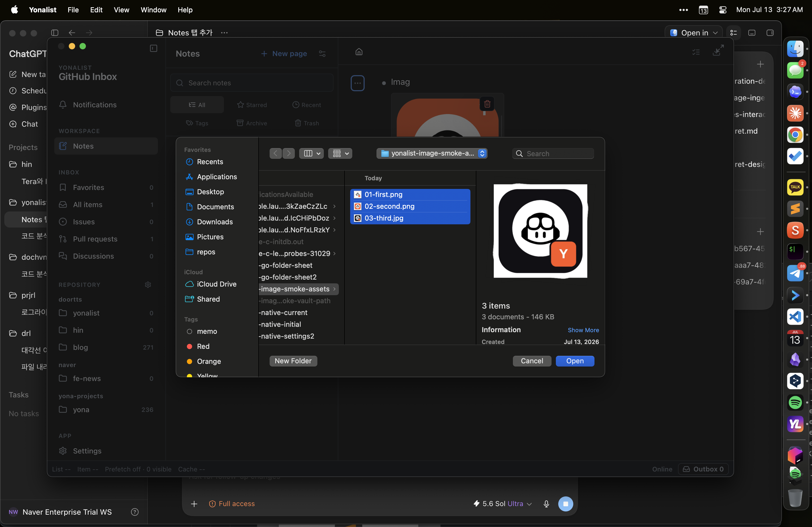
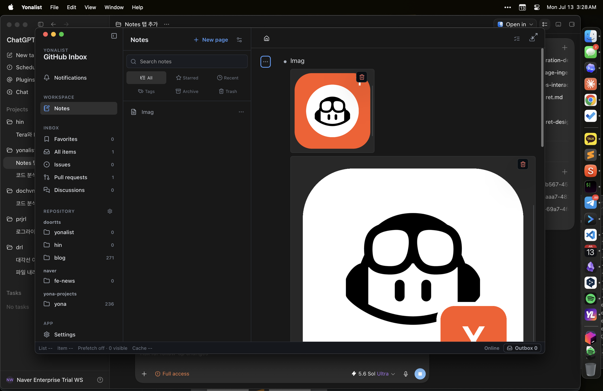
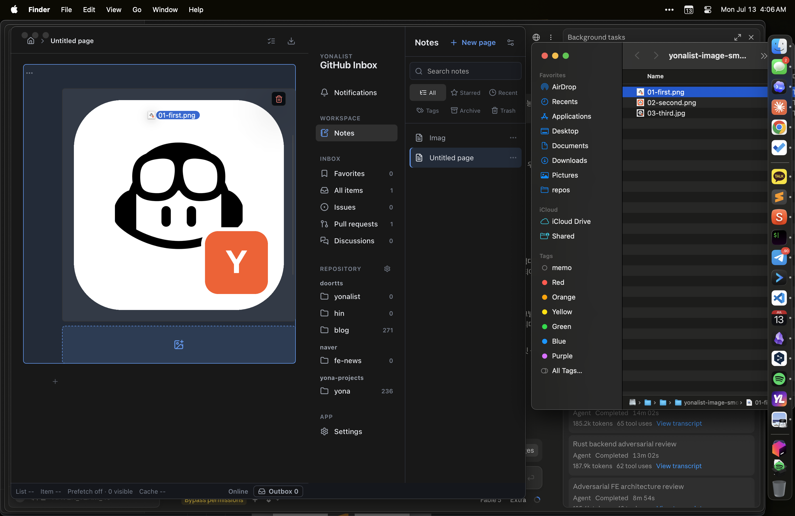

# Notes Multi-Image Ingest Verification Report

**Date:** 2026-07-12

**Branch:** `codex/notes-workflowy`

**Final implementation commit:** `d2f733c`

## Scope

This delivery is limited to offline Notes image attachments. Local Vault relocation and existing-data migration remain deferred, and their design documents were not changed or staged as part of this work.

## Delivered Behavior

- The native image picker opens with the required Tauri permission and accepts multiple files in one selection.
- Finder drag and drop imports one or more images into the highlighted bullet. During the drag, the target bullet is highlighted and an insertion placeholder appears after its existing attachments.
- Clipboard paste imports every image item available in the clipboard while preserving source order.
- PNG, JPEG, WebP, and GIF are accepted after byte-level format validation. SVG, mislabeled files, truncated data, and unsupported formats are rejected.
- A multi-image operation is atomic: either every image is stored and attached, or the entire operation leaves no metadata, files, or history behind.
- Each successful batch creates one history entry, so one Undo removes the batch and one Redo restores it, including its bullet relationship and order.
- Images retain their aspect ratio, are initially capped to the available Notes width, and can be resized horizontally with the chosen width persisted.
- Validation errors identify the affected filename when the input envelope is trustworthy, and aggregate limit failures report the batch limit.

## Storage Result

Attachment metadata and node placement are stored in `<vault>/.yonalist/notes.sqlite`. Original image bytes are stored separately as content-addressed files under `<vault>/.yonalist/notes-assets/<sha256>.<extension>`. Identical bytes share the same asset file while retaining independent ordered placements in SQLite.

The enforced limits are:

| Limit | Value |
| --- | ---: |
| Per image | 20 MiB and 40,000,000 decoded pixels |
| Per batch | 64 MiB and 128 images |
| Per bullet | 128 image placements |
| Per Vault | 512 image placements |

## Native App Verification

- Opened the native picker without the prior `dialog.open not allowed` failure and selected three images at once; SQLite retained the selected order.
- Pasted an image copied from Preview and a synthetic two-item macOS clipboard batch; both items were imported and their hashes confirmed original clipboard order.
- Dragged an image from Finder and captured the live target highlight and dashed insertion placeholder before releasing the mouse.
- Resized an attachment and confirmed its persisted display width changed from 211 to 160 pixels.
- Repeated native keyboard history operations: two `Cmd+Z` actions changed the attachment count from 10 to 9 to 8, and two `Cmd+Shift+Z` actions restored it to 9 and 10.
- Restored the application Vault setting to `~/Yonalist` after smoke testing.

### Picker And Multi-Select

### Imported Image Batch

### Finder Drop Preview

## Automated Verification

| Check | Result |
| --- | --- |
| Frontend test suite | 122 files passed, 1 skipped; 2,195 tests passed, 21 skipped |
| Rust test suite | 336 passed, 3 opt-in tests ignored |
| Production frontend build | Passed; 2,302 modules transformed |
| Rust formatting | Passed |
| Patch whitespace validation | Passed |
| Exact 64 MiB release boundary test | Passed |
| 128-image release performance test | Passed |

The production build retains the existing warning that the main minified application chunk is above 500 kB.

## Performance Verification

The release-mode 128-image atomic batch test completed successfully with these measured stages:

| Stage | Time |
| --- | ---: |
| Prepare and validate | 4.139 ms |
| Publish files | 1,233.686 ms |
| Commit SQLite metadata/history | 0.883 ms |
| Undo | 9.069 ms |
| Redo | 13.717 ms |
| Total | 1,293.118 ms |

## Adversarial Review

The first final review identified that valid oversized inputs could receive a generic batch error rather than a filename-specific size error. The validation path was revised to prevalidate the complete byte envelope and accept a source name only when it is nonblank and no longer than 1,024 UTF-8 bytes. Boundary tests now cover accepted 1,024-byte names, rejected 1,025-byte names, per-file 20 MiB failures, and aggregate 64 MiB failures.

The corrected implementation received a fresh adversarial review covering picker, drop, paste ordering, atomic publication, history, lifecycle races, retry behavior, resize, cleanup, limits, and performance. The reviewer returned `APPROVED` with no Critical or Important findings.

## Deferred Work

- Moving the Vault to an app-selected external local folder.
- Verified copy, cutover, rollback, and backup preservation for existing Vault data.
