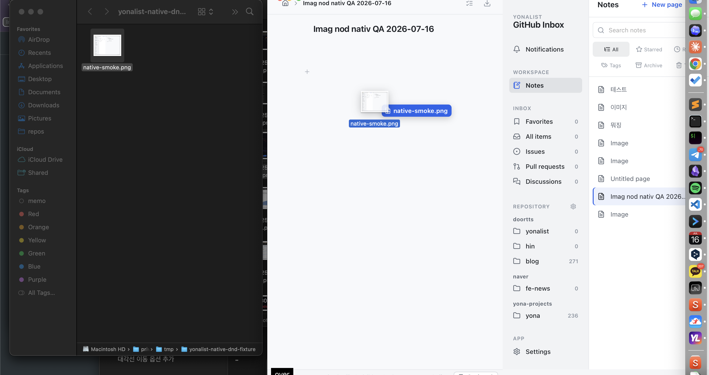
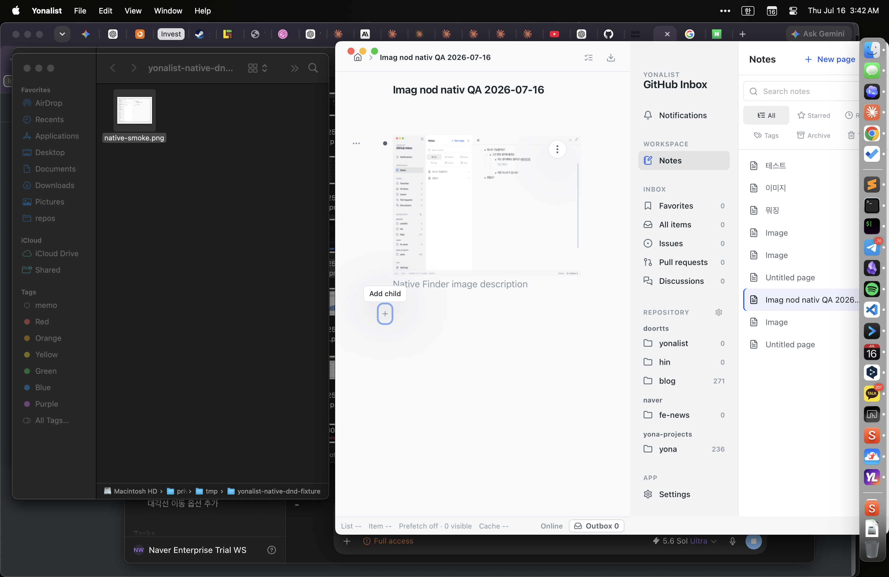
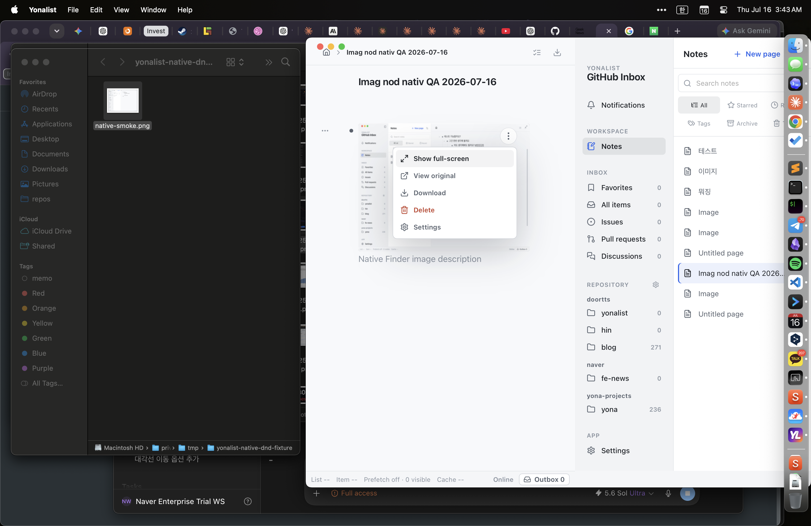
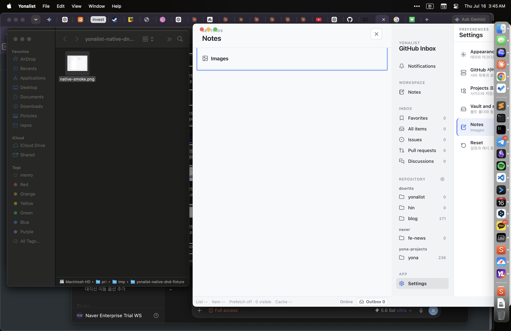
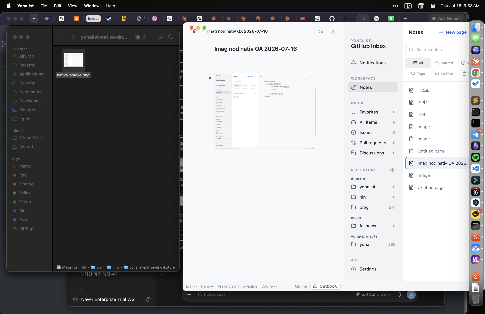

# Independent Notes Image Nodes Verification Report

**Date:** 2026-07-16

**Branch:** `main`

**Environment:** macOS, Apple M1 Pro, Node 26.4.0, Vitest 4.1.9

## Scope

This delivery changes new Notes image imports from child attachments on text
bullets into independent outline nodes. Existing image attachments are not
migrated. Vault relocation and existing-data migration remain deferred.

## Acceptance Result

The independent image-node flow is implemented and verified for picker,
Finder drag and drop, clipboard paste, description editing, outline history,
image actions, restart persistence, export/search compatibility, and storage
reconciliation. No failing automated test or performance gate remains.

## Delivered Behavior

- Picker, Finder drop, and clipboard paste create one independent image node
  per accepted image while preserving source order.
- Multi-image imports are atomic: the whole batch succeeds or leaves no node,
  attachment metadata, history entry, or owned orphan file behind.
- Image nodes participate in normal outline movement, indentation, deletion,
  duplicate, Archive, Trash, Undo, Redo, and zoom behavior.
- `Shift+Enter` focuses an image node description through the same supporting
  note interaction used by text bullets.
- Finder drag uses a cursor-following filename badge. The insertion marker is
  a 6 px outlined rectangle between rows and does not reflow nearby content.
- The hover menu provides Show full-screen, View original, Download, Delete,
  and Settings.
- Settings opens and outlines `Notes > Images` without adding a speculative
  image preference.
- Image filenames remain available to search, breadcrumbs, accessibility, and
  export metadata without becoming duplicate visible titles.

## Storage And Compatibility

Image-node kind, outline position, description, dimensions, history, and asset
ownership are stored in `<vault>/.yonalist/notes.sqlite`. Original image bytes
are content-addressed under
`<vault>/.yonalist/notes-assets/<sha256>.<extension>`.

Schema version 5 adds `text | image` node kinds while retaining legacy
text-node attachments unchanged. Each new image node owns exactly one image
attachment. Search and export branch on node kind so filename text does not
create structured tag/date matches or duplicate visible captions.

## Automated Verification

| Gate | Result |
| --- | --- |
| `npx vitest run --maxWorkers=4` | 359/359 files passed; 2,761 passed, 27 skipped, 0 failed; 37.90 s |
| Image async-leak audit | 75/75 passed; 0 leaked Promise/timer resources |
| `npm run lint` | 0 errors |
| `npm run build` | Passed; 2,321 modules transformed |
| `cargo fmt --all -- --check` | Passed |
| `cargo check --all-targets --locked` | Passed |
| `cargo test --all-targets --quiet` | 622 passed, 3 ignored, 0 failed |

The build retains the pre-existing warning that the minified App chunk is over
500 kB (`633.75 kB`, `188.20 kB` gzip). It is not an image-node regression.

The first unsharded frontend run exposed an unclosed Base UI animation frame
and an unused unresolved Promise in the image tests. The tests now settle the
pending image load and close the full-screen dialog. Leak detection then
reported zero resources and the same full suite completed in 37.90 seconds.

## Performance Verification

### Frontend outline paths

Command:

```text
NOTES_PERF=1 npx vitest run src/features/notes/notesExpansion.performance.test.ts \
  --pool=threads --maxWorkers=1 --no-file-parallelism
```

- 27/27 performance checks passed against the `1.20x` regression gate.
- 10,000-node mixed image projection: `3.58 ms`, normalized ratio `1.040x`.
- 10,000-node active load: `3.37 ms`, normalized ratio `1.037x`.
- Highest frontend ratio: mutation + Undo settlement at `1.082x`.
- Mixed-image residency remains capped at eight object URLs and releases all
  eight at teardown.

### Native storage paths

The release-mode 1,000/10,000-node interaction harness passed all 14 rows
against the `1.50x` gate. The highest normalized median was `1.22x` for
10,000-node mutation + Undo; the complete harness finished in `127.74 s`.

The release-mode 128-image atomic batch completed in `1.359 s`:

| Stage | Time |
| --- | ---: |
| Prepare | 4.85 ms |
| Publish | 1.297 s |
| Commit | 1.41 ms |
| Undo | 8.94 ms |
| Redo | 19.16 ms |

## Native App Verification

The test used a real Finder file,
`/tmp/yonalist-native-dnd-fixture/native-smoke.png`, and the native Tauri app.

1. Dragged the Finder image onto an otherwise blank zoomed Notes page.
2. Confirmed the native filename drag badge and successful insertion as an
   independent child bullet rather than a legacy sub-attachment.
3. Quit and relaunched the app; the image node and bytes loaded again.
4. Focused the image node, pressed `Shift+Enter`, entered
   `Native Finder image description`, and committed the description.
5. Opened the hover action menu and confirmed all five actions.
6. Chose Settings and confirmed navigation to the outlined Notes > Images row.
7. Used `Cmd+Z` on the structural import and confirmed that the image node was
   removed as one history operation.











## Adversarial Review

Separate frontend, attachment-storage, SQLite-connection, export-publication,
and final whole-diff reviews were run. Corrections made during review include:

- blank zoom-page Finder drops now use the complete outline surface and retain
  the last valid highlighted target when the final native event has no hit;
- queued draft-close barriers no longer lose image-node structural intents;
- image tests release pending Promises and Base UI animation timers;
- Windows capability checks reject generic reparse points, not only symlinks;
- attachment and export paths validate held file identity, quarantine before
  cleanup, preserve verified bytes on conflicts, and serialize DB cleanup.

One reviewer identified the final POSIX pathname-unlink window: another process
running as the same OS user could replace a quarantine entry after the last
identity check and before `unlink`. POSIX has no atomic "unlink only if this is
the held inode" operation. This is retained as a documented residual rather
than leaking every ordinary cleanup file indefinitely. It is not a privilege
boundary: a same-user process capable of winning that window can already
delete or replace the user's files directly. Windows uses handle-based delete;
Unix paths retain quarantine, revalidation, link-count diagnostics, and held
byte recovery around the operation.

## Residual Risk And Deferred Work

- A hard process kill can retain private export staging or rollback entries;
  durable cleanup journaling remains future work.
- Windows-specific source paths were reviewed and tested under conditional
  unit coverage, but this macOS host did not cross-compile or execute a Windows
  binary.
- Migration of legacy text-node image attachments to independent image nodes.
- User-selected Vault relocation and automatic migration of existing data.
- Turn Into and other advanced node types already listed in the Notes roadmap.
- Collaboration, comments, sharing, permissions, and synchronization.
