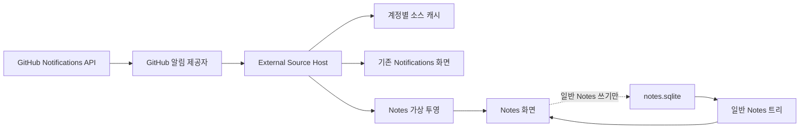
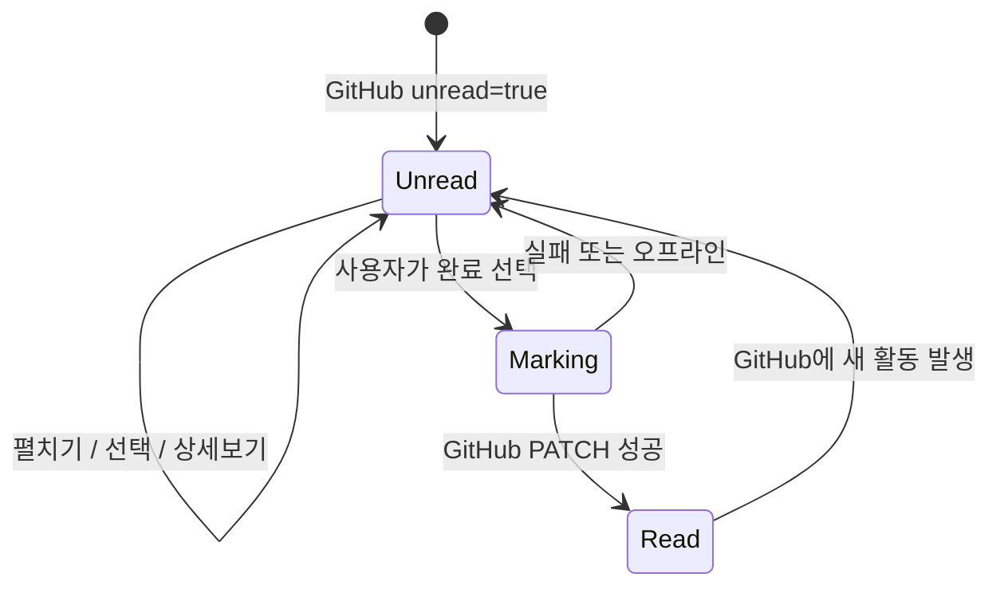
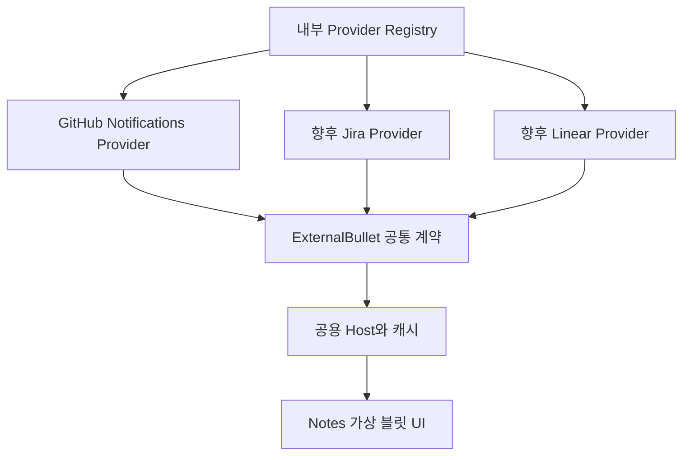

# Notes 외부 알림 블릿과 내부 플러그인 설계

**상태:** 구현 계획 작성 전 승인됨

**날짜:** 2026-07-22

**첫 번째 제공자:** GitHub Notifications

## 1. 한눈에 보는 결론

Yonalist의 Notes 안에 `Notifications`라는 가상의 최상위 페이지를 추가한다. 이 페이지 아래에는 GitHub 알림이 일반 Notes 블릿과 비슷한 모습으로 나타난다. 다만 이 블릿은 사용자가 작성한 노트가 아니라 GitHub 데이터를 잠시 보여 주는 **읽기 전용 투영(projection)** 이다.

- 알림 제목은 블릿 제목으로 표시한다.
- 저장소, 알림 사유, 발생 시각 같은 정보는 블릿의 읽기 전용 노트로 표시한다.
- GitHub에서 이미 읽은 알림은 완료된 블릿처럼 표시한다.
- 블릿을 열거나 펼쳐도 완료되지 않는다.
- `상세보기`는 현재 존재하는 Notifications 화면으로 이동한다.
- 사용자가 명시적으로 완료해야만 GitHub에 읽음 요청을 보낸다.
- 기존 Notifications 화면의 동작은 변경하지 않는다.
- GitHub부터 시작하되, 나중에 Jira나 Linear를 같은 틀에 추가할 수 있게 만든다.

핵심 안전장치는 외부 알림을 `notes.sqlite`에 일반 노트로 복사하지 않는 것이다. 이렇게 해야 외부 데이터가 Notes의 편집, 이동, 실행 취소, 휴지통, 검색 및 내보내기 규칙에 잘못 섞이지 않는다.

## 2. 초보자를 위한 용어

| 용어 | 쉬운 설명 |
| --- | --- |
| 제공자(provider) | GitHub, Jira, Linear처럼 데이터를 가져오는 곳을 Yonalist에 연결하는 작은 어댑터 |
| 내부 플러그인 | Yonalist와 함께 빌드되어 배포되는 기능. 사용자가 인터넷에서 임의의 코드를 설치하는 방식은 아님 |
| 투영(projection) | 원본을 복사해 소유하는 대신, 현재 원본을 Yonalist 화면 형식으로 보여 주는 것 |
| 원본(source of truth) | 어떤 상태가 맞는지를 최종적으로 결정하는 시스템. 이 설계에서 알림 읽음 여부의 원본은 GitHub |
| 캐시(cache) | 오프라인이나 빠른 표시를 위해 잠시 보관하는 사본. 원본은 아님 |
| 읽기 전용 | 내용을 보거나 정해진 동작을 할 수는 있지만 제목 수정, 이동, 삭제 같은 일반 편집은 할 수 없는 상태 |
| 가상 블릿 | Notes 데이터베이스에는 없지만 Notes 화면에서 블릿처럼 보이는 항목 |

## 3. 목표와 완료 조건

### 목표

1. Notes에서 GitHub 알림을 자연스럽게 훑어볼 수 있다.
2. 사용자가 알림을 명시적으로 완료할 때만 GitHub 읽음 상태가 바뀐다.
3. 기존 Notifications 기능과 Notes의 데이터 소유권을 보존한다.
4. 이후 Jira나 Linear 같은 제공자를 첫 번째 제공자와 같은 계약으로 추가할 수 있다.

### 관찰 가능한 완료 조건

| 상황 | 기대 결과 |
| --- | --- |
| Notes에서 Notifications를 연다 | 최신 알림이 직접 자식 블릿으로 최신순 표시된다. |
| 읽지 않은 블릿을 펼치거나 선택한다 | 미완료 상태가 유지되고 GitHub 읽음 요청도 발생하지 않는다. |
| `상세보기`를 누른다 | 기존 Notifications 화면에서 같은 알림이 선택된다. 기존 화면의 로컬 확인 처리도 지금과 동일하게 동작한다. |
| `상세보기` 후 Notes로 돌아온다 | Notes 블릿은 사용자가 완료하지 않았다면 계속 미완료다. |
| 사용자가 완료를 누른다 | GitHub 읽음 요청을 정확히 한 번 보내고, 성공한 뒤에만 완료 모양이 된다. |
| 완료 요청이 실패한다 | 블릿은 미완료로 남고 다시 시도할 수 있는 안내가 나타난다. |
| GitHub에서 새 활동이 발생한다 | 다음 동기화에서 해당 블릿이 다시 미완료로 나타난다. |
| 표시 기간을 바꾼다 | 읽은 알림의 기간 필터가 즉시 바뀌며, 읽지 않은 알림은 기간과 무관하게 유지된다. |
| 일반 Notes 기능을 사용한다 | 외부 블릿이 Notes 저장, Undo/Redo, 휴지통, 검색 또는 내보내기에 들어가지 않는다. |

## 4. 비대상

- 기존 Notifications 화면의 선택, 로컬 `viewedAt`, 검색, 그룹, 상세 화면, 댓글 및 브라우저 열기 동작 변경
- Jira 또는 Linear 제공자의 실제 구현
- 제3자가 설치하는 실행형 플러그인, 마켓플레이스, 원격 코드 로딩 또는 샌드박스
- 외부 알림을 일반 `NoteNode`로 복사하거나 `notes.sqlite`에 저장하는 기능
- Notes 안에서 GitHub 이슈·PR 본문이나 댓글을 편집하는 기능
- GitHub 알림을 다시 읽지 않음으로 바꾸는 기능
- 외부 블릿을 일반 Notes 블릿 아래로 이동하거나 일반 자식을 만드는 기능

## 5. 현재 시스템과 가능한 이유

현재 Yonalist에는 서로 다른 두 데이터 영역이 있다.

1. **Notifications**는 GitHub API에서 알림을 가져온다. 사용자가 목록에서 알림을 열면 앱 내부의 `viewedAt`만 기록하여 조용한 모양으로 바꾼다. 현재 생산 코드에서는 GitHub 읽음 API를 호출하지 않는다.
2. **Notes**는 `<vault>/.yonalist/notes.sqlite`에 사용자가 만든 트리를 저장한다. 노트의 제목, 순서, 완료, 삭제 및 실행 취소 기록을 Yonalist가 소유한다.

GitHub 읽음 요청 함수 `markNotificationRead`는 이미 존재하지만 현재 Notifications 화면에서 사용되지 않는다. 따라서 새 Notes 통합은 이 함수를 명시적 완료 동작에만 연결할 수 있다. 동시에 Notes 화면은 가상 행을 표시할 수 있는 프레젠테이션 경계를 갖고 있으므로, 외부 알림을 Notes 데이터베이스에 넣지 않고도 같은 모양을 만들 수 있다.

이 기능은 기술적으로 가능하다. 가장 큰 과제는 화면 모양이 아니라 서로 다른 상태를 섞지 않는 것이다.

| 상태 | 의미 | 소유자 |
| --- | --- | --- |
| GitHub `unread` | 알림을 읽었는지 | GitHub |
| 기존 Notifications `viewedAt` | Yonalist의 기존 화면에서 한번 열어 보았는지 | 기존 Notifications UI |
| Notes `completedAt` | 사용자가 만든 일반 노트를 완료했는지 | Notes 데이터베이스 |
| 외부 알림 블릿의 완료 모양 | GitHub가 읽음으로 보고하는지 | 외부 제공자 투영 |

새 기능은 마지막 행을 GitHub `unread`에서만 계산한다. 기존 Notifications의 `viewedAt`은 참조하지 않는다.

## 6. 전체 구조



### 6.1 내부 제공자 레지스트리

제공자는 코드에 정적으로 등록한다. 첫 버전에는 `github-notifications` 하나만 들어간다. 임의의 외부 JavaScript를 다운로드하거나 실행하지 않는다.

제공자 하나는 다음 책임만 가진다.

- 자신의 서비스에서 항목을 가져온다.
- 서비스 데이터를 공통 외부 블릿 형식으로 바꾼다.
- 지원하는 동작을 선언한다.
- 명시적 완료처럼 자신의 서비스에 필요한 요청을 수행한다.
- 자신의 설정을 읽고 검증한다.

최소 계약은 다음 정도로 제한한다.

```ts
interface ExternalBulletProvider {
  id: string;
  label: string;
  load(input: { connectionId: string; signal: AbortSignal }): Promise<ExternalSnapshot>;
  markComplete?(key: ExternalBulletKey): Promise<void>;
  openDetails?(key: ExternalBulletKey): void;
}
```

첫 버전에 필요하지 않은 임의 명령 실행, 사용자 정의 UI, 범용 네트워크 요청 같은 기능은 계약에 넣지 않는다.

### 6.2 External Source Host

호스트는 제공자와 화면 사이의 공용 관리자다.

- 활성 계정과 제공자 조합을 구분한다.
- 한 번 가져온 스냅샷을 기존 Notifications와 Notes 투영이 함께 사용하게 한다.
- 요청 취소, 오래된 응답 무시, 주기적 새로고침 및 오류 상태를 관리한다.
- 앱이 오프라인일 때 마지막 정상 캐시를 제공한다.
- 한 제공자의 실패가 일반 Notes나 다른 제공자를 막지 않게 한다.

기존 Notifications 화면은 검색, 날짜 그룹, `Only new`, 선택 및 상세 화면을 포함한 현재 UI 계약을 그대로 유지한다. 내부 데이터 공급 경로만 공유할 수 있으며 사용자가 보는 동작은 바꾸지 않는다.

Notes는 GitHub 전용 hook이나 서비스를 직접 import하지 않는다. 앱의 공용 경계가 중립적인 외부 투영을 Notes에 주입한다. 따라서 GitHub 제공자를 바꾸거나 Jira를 추가해도 Notes 편집기의 내부 코드는 특정 서비스 인증 방식에 의존하지 않는다.

### 6.3 Notes 가상 투영

Notes는 일반 `NoteNode` 목록에 외부 항목을 삽입하지 않는다. 대신 화면용 행을 만들 때 다음 두 종류를 합성한다.

```ts
type OutlineRow =
  | { kind: "note"; noteId: string }
  | { kind: "external"; key: ExternalBulletKey; capabilities: ExternalCapabilities };
```

외부 행은 Notes 저장 명령이 받을 수 없는 별도의 키와 기능 목록을 사용한다. 따라서 실수로 제목 수정, 이동, 삭제 또는 Notes의 완료 명령이 `notes.sqlite`로 전달되지 않는다. 외부 완료는 제공자 계약을 통해서만 실행한다.

## 7. 공통 데이터 계약

```ts
type ExternalBulletKey = {
  providerId: string;
  connectionId: string;
  remoteId: string;
};

type ExternalBullet = {
  key: ExternalBulletKey;
  parentKey: ExternalBulletKey | null;
  title: string;
  note: string;
  updatedAt: string;
  completed: boolean;
  capabilities: {
    expand: boolean;
    openDetails: boolean;
    complete: boolean;
    uncomplete: boolean;
    edit: false;
    move: false;
    delete: false;
    createChild: false;
  };
};
```

GitHub 항목의 `parentKey: null`은 해당 제공자의 가상 최상위 페이지 바로 아래라는 뜻이다. 최상위 페이지 자체는 제공자 레지스트리가 만드는 화면 요소이며 원격 thread ID를 가장하지 않는다.

키는 세 부분을 사용한다.

- `providerId`: `github-notifications`처럼 데이터 종류를 구분한다.
- `connectionId`: GitHub 서버와 확인된 사용자 계정을 함께 구분한다. 토큰 자체는 키에 넣지 않는다.
- `remoteId`: GitHub notification thread ID다.

이 조합은 같은 GitHub 서버에서 계정을 바꾸거나, Jira와 GitHub가 같은 숫자 ID를 사용하더라도 충돌하지 않는다. 브라우저 URL은 여러 알림이 같은 주소를 가질 수 있으므로 ID로 사용하지 않는다.

## 8. GitHub 알림을 블릿으로 바꾸는 규칙

### 최상위 페이지

Notes의 최상위 페이지 목록에 읽기 전용 `Notifications` 항목을 일반 페이지와 함께 표시한다. 이 항목은 가상 페이지이므로 Notes 데이터베이스에 ID나 순서를 저장하지 않는다. 여러 제공자가 생기면 레지스트리에 선언된 고정된 제공자 순서로 표시하며 드래그 정렬할 수 없다. 선택하면 오른쪽 Notes 영역에서 제공자 투영을 연다.

GitHub 연결이 없으면 페이지는 일반 Notes를 막지 않고 연결 안내만 보여 준다. 오프라인이지만 같은 계정의 캐시가 있으면 마지막 동기화 시각과 함께 캐시를 보여 준다.

### 자식 블릿

첫 버전은 중간 저장소 그룹이나 날짜 그룹을 만들지 않는다. 알림을 `Notifications`의 직접 자식으로 최신 활동순 표시한다.

| GitHub 값 | Notes 표시 |
| --- | --- |
| `subject.title`과 번호 | 블릿 제목 |
| `repository.full_name` | 읽기 전용 노트의 저장소 줄 |
| `reason` | 읽기 전용 노트의 알림 사유 줄 |
| `updated_at` | 읽기 전용 노트의 발생 시각 줄 |
| `subject.type` | 읽기 전용 노트의 종류 줄 |
| `unread === false` | 완료된 블릿 모양 |
| `unread === true` | 미완료 블릿 모양 |

제공자 노트는 일반 supporting note와 같은 글꼴과 간격으로 렌더링하지만 편집할 수 없다.

### 허용되는 동작

- 펼치기와 접기
- 키보드 및 포인터로 선택
- `상세보기`
- 미완료 항목의 명시적 완료

다음 동작은 제공하지 않는다.

- 제목이나 노트 편집
- 들여쓰기, 내어쓰기, 드래그 이동 및 순서 변경
- 복사 후 Notes 원본처럼 잘라내기
- 자식 만들기, 복제, 별표, 보관, 삭제 및 휴지통
- Notes Undo/Redo, 검색, 태그 및 내보내기 참여

## 9. `상세보기`와 기존 Notifications 보존

버튼 이름은 `상세보기`를 그대로 사용한다. 이 버튼은 팝업이나 웹 브라우저가 아니라 앱에 이미 존재하는 Notifications 화면을 연다.

1. 기존 Notifications 기능으로 이동한다.
2. 같은 GitHub thread ID의 알림을 선택한다.
3. 기존 Notifications가 현재 하던 로컬 `viewedAt` 기록을 그대로 수행한다.
4. Notes로 돌아올 때 이전 Notes 선택, 스크롤 및 펼침 상태를 복원한다.

중요하게도 기존 Notifications의 `viewedAt`과 Notes 외부 블릿의 완료 상태는 연결하지 않는다. 따라서 `상세보기`를 눌러 기존 화면에서 조용한 모양이 되더라도 Notes 블릿은 GitHub가 실제 읽음이라고 응답하거나 사용자가 명시적으로 완료할 때까지 미완료다.

## 10. 완료 처리 상태 흐름



명시적 완료는 다음 순서로 처리한다.

1. 해당 블릿만 `처리 중` 상태로 만들고 중복 완료 입력을 막는다.
2. `PATCH /notifications/threads/{threadId}` 요청을 한 번 보낸다.
3. 성공 응답 후 제공자 스냅샷을 `unread: false`로 갱신한다.
4. 그다음 완료 모양을 표시하고 캐시를 갱신한다.
5. 실패하면 완료 모양을 표시하지 않고 오류와 재시도 방법을 보여 준다.

GitHub는 개별 thread를 다시 읽지 않음으로 바꾸는 대응 API를 제공하지 않는다. 그러므로 첫 버전의 완료는 사용자가 수동으로 되돌릴 수 없는 단방향 동작이다. GitHub에 새 댓글 같은 활동이 생겨 `unread: true`가 되면 자연스럽게 다시 미완료로 돌아간다.

`Notifications` 최상위 가상 페이지 자체는 완료할 수 없다.

## 11. 표시 기간 설정

Settings의 내부 플러그인 설정에 `GitHub Notifications` 항목을 추가한다.

- 설정 이름: `읽은 알림 표시 기간`
- 기본값: 30일
- 허용 범위: 1일에서 365일
- 변경 시 Notes 투영에 즉시 반영

표시 규칙은 다음과 같다.

```text
표시 = 읽지 않음 OR updated_at이 오늘로부터 설정 일수 안쪽
```

즉, GitHub API가 반환한 범위 안에서는 30일보다 오래된 알림이라도 아직 읽지 않았다면 사라지지 않는다. 기간은 읽은 알림의 정리에만 적용한다. 기준 시각은 알림의 최신 활동 시각인 `updated_at`이다.

## 12. 동기화, 캐시 및 계정 변경

### 동기화

- Notes의 Notifications 가상 페이지나 기존 Notifications가 활성화되어 있으면 공용 호스트가 데이터를 가져온다.
- 기존 60초 갱신 흐름과 수동 새로고침을 재사용한다.
- 같은 계정과 제공자에 대한 동시 요청은 하나로 합친다.
- 화면이나 계정이 바뀌면 이전 요청을 취소하고 늦게 도착한 결과를 무시한다.

### 캐시

첫 버전의 `SourceSnapshotStore`는 기존 앱의 알림 캐시 방식과 같이 버전이 붙은 `window.localStorage` 캐시를 사용한다. Notes 데이터베이스와 Markdown Vault 인덱스에는 넣지 않는다. 키에는 `providerId`, GitHub API 서버 및 확인된 사용자 계정 ID를 포함한다. 토큰은 캐시에 넣지 않는다.

- 정상 응답을 받은 뒤에만 완전한 스냅샷을 교체한다.
- 중간 페이지 실패가 기존의 완전한 오프라인 사본을 잘라내지 않게 한다.
- 오프라인에서는 마지막 정상 사본을 읽기 전용으로 보여 준다.
- 로그아웃이나 계정 전환 시 이전 계정의 행을 현재 화면에서 즉시 제거한다.
- 같은 계정으로 다시 로그인하면 그 계정의 캐시만 복원할 수 있다.
- 앱의 캐시 초기화 기능은 이 스냅샷도 제거한다.

기존 Notifications가 사용하는 URL 기반 `viewedAt` 저장 방식은 이번 작업에서 변경하지 않는다. 새 Notes 투영만 충돌 없는 외부 키를 사용한다.

## 13. 오류와 오프라인 동작

| 오류 | 사용자에게 보이는 결과 |
| --- | --- |
| 첫 로딩 실패, 캐시 없음 | Notifications 가상 페이지 안에 짧은 오류와 다시 시도 버튼 표시 |
| 새로고침 실패, 캐시 있음 | 기존 항목을 유지하고 마지막 동기화 시각 및 오류 상태 표시 |
| 인증 만료 | 일반 Notes는 계속 사용 가능하며 플러그인 영역에 GitHub 재연결 안내 표시 |
| 완료 요청 실패 | 미완료 유지, 처리 중 상태 해제, 다시 시도 가능한 메시지 표시 |
| 오프라인 완료 시도 | 로컬에서 먼저 완료하지 않고 연결 후 다시 시도하도록 안내 |
| 한 제공자의 데이터 오류 | 해당 가상 페이지에만 오류를 격리하고 다른 Notes와 제공자는 계속 동작 |

오류 메시지에 토큰, 전체 API 응답 또는 불필요한 로컬 경로를 노출하지 않는다.

## 14. Jira와 Linear로 확장하는 방법

새 서비스를 추가할 때 Notes 화면을 다시 만드는 대신 제공자 어댑터를 하나 추가한다.



각 제공자는 자신의 인증, 페이지 넘김, 원격 ID, 완료 의미 및 설정을 책임진다. 공용 호스트는 인증 토큰을 임의 URL로 전달하는 범용 프록시가 되지 않는다. 네이티브 네트워크 접근이 필요한 제공자는 허용된 도메인과 메서드를 코드에 명시한다.

각 제공자는 Notes에 자신의 독립된 최상위 가상 페이지를 제공한다. 예를 들어 나중에는 `Notifications`, `Jira`, `Linear`가 서로 다른 최상위 항목으로 나타날 수 있다.

Jira나 Linear에서 “완료”가 알림 읽음과 다른 의미라면 그 제공자는 완료 기능을 선언하지 않거나 별도 설계를 받아야 한다. 공통 UI를 맞추기 위해 서로 다른 원격 의미를 억지로 같게 만들지 않는다.

## 15. 보안 및 데이터 소유권

- 첫 버전의 제공자는 Yonalist 릴리스에 포함된 신뢰된 코드만 사용한다.
- GitHub 인증은 기존 연결 정보를 사용하며 토큰을 Notes 데이터나 외부 블릿에 복사하지 않는다.
- 외부 콘텐츠는 렌더링 전에 기존 텍스트 및 URL 안전 규칙을 거친다.
- 제공자는 Notes의 생성, 수정, 이동, 삭제 명령에 접근하지 않는다.
- 외부 스냅샷은 캐시이며 사용자의 Notes 백업이나 내보내기 대상이 아니다.
- 외부 항목 ID는 로그에 필요 이상으로 남기지 않고 토큰은 절대 기록하지 않는다.

## 16. 테스트 전략

### 제공자와 데이터 테스트

- GitHub fixture가 제목, 노트, 시간, 완료 상태로 정확히 매핑되는지 확인한다.
- 서버, 계정 및 remote ID가 다른 항목이 충돌하지 않는지 확인한다.
- 중복 페이지, 삭제된 원격 항목, 순서 결정 및 기간 경계를 확인한다.
- 계정 전환 중 늦게 도착한 응답이 새 계정 화면을 덮지 않는지 확인한다.
- 손상되거나 오래된 캐시를 안전하게 무시하는지 확인한다.

### Notes UI 테스트

- 가상 루트와 최신순 직접 자식이 표시되는지 확인한다.
- 제목과 supporting note가 읽기 전용인지 확인한다.
- 편집, 드래그, 들여쓰기, 삭제, 자식 만들기 및 일괄 Notes 동작이 노출되지 않는지 확인한다.
- 펼치기, 선택 및 `상세보기`가 완료 요청을 보내지 않는지 확인한다.
- 가상 ID가 Notes 명령, 히스토리, 검색, 휴지통 및 내보내기에 들어가지 않는지 확인한다.

### 완료 상태 테스트

- 명시적 완료에서만 PATCH가 정확히 한 번 호출되는지 확인한다.
- 요청 중 중복 입력을 막는지 확인한다.
- 성공 전에는 완료 모양이 나타나지 않는지 확인한다.
- 실패 및 오프라인에서 미완료로 남는지 확인한다.
- 새 GitHub 활동 후 다시 미완료가 되는지 확인한다.
- 수동 완료 취소 동작이 노출되지 않는지 확인한다.

### 기존 Notifications 회귀 테스트

- 기존 행 선택은 지금처럼 로컬 `viewedAt`만 기록한다.
- 기존 행 선택 때문에 GitHub PATCH가 호출되지 않는다.
- 검색, `Only new`, 날짜 그룹, 상세 화면, 댓글 및 브라우저 열기가 그대로 동작한다.
- `상세보기`로 이동한 경우에도 기존 화면의 동작이 그대로다.
- 기존 화면의 로컬 확인 상태가 Notes 완료 상태를 바꾸지 않는다.

### 설정 및 오프라인 테스트

- 기본 30일, 최소·최대값 및 설정 복원을 확인한다.
- 오래된 읽지 않은 알림은 유지되고 오래된 읽은 알림만 제외되는지 확인한다.
- 캐시가 있을 때와 없을 때의 오프라인 화면을 각각 확인한다.

## 17. 구현 순서

1. 공통 외부 키, 블릿, 기능 및 제공자 계약을 정의하고 가짜 제공자로 계약 테스트를 만든다.
2. 계정별 스냅샷 캐시와 요청 취소를 포함한 External Source Host를 만든다.
3. 기존 GitHub 알림 서비스를 감싼 GitHub 제공자를 추가하되 기존 Notifications 회귀 테스트를 먼저 고정한다.
4. Notes 프레젠테이션 계층에 가상 루트와 외부 행을 추가하고 모든 Notes 쓰기 경로에서 분리한다.
5. `상세보기` 이동과 Notes 상태 복원을 연결한다.
6. 명시적 완료 상태 머신과 GitHub PATCH를 연결한다.
7. 30일 기본 설정과 오류·오프라인 UI를 추가한다.
8. 집중 테스트, 기존 frontend 전체 테스트, lint, build 및 실제 데스크톱 사용자 흐름을 검증한다.

각 단계는 독립적으로 테스트할 수 있어야 한다. 첫 번째 실제 데스크톱 검증은 GitHub 제공자에서 Notes 가상 행까지 한 개 알림이 보이는 얇은 수직 경로가 완성되는 즉시 수행한다.

## 18. 직접 확인할 사용자 시나리오

1. GitHub에 읽지 않은 알림 한 개와 읽은 알림 한 개를 준비한다.
2. Yonalist Notes에서 `Notifications`를 열어 두 알림의 모양을 확인한다.
3. 읽지 않은 블릿을 펼치고 접은 뒤 여전히 미완료인지 확인한다.
4. `상세보기`를 눌러 기존 Notifications 화면으로 이동하고 기존처럼 로컬 확인 표시가 생기는지 확인한다.
5. Notes로 돌아와 해당 블릿이 여전히 미완료인지 확인한다.
6. Notes에서 명시적으로 완료하고 GitHub에서도 읽음이 되었는지 확인한다.
7. 오프라인에서 다른 미완료 블릿을 완료해 보고 거짓 완료 표시가 생기지 않는지 확인한다.
8. 표시 기간을 바꾸어 오래된 읽은 항목만 사라지는지 확인한다.
9. 일반 Notes를 만들고 Undo/Redo, 검색 및 내보내기를 실행해 외부 알림이 섞이지 않는지 확인한다.

## 19. 위험과 대응

| 위험 | 대응 |
| --- | --- |
| 가상 ID가 Notes 쓰기 명령으로 들어감 | 화면 행을 판별 가능한 union으로 만들고 capability와 명령 경계 양쪽에서 차단한다. |
| `상세보기`의 기존 로컬 확인이 Notes 완료로 전파됨 | Notes 완료는 GitHub `unread`만 사용하고 `viewedAt`을 의존성에서 제외한다. |
| 완료 요청 실패인데 화면만 완료됨 | 원격 성공 뒤에만 완료 상태를 갱신한다. |
| 계정 전환 시 이전 사용자의 알림 노출 | 제공자·서버·확인된 계정 ID로 키를 만들고 전환 즉시 투영을 비운다. |
| Notes에 있는 동안 중복 폴링 | 공용 호스트가 계정·제공자별 요청을 합치고 하나의 활성 주기를 소유한다. |
| 플러그인 추상화가 지나치게 커짐 | 첫 버전 계약은 목록, 상세 이동, 선택적 완료, 설정 및 캐시에만 한정한다. |
| Jira의 의미를 GitHub에 억지로 맞춤 | 기능 선언으로 제공자별 차이를 표현하고 새 쓰기 의미는 별도 설계한다. |

## 20. 최종 설계 결정

이 기능의 첫 버전은 **설치형 플러그인 시스템이 아니라, 정적으로 등록된 내부 제공자와 Notes의 읽기 전용 가상 투영**이다. GitHub 알림은 일반 Notes처럼 보이지만 Notes 데이터는 아니다. 기존 Notifications는 현재 동작을 유지하며, Notes의 명시적 완료만 GitHub 읽음 요청으로 연결된다.

이 경계가 첫 버전의 가장 중요한 결정이다. 사용자는 한곳에서 외부 업무를 볼 수 있고, 개발자는 Jira나 Linear를 추가할 공통 틀을 얻으며, Notes와 GitHub 양쪽의 데이터 의미는 손상되지 않는다.
