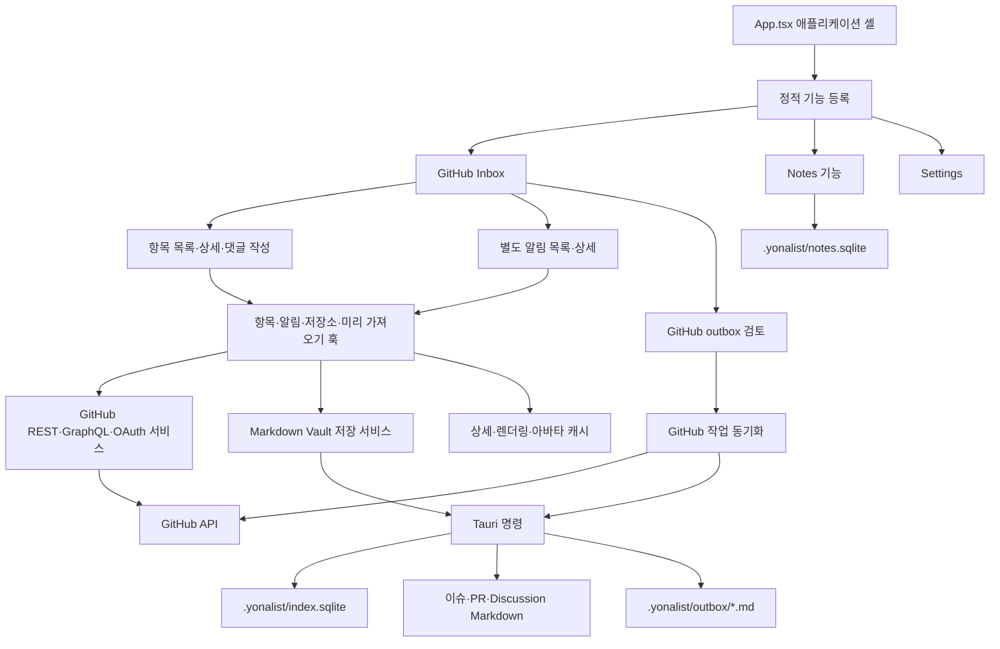
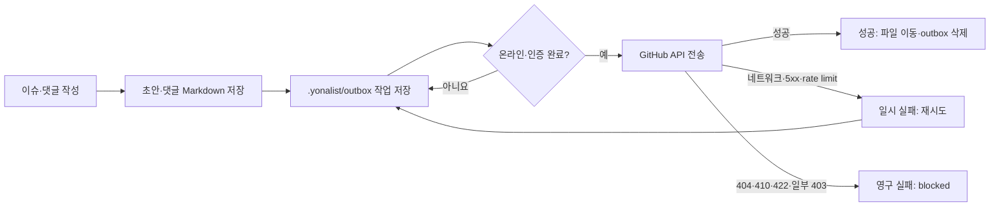
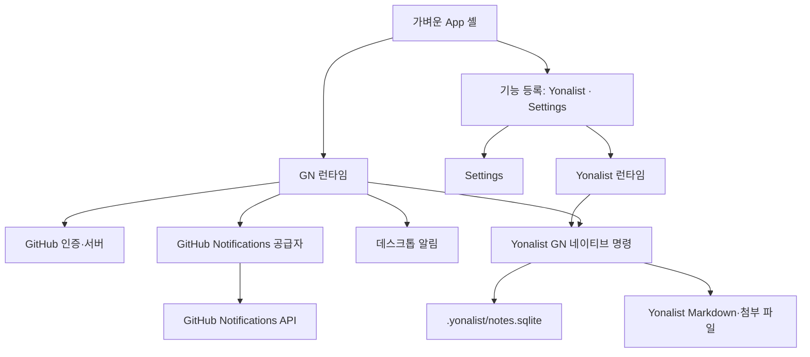

# GitHub Inbox 제거와 Yonalist 중심 구조 전환 설계

**작성일:** 2026-07-27
**상태:** 사용자와 합의한 설계
**대상 브랜치:** `main`

## 1. 문서 목적

이 문서는 Yonalist에서 GitHub Inbox를 제거하고 기존 Notes 기능을 제품의
중심인 Yonalist로 전환하는 기술 설계를 기록한다.

두 가지 목적을 함께 가진다.

1. 제거 작업에서 무엇을 남기고 무엇을 없앨지 결정한다.
2. 기존 GitHub Inbox가 어떤 문제를 풀려고 했고 왜 현재 구조를 택했는지
   역사 자료로 보존한다.

기존 Inbox 설계를 실패한 구조로 단정하지 않는다. 당시 목표는 GitHub 업무를
오프라인에서도 읽고 작성할 수 있는 데스크톱 Inbox였다. 현재는 제품 목표가
Yonalist 아웃라이너 중심으로 바뀌었기 때문에 같은 구조의 유지 비용이 이점보다
커졌다.

이 문서에서 사용자 기능은 **Yonalist**라고 부른다. 현재 코드와 저장소에 남아
있는 `NotesFeature`, `notes.sqlite`, `src/features/notes` 같은 내부 이름은 이번
작업에서 한꺼번에 바꾸지 않는다.

## 2. 결정 요약

| 항목 | 결정 |
| --- | --- |
| 기본 기능 | GitHub Inbox 대신 Yonalist |
| 앱 탐색 | Yonalist와 Settings만 유지 |
| GitHub Inbox | UI, 상태, 서비스, Rust 명령, 데이터 모두 제거 |
| 별도 Notifications 화면 | 제거 |
| GN 플러그인 | 유지 |
| GN 링크 버튼 | 현재 동작 유지 |
| 데스크톱 알림 | GN 플러그인의 기능으로 유지 |
| 기존 GitHub outbox | 제거 |
| 향후 Yonalist outbox | 별도 작업에서 설계하고 구현 |
| 개발 데이터 | 호환 코드나 마이그레이션 없이 직접 초기화 |
| Yonalist 데이터 | `notes.sqlite`, Markdown, 첨부 파일 유지 |
| 대규모 이름 변경 | 이번 작업에서 제외 |

## 3. 변경 계약

### 3.1 목표

앱을 실행하면 Yonalist가 바로 열리고 GitHub Inbox 코드가 어떤 화면이나
백그라운드 작업에서도 실행되지 않아야 한다. GN 플러그인과 데스크톱 알림은
기존 GitHub 연결을 사용해 계속 동작해야 한다.

### 3.2 완료 조건

| 확인 항목 | 통과 조건 |
| --- | --- |
| 시작 화면 | 새 프로세스에서 Yonalist가 바로 열림 |
| 탐색 | Sidebar에 Inbox, 별도 Notifications, 저장소 필터가 없음 |
| Inbox 실행 | 항목 조회, 상세 조회, 미리 가져오기, outbox 전송이 실행되지 않음 |
| GN 동작 | GitHub 알림을 Yonalist 트리에 계속 반영함 |
| GN 링크 | 현재 링크 버튼이 같은 GitHub 웹페이지를 엶 |
| 데스크톱 알림 | GN 활성화, 인증, 온라인, 설정 활성화 조건에서 동작함 |
| 네이티브 경계 | Inbox 인덱스와 outbox 명령이 등록되지 않음 |
| 저장소 | `index.sqlite`와 기존 GitHub outbox가 다시 생성되지 않음 |
| Yonalist 데이터 | `notes.sqlite`, Yonalist Markdown, 첨부 파일이 유지됨 |

### 3.3 비대상

- Yonalist 오프라인·온라인 동기화용 outbox 구현
- Yonalist 원격 동기화 프로토콜 선정
- GN 링크 버튼의 UX 변경
- GN 플러그인 데이터 모델 재설계
- `Notes*` 코드 식별자의 전면적인 이름 변경
- 기존 Inbox 데이터 마이그레이션 또는 호환 읽기
- 과거 설계 문서 삭제

### 3.4 변경 경계

- React 앱 셸과 기능 등록
- Sidebar, 상태 표시줄, Settings
- GitHub Inbox 컴포넌트와 훅
- GitHub 항목·상세·outbox 서비스
- GN 런타임의 소유권
- Tauri 명령과 권한
- Inbox용 `index.sqlite`
- Inbox가 만든 Markdown과 로컬 저장소 데이터
- macOS 데스크톱 알림

## 4. 기존 GitHub Inbox 설계 기록

### 4.1 당시 제품 목표와 전제

초기 Yonalist는 로컬 Markdown Vault를 사용하는 오프라인 우선 GitHub Inbox
프로토타입이었다. GitHub가 이슈·PR·Discussion의 원본이었고 로컬 Vault는
읽기 캐시이자 오프라인 작업 저장소 역할을 맡았다.

당시 중요한 전제는 다음과 같았다.

- 사용자는 GitHub 업무를 한 화면에서 모아 본다.
- 읽기와 탐색은 네트워크 상태에 덜 영향을 받아야 한다.
- 오프라인에서 작성한 이슈와 댓글은 먼저 로컬에 남아야 한다.
- 온라인으로 돌아오면 대기 작업을 GitHub에 전송한다.
- GitHub Enterprise와 GitHub.com을 같은 클라이언트에서 지원한다.
- 이슈·PR·Discussion 목록과 긴 대화를 빠르게 열어야 한다.
- 로컬 데이터는 사람이 확인할 수 있는 Markdown이어야 한다.

이 전제를 기준으로 보면 세 칸 화면, Markdown Vault, GitHub 전용 outbox,
상세 캐시와 미리 가져오기는 서로 일관된 선택이었다.

### 4.2 주요 결정의 흐름

| 시기 | 결정 | 이유 |
| --- | --- | --- |
| 2026-07-03 | GitHub 알림 Inbox 추가 | GitHub의 알림을 날짜·사유별로 모아 보고 웹페이지로 바로 이동하기 위해서 |
| 2026-07-03 | 인증 우선 시작 | 당시 기본 제품이 GitHub Inbox라서 첫 화면의 데이터가 인증에 의존했기 때문 |
| 2026-07-04 | Markdown Vault 영속화 | 원격 조회 결과와 오프라인 초안이 재시작 뒤에도 남아야 했기 때문 |
| 2026-07-04 | 데스크톱 알림 추가 | 앱을 보고 있지 않아도 새 GitHub 알림을 알려야 했기 때문 |
| 2026-07-05 | outbox 재시도·차단 상태 추가 | 네트워크 오류와 영구 실패를 구분하고 재접속 동기화를 안전하게 처리하기 위해서 |
| 2026-07-07~10 | 상세 캐시와 미리 가져오기 | 긴 대화와 Markdown 렌더링의 체감 대기 시간을 줄이기 위해서 |
| 2026-07-10 | 정적 기능 등록 도입 | Inbox를 깨뜨리지 않고 독립적인 Notes 기능을 추가하기 위해서 |
| 2026-07-19 | 기능 런타임 지연 로딩 | Notes 코드가 Inbox 시작 묶음에 들어오지 않게 해 시작 비용을 줄이기 위해서 |
| 2026-07-22~25 | GitHub 알림을 Yonalist에 반영 | 별도 알림 화면 밖에서도 외부 업무를 아웃라인 안에서 다루기 위해서 |
| 2026-07-24 | Vault 인덱스 백그라운드 정합화 | iCloud Vault 전체 파일 검사가 UI를 막는 문제를 해결하기 위해서 |

### 4.3 기존 전체 구조



기존 시각 자료는 `docs/yonalist-architecture/`에 보존되어 있다. 특히 다음
자료는 제거 뒤에도 당시 구조를 빠르게 이해할 수 있는 스냅샷이다.

- `yonalist-overall-architecture.svg`
- `yonalist-runtime-data-flow.svg`
- `yonalist-outbox-sync-flow.svg`
- `yonalist-techniques-and-improvements.svg`

이 자료는 2026-07-07 무렵의 구조를 나타내므로 이후 도입한 기능 등록, GN
플러그인, 네이티브 Yonalist 알림 반영은 포함하지 않는다.

### 4.4 세 칸 화면과 App 셸

기존 UI는 탐색, 항목 목록, 상세·댓글의 세 칸 구조였다.

- Sidebar는 Inbox 종류와 저장소를 선택했다.
- 가운데 칸은 이슈·PR·Discussion 또는 알림 목록을 표시했다.
- 상세 칸은 본문, 댓글, 작성기를 표시했다.
- 상태 표시줄은 온라인 상태, outbox, 미리 가져오기와 캐시 측정값을 표시했다.

이 구조는 목록과 상세를 오가며 GitHub 업무를 처리하는 데 적합했다. 반면
`App.tsx`가 기능 선택, 인증, 목록, 상세, outbox, GN, Settings를 한꺼번에
조립하면서 오케스트레이션 코드가 2,500줄을 넘었다. 정적 기능 등록을
도입했어도 Inbox의 실제 상태와 효과는 셸에 남았다. 기능 등록은 화면 어댑터를
분리했지만 런타임 소유권까지 완전히 옮기지는 못했다.

### 4.5 Markdown Vault

GitHub 항목은 다음과 같은 경로에 저장했다.

```text
<vault>/<host>/<owner>/<repo>/issues/<number>/issue.md
<vault>/<host>/<owner>/<repo>/pulls/<number>/pull.md
<vault>/<host>/<owner>/<repo>/discussions/<number>/discussion.md
<vault>/<host>/<owner>/<repo>/<kind>/<number>/comments/*.md
<vault>/.yonalist/outbox/*.md
```

front matter에는 원격 식별자, 상태, 작성자, 레이블, 갱신 시각, 즐겨찾기와
동기화 상태를 기록했다.

이 선택의 장점은 다음과 같았다.

- 오프라인에서도 원격 항목을 읽을 수 있었다.
- 초안과 대기 작업을 재시작 뒤에 복구할 수 있었다.
- 로컬 파일을 사람이 직접 확인할 수 있었다.
- 성공한 이슈 생성은 초안 파일을 원격 번호 경로로 옮겨 표현할 수 있었다.

대신 GitHub 원격 상태, Markdown 파일, SQLite 투영 사이의 정합성을 계속
관리해야 했다. 파일 이름 변경, 중복 후보, 깨진 front matter, iCloud 지연
다운로드도 처리 대상이 되었다.

### 4.6 `index.sqlite`

Inbox용 `.yonalist/index.sqlite`에는 다음 투영과 캐시가 들어갔다.

- `item_index`: 목록을 빠르게 표시하기 위한 항목 투영
- `document_hashes`: 파일 변경 여부와 파싱 후보를 기록하는 manifest
- `avatar_cache`: GitHub 아바타 파일 캐시의 메타데이터

초기 구현은 Vault의 Markdown을 읽어 인덱스를 만들었다. Vault 규모가 커지고
iCloud 파일 접근이 느려지면서 전체 검사가 UI 이벤트 처리를 막았다. 이에 따라
2026-07-24 설계는 기존 `item_index`를 먼저 읽어 화면을 표시하고 파일 검사는
백그라운드에서 수행하도록 바뀌었다.

핵심 결정은 다음과 같았다.

- 네이티브 파일 열거와 해시는 blocking thread에서 실행한다.
- TypeScript의 기존 `yaml` 파서를 worker에서 사용한다.
- Rust에서 별도의 부분 YAML 파서를 만들지 않는다.
- `document_hashes` 변경과 `item_index` 재투영을 한 트랜잭션에서 처리한다.
- 변경이 없으면 목록을 다시 읽거나 React 상태를 갱신하지 않는다.
- 파일 내용 전체를 프런트엔드로 보내지 않고 front matter만 보낸다.

당시 실제 Vault는 Markdown 164개와 인덱스 항목 66개를 가지고 있었다.
front matter 전체 파싱의 사전 측정 중앙값이 약 15ms라서 UI thread에서
최초 정합화를 수행하지 않는 쪽을 택했다.

### 4.7 GitHub 전용 outbox

기존 outbox는 범용 동기화 큐가 아니었다. 다음 두 작업을 위한 GitHub 전용
명령 문서였다.

```text
create_issue
create_comment
```

댓글 작업에는 이슈·PR·Discussion 종료 동작이 함께 들어갈 수 있었다.



이 구조를 택한 이유는 사용자의 입력 성공과 GitHub 요청 성공을 분리하기
위해서였다. 로컬 저장이 먼저 끝나면 네트워크 오류가 입력을 잃게 만들지 않는다.

추가 결정은 다음과 같았다.

- 일시 오류는 지수형에 가까운 지연 뒤 다시 시도한다.
- 서버가 확정적으로 거부한 작업은 `blocked`로 바꿔 자동 재시도하지 않는다.
- 재접속하면 다시 시도할 수 있는 작업만 자동 전송한다.
- 원격 대상이 대기 중에 바뀌면 사용자가 다시 읽을 수 있도록 힌트를 표시한다.
- 토큰이 없는 프로토타입 모드에는 로컬 큐를 비우는 예외 경로가 있었다.

이 outbox는 GitHub의 이슈·댓글 API, 원격 경로, 오류 코드와 파일 이동 규칙에
묶여 있다. 따라서 향후 Yonalist 동기화용 outbox의 기반으로 그대로 유지하지
않는다.

### 4.8 별도 GitHub Notifications 화면

GitHub Notifications는 60초 간격 조회, `If-Modified-Since`, 페이지 순회,
로컬 확인 시각과 숨김 상태를 사용했다.

화면은 다음 기능을 제공했다.

- 날짜별 그룹
- 알림 사유별 아이콘과 색
- 읽지 않은 개수
- 새 알림만 보기
- 제목·저장소 검색
- 숨기기와 다시 표시
- 브라우저에서 열기
- 상세 대화 보기

상세 화면을 즉시 열기 위해 다음 최적화가 추가되었다.

- 메모리 캐시를 먼저 보여 준 뒤 백그라운드에서 재검증
- 최근 상세 내용을 `localStorage`에 저장
- 바뀌지 않은 알림 객체의 참조 동일성 유지
- 보이는 항목이 일정 시간 머물면 상세와 Markdown을 미리 준비
- 상세 렌더 결과 스냅샷 유지

이 선택들은 GitHub 목록·상세 제품에서는 유효했다. GN 플러그인이 Yonalist
트리 안에 알림을 보여 주는 현재 제품에서는 별도 목록과 상세 경로가 같은 원격
데이터를 두 방식으로 표현해 중복 비용이 된다.

### 4.9 데스크톱 알림

데스크톱 알림은 GitHub Notifications 피드의 읽지 않은 갱신을 확인해 운영체제
알림을 보내도록 설계했다. Tauri 알림 플러그인을 사용하고 웹 환경에서는 Web
Notifications로 대체했다.

이 기능의 목적은 Inbox 화면이 아니라 새 GitHub 알림을 앱 밖에서도 알려 주는
것이다. 따라서 Inbox 제거 뒤에도 GN 플러그인의 기능으로 유지한다.

### 4.10 정적 기능 등록과 지연 로딩

Notes 기능을 추가할 때 기존 Inbox를 크게 고치지 않기 위해 정적 기능 등록을
도입했다.

초기 결정은 다음과 같았다.

- 다운로드 가능한 외부 플러그인 체계를 만들지 않는다.
- 컴파일 시점에 알 수 있는 작은 기능 목록만 둔다.
- Inbox는 기존 동작을 감싸는 얇은 어댑터로 등록한다.
- Notes는 GitHub 인증 없이 실행할 수 있다.
- 기능을 전환해도 Notes의 편집 상태와 Inbox 선택 상태를 유지한다.
- 기존 사용자의 기본 기능은 Inbox로 둔다.

이후 Notes 런타임을 지연 로딩하고 한 번 활성화한 런타임은 다시 열 때 재사용했다.
성능 보고서 기준 초기 정적 JavaScript gzip 크기는 약 32.8% 줄었고 시작 시간
p50은 151ms에서 108ms로 줄었다.

현재는 기본 기능이 Yonalist로 바뀐다. `InboxFeature` 어댑터와 Inbox 상태 유지
계약은 더 이상 필요하지 않지만 정적 등록과 Yonalist 런타임 유지 기능은 남길
가치가 있다.

### 4.11 GN 플러그인으로 이어진 부분

GitHub 알림을 Yonalist 안에서 다루는 GN 플러그인은 기존 Notifications API와
인증 계층을 재사용한다. 이후 알림은 Yonalist의 읽기 전용 노드로 네이티브
저장되고 Yonalist 트리와 Markdown 동기화 규칙을 따른다.

남겨야 할 경계는 다음과 같다.

- GitHub 연결과 계정 식별
- 알림 조회와 읽음 처리
- 외부 소스 공급자
- Yonalist 네이티브 노드 반영
- GN 링크 열기
- 알림 확인 시각
- 데스크톱 알림

제거해야 할 경계는 별도 Notifications 목록, Inbox 상세 화면, 상세 캐시,
저장소 필터다.

### 4.12 분산형 이슈 추적기 설계와의 관계

`2026-07-18-distributed-issue-tracker-design.md`는 현재 GitHub Inbox의 구현
설계가 아니다. GitHub를 원본으로 쓰지 않고 서명된 변경 원자와 내부 Git
저장소를 사용하는 별도의 장기 설계다.

그 설계에서는 로컬 device head와 관찰한 peer head의 차이가 대기 동기화 상태라서
별도 Git outbox가 필요하지 않다고 결정했다. 향후 Yonalist 동기화용 outbox를
설계할 때는 이 선택도 다시 검토해야 한다. UI에 보이는 “보낼 작업”이 반드시
`.yonalist/outbox/*.md` 같은 별도 파일 큐여야 하는 것은 아니다.

## 5. 제품 전환으로 바뀐 전제

현재 제품 방향은 다음과 같다.

- Yonalist 아웃라이너가 제품의 중심이다.
- GitHub 알림은 Yonalist 안으로 들어오는 외부 소스 중 하나다.
- 별도 GitHub 업무 클라이언트를 함께 유지하지 않는다.
- GitHub 로그인은 앱 전체의 시작 조건이 아니다.
- Yonalist 편집과 로컬 저장은 GitHub 상태와 독립적이어야 한다.
- 향후 온라인 동기화는 GitHub 이슈 API가 아닌 별도 Yonalist 설계로 결정한다.

이 변화 때문에 기존 구조의 다음 비용이 불필요해졌다.

- 하나의 원격 알림을 두 화면에서 표현
- Yonalist와 무관한 항목 목록·상세·댓글 상태
- GitHub 항목 Markdown과 SQLite 투영의 정합화
- GitHub 전용 outbox 상태와 화면
- 상세 화면 미리 가져오기와 여러 단계 캐시
- Inbox를 기본 기능으로 가정한 인증과 기능 선택 분기
- `App.tsx`에 남은 대규모 Inbox 오케스트레이션

## 6. 목표 구조



목표 구조에는 GitHub 항목 목록, 상세 화면, GitHub outbox, `index.sqlite`가 없다.
GitHub는 GN 플러그인이 쓰는 외부 소스 경계에만 남는다.

### 6.1 GN 실행 조건

```text
GN 플러그인 활성화
+ GitHub 인증 완료
+ 온라인 상태
= 알림 조회와 Yonalist 반영 활성화
```

데스크톱 알림은 위 조건에 사용자의 데스크톱 알림 설정을 추가한다.

```text
GN 플러그인 활성화
+ GitHub 인증 완료
+ 온라인 상태
+ 데스크톱 알림 설정 활성화
= 운영체제 알림 활성화
```

`activeFeatureId === "inbox"` 조건과 저장소 표시 필터는 사용하지 않는다.

### 6.2 데이터 소유권

| 데이터 | 원본 | 유지 여부 |
| --- | --- | --- |
| Yonalist 트리와 편집 상태 | `notes.sqlite`와 Yonalist 파일 | 유지 |
| GN 알림 원격 상태 | GitHub | 유지 |
| GN의 Yonalist 노드 | Yonalist 네이티브 저장소 | 유지 |
| GitHub 인증·서버 | 키 저장소와 앱 설정 | 유지 |
| 데스크톱 알림 설정 | 앱 설정 | 유지 |
| GitHub 이슈·PR·Discussion Markdown | 기존 Inbox Vault | 삭제 |
| GitHub create issue/comment outbox | `.yonalist/outbox` | 삭제 |
| Inbox 목록 투영 | `index.sqlite` | 삭제 |
| Inbox 상세·숨김 캐시 | `localStorage`와 메모리 | 삭제 |

## 7. 프런트엔드 설계

### 7.1 기능 등록

삭제:

- `src/features/inbox/InboxFeature.tsx`

수정:

- `src/features/core/featureTypes.ts`
- `src/features/core/featureRegistry.tsx`
- `src/features/core/featureSelection.ts`

`FeatureId`에서 `"inbox"`를 제거하고 `FeatureRenderContext`에서
`renderInboxPanes`를 제거한다. 저장된 기능 값이 `"inbox"`라면 유효하지 않은
값으로 처리하고 Yonalist를 기본값으로 선택한다. 호환 분기나 일회성 변환은
추가하지 않는다.

### 7.2 Sidebar

`src/components/Sidebar.tsx`에서 다음 항목을 제거한다.

- GitHub Inbox
- 별도 Notifications
- Favorites, All items, Issues, Pull requests, Discussions
- 저장소 그룹과 항목 수
- 프로젝트 표시 설정 진입
- Inbox 전용 props와 조건문

유지:

- Yonalist
- Settings
- 로그인 필요 상태
- 온라인·오프라인 상태

### 7.3 `App.tsx`

삭제할 상태와 효과:

- 항목 목록, 선택, 정렬, 필터
- 이슈·PR·Discussion 상세
- 댓글 작성과 답글 초안
- 새 이슈 화면
- 별도 알림 목록과 상세
- 저장소 목록·개수·표시 여부
- GitHub outbox와 재접속 확인
- 항목·알림 미리 가져오기
- 상세 화면 재검증과 렌더 스냅샷
- Inbox 성능 측정
- `renderInboxPanes`

유지할 조립:

- 앱 설정
- Vault 경로
- 기능 선택
- Yonalist 런타임
- Settings
- GitHub 인증
- GN 외부 소스
- 데스크톱 알림
- Yonalist 상태 메시지

남은 GN 조립은 `src/features/notes/githubNotifications/` 아래의 전용 런타임
또는 훅으로 옮긴다. 파일 이름은 구현 시 현재 모듈 경계에 맞게 정하되 다음
책임을 한곳에서 소유해야 한다.

1. GN 활성 상태와 GitHub 인증 확인
2. 알림 공급자 생성과 조회
3. Yonalist 네이티브 반영
4. 링크 열기 경계 제공
5. 데스크톱 알림 실행

### 7.4 삭제할 화면과 훅

화면:

- `ItemListPane`
- `ItemDetail`
- `NewIssuePage`
- `NotificationDetail`
- `NotificationsPane`
- `OutboxModal`

훅:

- `useWorkItems`
- `useItemThread`
- `useNotificationDetail`
- `useDraftIssue`
- `useOutboxSync`
- `useRepositories`
- `useRepositoryOpenCounts`
- `useProjectVisibility`
- 항목·알림 미리 가져오기 훅
- Inbox 상세 측정·재검증 훅

위 파일만 가져다 쓰는 댓글 작성기, 대화 목록, 상태 배지, 레이블, 아바타
컴포넌트는 역참조를 확인한 뒤 함께 삭제한다.

### 7.5 상태 표시줄과 Settings

`AppStatusBar`는 Yonalist 상태 메시지와 온라인 상태만 남긴다.

제거:

- GitHub outbox 버튼과 개수
- GitHub 동기화 중 표시
- Inbox 목록·상세·미리 가져오기·캐시 측정값

Settings에서는 다음 항목을 제거한다.

- 재접속 시 GitHub 대기 작업 전송
- 댓글 동기화 옵션
- Inbox 항목 미리 가져오기
- 저장소 표시 설정
- Inbox 캐시와 관련된 설정

유지:

- GN 플러그인 활성화
- GN 읽은 항목 보존 기간
- 데스크톱 알림
- GitHub 서버·인증
- Yonalist Vault와 일반 설정

## 8. 서비스와 도메인 설계

### 8.1 제거

- GitHub 이슈·댓글 outbox 도메인
- GitHub outbox 전송 서비스
- GitHub 항목·대화 조회 서비스
- Vault 항목 저장과 인덱스 정합화 서비스
- 저장소 목록·개수 캐시
- 프로젝트 표시와 즐겨찾기 저장소
- Inbox 상세 캐시
- Inbox 샘플 항목과 샘플 알림 상세

### 8.2 유지

- GitHub Notifications 공급자
- GitHub 알림 조회와 읽음 처리
- GitHub 전송 계층
- GitHub 계정·서버·인증
- GN 외부 소스 host와 스냅샷
- Yonalist 네이티브 반영 bridge
- 외부 링크 열기
- 데스크톱 알림 서비스

### 8.3 알림 저장소 분리

현재 `notificationStores.ts`는 확인 시각, 숨김 상태, 상세 내용을 함께 다룬다.

- GN 투영과 링크 열기가 쓰는 `viewedAt`만 작은 저장소로 옮긴다.
- 별도 Notifications 화면이 쓰던 hidden과 details 저장은 제거한다.
- `useNotifications`가 목록 UI, 샘플 데이터, 필터, 읽지 않은 개수, 링크 열기를
  한꺼번에 소유하지 않도록 줄인다.
- GN 런타임은 확인 시각과 링크 열기에 필요한 작은 경계만 사용한다.

## 9. Rust와 IPC 설계

### 9.1 제거

`src-tauri/src/vault_index_reconcile.rs`는 파일 전체를 삭제한다.

`src-tauri/src/lib.rs`에서는 다음 영역을 제거한다.

- `INDEX_DATA_ROOT`
- `index.sqlite` 경로와 연결
- `document_hashes`, `item_index`, `avatar_cache` 생성
- Inbox Vault 파일 구조체
- outbox Markdown 목록
- 항목 인덱스 조회·저장
- Vault 항목 검사·반영
- Inbox 캐시 초기화
- Inbox용 텍스트 파일 읽기·쓰기·이동·삭제 명령
- Inbox 아바타 캐시 명령
- 관련 명령 등록과 테스트

`fetch_image`는 Yonalist Markdown의 원격 이미지 표시가 사용하므로 유지한다.

같이 정리할 영역:

- `src-tauri/build.rs` 명령 목록
- `src-tauri/capabilities/default.json`
- `src-tauri/permissions/main-window.toml`
- Inbox 명령의 자동 생성 권한
- 생성된 Tauri 권한 스키마

생성 스키마는 손으로 일부만 고치지 않고 기존 생성 절차로 다시 만든다.

### 9.2 유지

- `src-tauri/src/notes/**`
- `notes.sqlite`
- Yonalist Markdown 동기화
- 첨부 파일과 Undo/Redo
- GN 네이티브 노드 반영
- GN 읽음 처리
- 외부 링크 열기
- 인증 정보 저장
- 데스크톱 알림 플러그인
- 원격 이미지 가져오기

## 10. 개발 데이터 초기화

이 작업은 개발 중인 제품을 대상으로 한다. 사용자는 기존 Inbox 데이터와의
호환을 요구하지 않았다. 마이그레이션, 이중 읽기, 구형 형식 지원을 추가하지
않는다.

### 10.1 파일과 데이터베이스

현재 개발 Vault에서 다음 항목을 직접 삭제한다.

```text
<vault>/.yonalist/index.sqlite
<vault>/.yonalist/index.sqlite-wal
<vault>/.yonalist/index.sqlite-shm
<vault>/.yonalist/outbox/
<vault>/<github-host>/<owner>/<repo>/issues/
<vault>/<github-host>/<owner>/<repo>/pulls/
<vault>/<github-host>/<owner>/<repo>/discussions/
```

넓은 경로를 이름만 보고 지우지 않는다. front matter의 `kind`와 Inbox 경로
규칙을 함께 확인한다.

삭제하지 않는 항목:

```text
<vault>/.yonalist/notes.sqlite
<vault>/.yonalist/notes.sqlite-wal
<vault>/.yonalist/notes.sqlite-shm
<vault>/.yonalist/notes-assets/
Yonalist가 관리하는 Markdown과 휴지통
```

### 10.2 브라우저 저장소

삭제:

- `yonalist.activeFeature.v1`의 기존 `"inbox"` 값
- `yonalist.favorites.v1`
- `yonalist.projectVisibility.v1`
- `yonalist.repositorySummaries.v1`
- `yonalist.repositoryOpenCounts.v1`
- `yonalist.vaultDocuments.v1`
- `yonalist.vaultDocumentHashes.v1`
- `yonalist.notifications.hidden.v1`
- `yonalist.notifications.details.v1`
- `yonalist.avatarImages.v1`
- Inbox 전용 설정 필드

유지:

- `yonalist.notifications.viewedAt.v1`
- `yonalist.externalSources.snapshots.v1`
- GitHub 계정·서버·토큰 저장
- 테마와 Yonalist 설정
- GN과 데스크톱 알림 설정

## 11. Fowler 리팩터링 적용

### 11.1 Remove Dead Code

이번 작업의 가장 큰 개선 수단이다. Inbox 화면만 숨기고 관련 상태와 효과를
남기지 않는다. 사용하지 않는 컴포넌트, 훅, 서비스, IPC, 권한, 테스트를 같은
기능 단면에서 함께 제거한다.

### 11.2 Inline Function

`InboxFeature`는 기존 `renderInboxPanes`를 호출하는 얇은 어댑터다. 곧 없어질
동작을 새 추상화로 옮기지 않고 등록과 함께 제거한다.

삭제 뒤 호출 한 곳만 남는 작은 Inbox 보조 함수도 의미 있는 이름이나 정책을
담지 않는다면 호출부에 합치고 제거한다.

### 11.3 Extract Function

`App.tsx`에서 살아남는 GN 활성 조건, 공급자 생성, 네이티브 반영, 데스크톱
알림 조립을 이름 있는 작은 함수와 훅으로 분리한다.

### 11.4 Move Function

GN 전용 로직을 앱 셸에서 Yonalist의 GitHub Notifications 경계로 옮긴다.
데스크톱 알림도 Inbox가 아니라 GN 런타임이 소유한다.

### 11.5 Split Phase

GN 흐름을 다음 단계로 분리한다.

1. GitHub 연결과 알림 조회
2. 알림을 Yonalist 입력 형식으로 투영
3. 네이티브 Yonalist 저장소에 반영
4. 새 읽지 않은 항목을 운영체제 알림으로 표시

각 단계는 독립적으로 테스트할 수 있어야 한다.

### 11.6 Encapsulate Variable

`viewedAt`의 `localStorage` 접근을 작은 저장소 뒤에 둔다. `App.tsx`와 GN
공급자가 저장 키와 직렬화 형식을 직접 다루지 않는다.

### 11.7 Separate Query from Modifier

GitHub 알림 조회와 읽음 처리를 분리한다. 데스크톱 알림 조회도 운영체제 알림을
보내는 함수와 구분한다. 조회가 UI 상태나 원격 읽음 상태를 몰래 바꾸지 않게 한다.

### 11.8 적용하지 않을 기법

삭제할 Inbox를 먼저 여러 클래스로 나누지 않는다. 기능이 두 개로 줄었다는
이유만으로 기능 등록 전체를 없애지도 않는다. Yonalist 런타임의 지연 로딩과
마운트 유지라는 검증된 목적이 남아 있기 때문이다.

`Replace Conditional with Polymorphism`도 이번 작업의 기본 수단으로 쓰지 않는다.
Inbox 조건은 새 하위 타입으로 옮길 대상이 아니라 삭제 대상이다.

## 12. 구현 순서

### 12.1 1단계: 시작 경로

- 저장된 `"inbox"`가 Yonalist로 돌아가는 실패 테스트 추가
- 기능 등록에서 Inbox 제거
- Yonalist를 기본 기능으로 변경
- Sidebar에서 Inbox 탐색 제거

이 단계가 끝나면 사용자는 Inbox에 진입할 수 없지만 내부 코드는 아직 남아 있다.

### 12.2 2단계: App 단면 제거

- `renderInboxPanes` 삭제
- Inbox 상태와 효과 삭제
- Inbox 화면과 outbox UI 삭제
- 상태 표시줄 단순화

이 단계가 끝나면 Inbox 런타임은 실행되지 않아야 한다.

### 12.3 3단계: GN 소유권 이동

- GN 런타임을 App 셸 밖으로 이동
- GN 활성 조건 연결
- 데스크톱 알림을 GN 활성 조건에 연결
- 현재 링크 버튼 동작 확인

이 단계가 끝나면 GitHub 관련 실행 코드는 GN 경계와 인증에만 남아야 한다.

### 12.4 4단계: 프런트엔드 가지치기

- 사용처가 사라진 화면·훅·서비스 삭제
- Settings와 앱 초기화 정리
- 알림 저장소에서 `viewedAt` 분리
- 테스트를 소유 모듈 기준으로 정리

### 12.5 5단계: Rust와 권한 제거

- Vault 항목 인덱스와 outbox 명령 삭제
- `vault_index_reconcile.rs` 삭제
- `index.sqlite` 생성 제거
- 명령 manifest와 권한 다시 생성
- Rust 소유 테스트 정리

### 12.6 6단계: 개발 데이터 초기화

- 현재 Vault 경로와 대상 확인
- Inbox 파일, outbox, `index.sqlite` 삭제
- Inbox 전용 브라우저 저장소 삭제
- 앱 재시작 뒤 재생성 여부 확인

### 12.7 7단계: 전체 검증

- 프런트엔드 테스트·lint·build
- Rust 테스트와 formatting
- 새 Tauri 빌드로 별도 테스트 Vault 확인
- 최종 diff와 남은 `inbox`·outbox·item index 역참조 검사

## 13. 테스트 설계

### 13.1 프런트엔드

- 기능 등록에는 Yonalist와 Settings만 존재한다.
- 저장된 `"inbox"` 값은 Yonalist로 돌아간다.
- Sidebar에 GitHub Inbox와 별도 Notifications가 없다.
- Inbox 필터와 저장소 props가 없다.
- GN 비활성화 시 알림 공급자와 데스크톱 알림이 실행되지 않는다.
- GN 활성화와 인증 완료 상태에서 알림을 조회하고 Yonalist에 반영한다.
- GN 링크 버튼이 안전한 GitHub URL을 연다.
- 데스크톱 알림 설정을 끄면 운영체제 알림을 보내지 않는다.
- 별도 Notifications의 hidden/details 저장소가 없다.
- Settings에는 GN과 데스크톱 알림 설정이 남아 있다.

### 13.2 Rust

- Inbox 명령이 Tauri invoke handler에 없다.
- Inbox 명령이 application command manifest에 없다.
- 관련 권한이 capability에 없다.
- `vault_index_reconcile` 모듈이 없다.
- GN용 Yonalist 명령은 한 번씩 등록되어 있다.
- Yonalist 초기화가 `notes.sqlite`를 정상적으로 연다.
- 앱 시작과 Yonalist 사용이 `index.sqlite`를 만들지 않는다.

### 13.3 직접 확인

새로 빌드한 Tauri 앱을 완전히 종료하고 다시 시작한다. 기존 사용자 Vault와
분리한 테스트 Vault를 사용한다.

1. 인증하지 않은 상태에서도 Yonalist가 열린다.
2. Sidebar에 Yonalist와 Settings만 보인다.
3. GN을 끄면 GitHub 알림 조회와 데스크톱 알림이 멈춘다.
4. GN을 켜고 인증하면 알림이 Yonalist 트리에 나타난다.
5. 링크 버튼이 같은 GitHub 항목을 연다.
6. 새 읽지 않은 알림이 데스크톱 알림 조건을 만족한다.
7. 앱을 다시 시작해도 Inbox 데이터와 `index.sqlite`가 생기지 않는다.
8. 기존 Yonalist 노드와 첨부 파일을 열고 편집할 수 있다.

### 13.4 최종 명령

```text
npm test
npm run lint
npm run build
cargo test --manifest-path src-tauri/Cargo.toml
cargo fmt --manifest-path src-tauri/Cargo.toml --check
git diff --check
```

Rust, IPC, 저장소와 권한을 바꾸므로 프런트엔드 검사만으로 완료 처리하지 않는다.

## 14. 위험과 대응

| 위험 | 대응 |
| --- | --- |
| GN이 쓰는 GitHub 함수를 함께 삭제 | 공급자에서 실제 사용하는 import와 테스트를 먼저 고정 |
| Inbox 화면은 사라졌지만 효과가 계속 실행 | `App.tsx`의 타이머, 효과, 네트워크 호출을 역참조로 검사 |
| `index.sqlite`가 다른 경로에서 다시 생성 | 생성 함수와 모든 명령 등록을 제거하고 재시작 검사 추가 |
| `viewedAt`을 지워 GN 보존 기간이나 알림 억제가 바뀜 | hidden/details와 분리해 유지 |
| 데스크톱 알림이 `inboxActive` 제거와 함께 꺼짐 | GN 활성 조건을 소유 테스트로 고정 |
| Yonalist 데이터까지 삭제 | `notes.sqlite`, notes-assets, Yonalist Markdown을 삭제 대상에서 명시적으로 제외 |
| Tauri 생성 권한이 낡게 남음 | 명령 manifest 수정 뒤 스키마 재생성과 등록 테스트 수행 |
| `App.tsx` 정리가 다른 사용자 변경과 충돌 | 작업 시작 전 diff를 확인하고 기능 단면별로 작은 변경 유지 |

## 15. 향후 Yonalist outbox 설계에 남기는 경계

Yonalist는 앞으로 오프라인·온라인 동기화를 제공해야 한다. 다만 기존 GitHub
outbox를 재사용하지 않는다.

향후 설계에서 먼저 답해야 할 질문은 다음과 같다.

- 원격 동기화 대상이 서버, peer, Git 저장소 중 무엇인가?
- 로컬 트랜잭션 자체가 durable pending 상태인가?
- 별도 큐가 필요하다면 명령을 저장할지 변경 원자를 저장할지?
- 순서, 중복 제거와 idempotency key를 어떻게 정의할지?
- 재시도 가능한 오류와 사용자 개입이 필요한 충돌을 어떻게 구분할지?
- 여러 기기에서 같은 변경을 보낼 때 어떻게 합칠지?
- 완료 acknowledgement 뒤 어떤 데이터를 정리할지?
- GN처럼 원격 시스템이 원본인 플러그인 작업과 Yonalist 자체 동기화를 어떻게
  분리할지?

지켜야 할 원칙:

- GitHub 이슈·댓글 타입과 오류 코드를 새 동기화 모델에 넣지 않는다.
- 기존 `.yonalist/outbox/*.md` 형식을 호환 대상으로 삼지 않는다.
- Yonalist 로컬 저장 성공과 네트워크 전송 성공은 분리한다.
- 사용자가 완료로 본 로컬 작업을 네트워크 실패 때문에 잃지 않는다.
- 재시도는 중복 원격 변경을 만들지 않아야 한다.
- UI의 “대기 중”과 저장 구조의 “outbox 파일”을 같은 개념으로 가정하지 않는다.
- 분산형 이슈 추적기 설계의 head 차이 모델도 후보로 다시 검토한다.

## 16. 참고 자료

### 기존 구조와 결정

- `README.md`
- `docs/yonalist-architecture/index.html`
- `docs/yonalist-architecture/yonalist-overall-architecture.svg`
- `docs/yonalist-architecture/yonalist-runtime-data-flow.svg`
- `docs/yonalist-architecture/yonalist-outbox-sync-flow.svg`
- `docs/yonalist-architecture/yonalist-techniques-and-improvements.svg`
- `docs/superpowers/specs/2026-07-10-notes-internal-plugin-architecture-design.md`
- `docs/superpowers/specs/2026-07-12-local-vault-migration-design.md`
- `docs/superpowers/specs/2026-07-18-distributed-issue-tracker-design.md`
- `docs/superpowers/specs/2026-07-22-notes-external-notifications-plugin-design.md`
- `docs/superpowers/specs/2026-07-24-background-vault-index-reconciliation-design.md`
- `docs/superpowers/specs/2026-07-24-notes-github-notifications-native-readonly-bullets-design.md`
- `docs/superpowers/reports/2026-07-19-startup-performance.md`

### 주요 구현 이력

- `79acd7d` — GitHub notifications inbox 추가
- `4cccddb` — 오프라인 우선 Vault 영속화
- `6f91d03` — 데스크톱 알림 추가
- `1888b09` — outbox 재시도·차단·재접속 처리
- `948b963` — 알림 동기화와 미리 가져오기 개선
- `cf8faef` — Notifications 상세 캐시와 미리 가져오기
- `6cc2e44` — 정적 기능 등록 도입
- `9715f58` — outbox와 초안 훅 추출
- `6af9a5e` — 기능 런타임 지연 로딩과 유지
- `8ae26b9` — Vault 인덱스 백그라운드 정합화
- `2a0e367` — GitHub 알림의 Yonalist 네이티브 반영

## 17. 최종 판단

기존 GitHub Inbox는 당시 목표에 맞춘 오프라인 우선 GitHub 클라이언트였다.
Markdown Vault와 outbox는 네트워크 실패에서 사용자 입력을 지켰고 인덱스와
미리 가져오기는 목록·상세 성능을 개선했다. 기능 등록과 지연 로딩은 이후
Yonalist 기능을 안전하게 추가하는 발판이 되었다.

제품 중심이 Yonalist로 이동한 지금은 GitHub 항목 목록, 상세, outbox,
`index.sqlite`를 계속 유지할 이유가 없다. 다만 인증, GN 공급자, 네이티브
Yonalist 반영, 링크 열기와 데스크톱 알림은 새 제품에서도 명확한 역할이 있다.

이번 리팩터링은 Inbox를 다른 추상화로 옮기는 작업이 아니다. 제거할 기능은
완전히 지우고 살아남는 GN 기능의 소유권을 Yonalist 경계로 옮기는 작업이다.
