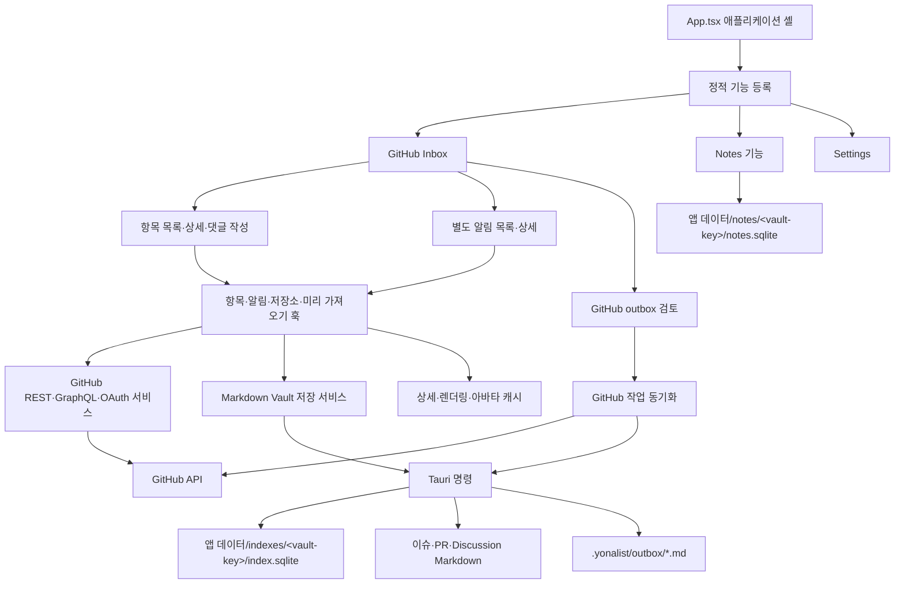
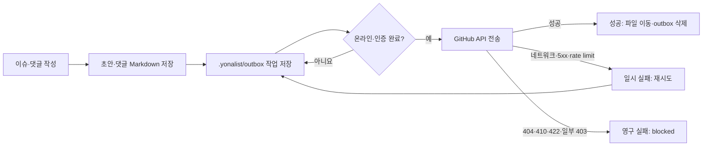
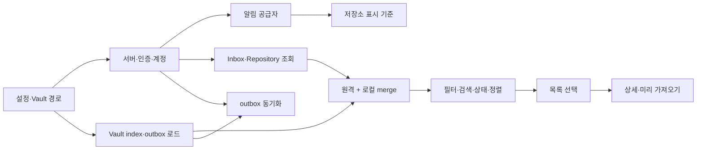
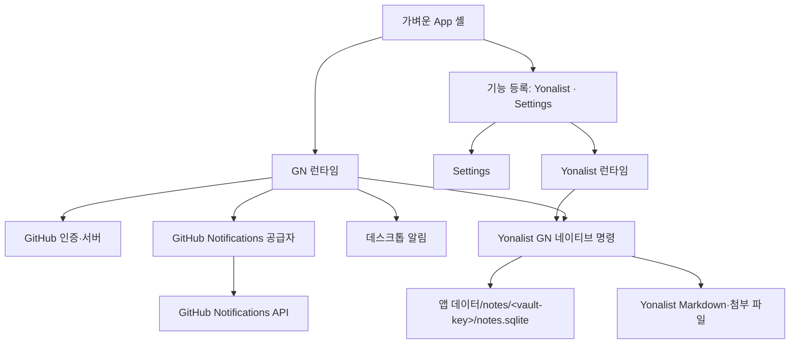

# GitHub Inbox 제거와 Yonalist 중심 구조 전환 설계

**작성일:** 2026-07-27
**상태:** 사용자와 합의한 설계
**대상 브랜치:** `main`

## 1. 문서 목적

이 문서는 Yonalist에서 GitHub Inbox를 제거하고 기존 Notes 기능을 제품의
중심인 Yonalist로 전환하는 기술 설계를 기록한다.

두 가지 목적을 함께 가진다.

1. 제거 작업에서 무엇을 남기고 무엇을 없앨지 결정한다.
2. 기존 GitHub Inbox가 어떤 문제를 풀려고 했고 왜 현재 구조를 택했는지
   역사 자료로 보존한다.

기존 Inbox 설계를 실패한 구조로 단정하지 않는다. 당시 목표는 GitHub 업무를
오프라인에서도 읽고 작성할 수 있는 데스크톱 Inbox였다. 현재는 제품 목표가
Yonalist 아웃라이너 중심으로 바뀌었기 때문에 같은 구조의 유지 비용이 이점보다
커졌다.

이 문서에서 사용자 기능은 **Yonalist**라고 부른다. 현재 코드와 저장소에 남아
있는 `NotesFeature`, `notes.sqlite`, `src/features/notes` 같은 내부 이름은 이번
작업에서 한꺼번에 바꾸지 않는다.

## 2. 결정 요약

| 항목 | 결정 |
| --- | --- |
| 기본 기능 | GitHub Inbox 대신 Yonalist |
| 앱 탐색 | Yonalist와 Settings만 유지 |
| GitHub Inbox | UI, 상태, 서비스, Rust 명령, 데이터 모두 제거 |
| 별도 Notifications 화면 | 제거 |
| GN 플러그인 | 유지 |
| GN 링크 버튼 | 현재 동작 유지 |
| 데스크톱 알림 | GN 플러그인의 기능으로 유지 |
| 기존 GitHub outbox | 제거 |
| 향후 Yonalist outbox | 별도 작업에서 설계하고 구현 |
| 개발 데이터 | 호환 코드나 마이그레이션 없이 직접 초기화 |
| Yonalist 데이터 | `notes.sqlite`, Markdown, 첨부 파일 유지 |
| 대규모 이름 변경 | 이번 작업에서 제외 |

## 3. 변경 계약

### 3.1 목표

앱을 실행하면 Yonalist가 바로 열리고 GitHub Inbox 코드가 어떤 화면이나
백그라운드 작업에서도 실행되지 않아야 한다. GN 플러그인과 데스크톱 알림은
기존 GitHub 연결을 사용해 계속 동작해야 한다.

### 3.2 완료 조건

| 확인 항목 | 통과 조건 |
| --- | --- |
| 시작 화면 | 새 프로세스에서 Yonalist가 바로 열림 |
| 탐색 | Sidebar에 Inbox, 별도 Notifications, 저장소 필터가 없음 |
| Inbox 실행 | 항목 조회, 상세 조회, 미리 가져오기, outbox 전송이 실행되지 않음 |
| GN 동작 | GitHub 알림을 Yonalist 트리에 계속 반영함 |
| GN 링크 | 현재 링크 버튼이 같은 GitHub 웹페이지를 엶 |
| 데스크톱 알림 | GN 활성화, 인증, 온라인, 설정 활성화 조건에서 동작함 |
| 네이티브 경계 | Inbox 인덱스와 outbox 명령이 등록되지 않음 |
| 저장소 | `index.sqlite`와 기존 GitHub outbox가 다시 생성되지 않음 |
| Yonalist 데이터 | `notes.sqlite`, Yonalist Markdown, 첨부 파일이 유지됨 |

### 3.3 비대상

- Yonalist 오프라인·온라인 동기화용 outbox 구현
- Yonalist 원격 동기화 프로토콜 선정
- GN 링크 버튼의 UX 변경
- GN 플러그인 데이터 모델 재설계
- `Notes*` 코드 식별자의 전면적인 이름 변경
- 기존 Inbox 데이터 마이그레이션 또는 호환 읽기
- 과거 설계 문서 삭제

### 3.4 변경 경계

- React 앱 셸과 기능 등록
- Sidebar, 상태 표시줄, Settings
- GitHub Inbox 컴포넌트와 훅
- GitHub 항목·상세·outbox 서비스
- GN 런타임의 소유권
- Tauri 명령과 권한
- Inbox용 `index.sqlite`
- Inbox가 만든 Markdown과 로컬 저장소 데이터
- macOS 데스크톱 알림

## 4. 기존 GitHub Inbox 설계 기록

### 4.1 당시 제품 목표와 전제

초기 Yonalist는 로컬 Markdown Vault를 사용하는 오프라인 우선 GitHub Inbox
프로토타입이었다. GitHub가 이슈·PR·Discussion의 원본이었고 로컬 Vault는
읽기 캐시이자 오프라인 작업 저장소 역할을 맡았다.

당시 중요한 전제는 다음과 같았다.

- 사용자는 GitHub 업무를 한 화면에서 모아 본다.
- 읽기와 탐색은 네트워크 상태에 덜 영향을 받아야 한다.
- 오프라인에서 작성한 이슈와 댓글은 먼저 로컬에 남아야 한다.
- 온라인으로 돌아오면 대기 작업을 GitHub에 전송한다.
- GitHub Enterprise와 GitHub.com을 같은 클라이언트에서 지원한다.
- 이슈·PR·Discussion 목록과 긴 대화를 빠르게 열어야 한다.
- 로컬 데이터는 사람이 확인할 수 있는 Markdown이어야 한다.

이 전제를 기준으로 보면 세 칸 화면, Markdown Vault, GitHub 전용 outbox,
상세 캐시와 미리 가져오기는 서로 일관된 선택이었다.

### 4.2 주요 결정의 흐름

| 시기 | 결정 | 이유 |
| --- | --- | --- |
| 2026-07-03 | GitHub 알림 Inbox 추가 | GitHub의 알림을 날짜·사유별로 모아 보고 웹페이지로 바로 이동하기 위해서 |
| 2026-07-03 | 인증 우선 시작 | 당시 기본 제품이 GitHub Inbox라서 첫 화면의 데이터가 인증에 의존했기 때문 |
| 2026-07-04 | Markdown Vault 영속화 | 원격 조회 결과와 오프라인 초안이 재시작 뒤에도 남아야 했기 때문 |
| 2026-07-04 | 데스크톱 알림 추가 | 앱을 보고 있지 않아도 새 GitHub 알림을 알려야 했기 때문 |
| 2026-07-05 | outbox 재시도·차단 상태 추가 | 네트워크 오류와 영구 실패를 구분하고 재접속 동기화를 안전하게 처리하기 위해서 |
| 2026-07-07~10 | 상세 캐시와 미리 가져오기 | 긴 대화와 Markdown 렌더링의 체감 대기 시간을 줄이기 위해서 |
| 2026-07-10 | 정적 기능 등록 도입 | Inbox를 깨뜨리지 않고 독립적인 Notes 기능을 추가하기 위해서 |
| 2026-07-19 | 기능 런타임 지연 로딩 | Notes 코드가 Inbox 시작 묶음에 들어오지 않게 해 시작 비용을 줄이기 위해서 |
| 2026-07-22~25 | GitHub 알림을 Yonalist에 반영 | 별도 알림 화면 밖에서도 외부 업무를 아웃라인 안에서 다루기 위해서 |
| 2026-07-24 | Vault 인덱스 백그라운드 정합화 | iCloud Vault 전체 파일 검사가 UI를 막는 문제를 해결하기 위해서 |

### 4.3 기존 전체 구조



기존 시각 자료는 `docs/yonalist-architecture/`에 보존되어 있다. 특히 다음
자료는 제거 뒤에도 당시 구조를 빠르게 이해할 수 있는 스냅샷이다.

- `yonalist-overall-architecture.svg`
- `yonalist-runtime-data-flow.svg`
- `yonalist-outbox-sync-flow.svg`
- `yonalist-techniques-and-improvements.svg`

이 자료는 2026-07-07 무렵의 구조를 나타내므로 이후 도입한 기능 등록, GN
플러그인, 네이티브 Yonalist 알림 반영은 포함하지 않는다.

### 4.4 세 칸 화면과 App 셸

기존 UI는 탐색, 항목 목록, 상세·댓글의 세 칸 구조였다.

- Sidebar는 Inbox 종류와 저장소를 선택했다.
- 가운데 칸은 이슈·PR·Discussion 또는 알림 목록을 표시했다.
- 상세 칸은 본문, 댓글, 작성기를 표시했다.
- 상태 표시줄은 온라인 상태, outbox, 미리 가져오기와 캐시 측정값을 표시했다.

이 구조는 목록과 상세를 오가며 GitHub 업무를 처리하는 데 적합했다. 반면
`App.tsx`가 기능 선택, 인증, 목록, 상세, outbox, GN, Settings를 한꺼번에
조립하면서 오케스트레이션 코드가 2,500줄을 넘었다. 정적 기능 등록을
도입했어도 Inbox의 실제 상태와 효과는 셸에 남았다. 기능 등록은 화면 어댑터를
분리했지만 런타임 소유권까지 완전히 옮기지는 못했다.

### 4.5 Markdown Vault

GitHub 항목은 다음과 같은 경로에 저장했다.

```text
<vault>/<host>/<owner>/<repo>/issues/<number>/issue.md
<vault>/<host>/<owner>/<repo>/pulls/<number>/pull.md
<vault>/<host>/<owner>/<repo>/discussions/<number>/discussion.md
<vault>/<host>/<owner>/<repo>/<kind>/<number>/comments/*.md
<vault>/.yonalist/outbox/*.md
```

front matter에는 원격 식별자, 상태, 작성자, 레이블, 갱신 시각, 즐겨찾기와
동기화 상태를 기록했다.

이 선택의 장점은 다음과 같았다.

- 오프라인에서도 원격 항목을 읽을 수 있었다.
- 초안과 대기 작업을 재시작 뒤에 복구할 수 있었다.
- 로컬 파일을 사람이 직접 확인할 수 있었다.
- 성공한 이슈 생성은 초안 파일을 원격 번호 경로로 옮겨 표현할 수 있었다.

대신 GitHub 원격 상태, Markdown 파일, SQLite 투영 사이의 정합성을 계속
관리해야 했다. 파일 이름 변경, 중복 후보, 깨진 front matter, iCloud 지연
다운로드도 처리 대상이 되었다.

### 4.6 `index.sqlite`

최종 구현에서 Inbox용 `index.sqlite`는 Vault 안이 아니라 Tauri의 앱 데이터
디렉터리에 저장했다. 논리 경로는
`<app-data>/indexes/<vault-key>/index.sqlite`였고, `vault-key`는 정규화한
Vault 절대 경로의 SHA-256 앞 8바이트를 소문자 16진수로 표현한 값이었다.
초기 버전과 오래된 구조도에는 `<vault>/.yonalist/index.sqlite`로 남아 있으므로
복원할 때 두 시점을 혼동하면 안 된다.

이 데이터베이스에는 다음 투영과 캐시가 들어갔다.

- `item_index`: 목록을 빠르게 표시하기 위한 항목 투영
- `document_hashes`: 파일 변경 여부와 파싱 후보를 기록하는 manifest
- `avatar_cache`: GitHub 아바타 파일 캐시의 메타데이터

초기 구현은 Vault의 Markdown을 읽어 인덱스를 만들었다. Vault 규모가 커지고
iCloud 파일 접근이 느려지면서 전체 검사가 UI 이벤트 처리를 막았다. 이에 따라
2026-07-24 설계는 기존 `item_index`를 먼저 읽어 화면을 표시하고 파일 검사는
백그라운드에서 수행하도록 바뀌었다.

핵심 결정은 다음과 같았다.

- 네이티브 파일 열거와 해시는 blocking thread에서 실행한다.
- TypeScript의 기존 `yaml` 파서를 worker에서 사용한다.
- Rust에서 별도의 부분 YAML 파서를 만들지 않는다.
- `document_hashes` 변경과 `item_index` 재투영을 한 트랜잭션에서 처리한다.
- 변경이 없으면 목록을 다시 읽거나 React 상태를 갱신하지 않는다.
- 파일 내용 전체를 프런트엔드로 보내지 않고 front matter만 보낸다.

당시 실제 Vault는 Markdown 164개와 인덱스 항목 66개를 가지고 있었다.
front matter 전체 파싱의 사전 측정 중앙값이 약 15ms라서 UI thread에서
최초 정합화를 수행하지 않는 쪽을 택했다.

### 4.7 GitHub 전용 outbox

기존 outbox는 범용 동기화 큐가 아니었다. 다음 두 작업을 위한 GitHub 전용
명령 문서였다.

```text
create_issue
create_comment
```

댓글 작업에는 이슈·PR·Discussion 종료 동작이 함께 들어갈 수 있었다.



이 구조를 택한 이유는 사용자의 입력 성공과 GitHub 요청 성공을 분리하기
위해서였다. 로컬 저장이 먼저 끝나면 네트워크 오류가 입력을 잃게 만들지 않는다.

추가 결정은 다음과 같았다.

- 일시 오류는 지수형에 가까운 지연 뒤 다시 시도한다.
- 서버가 확정적으로 거부한 작업은 `blocked`로 바꿔 자동 재시도하지 않는다.
- 재접속하면 다시 시도할 수 있는 작업만 추려 사용자 확인 뒤 전송한다.
- 원격 대상이 대기 중에 바뀌면 사용자가 다시 읽을 수 있도록 힌트를 표시한다.
- 토큰이 없는 프로토타입 모드에는 로컬 큐를 비우는 예외 경로가 있었다.

이 outbox는 GitHub의 이슈·댓글 API, 원격 경로, 오류 코드와 파일 이동 규칙에
묶여 있다. 따라서 향후 Yonalist 동기화용 outbox의 기반으로 그대로 유지하지
않는다.

### 4.8 별도 GitHub Notifications 화면

GitHub Notifications는 60초 간격 조회, `If-Modified-Since`, 페이지 순회,
로컬 확인 시각과 숨김 상태를 사용했다.

화면은 다음 기능을 제공했다.

- 날짜별 그룹
- 알림 사유별 아이콘과 색
- 읽지 않은 개수
- 새 알림만 보기
- 제목·저장소 검색
- 숨김 상태 저장소. 다만 제거 직전 화면에는 숨기기 버튼이 연결되어 있지 않았다.
- 브라우저에서 열기
- 상세 대화 보기

상세 화면을 즉시 열기 위해 다음 최적화가 추가되었다.

- 메모리 캐시를 먼저 보여 준 뒤 백그라운드에서 재검증
- 최근 상세 내용을 `localStorage`에 저장
- 바뀌지 않은 알림 객체의 참조 동일성 유지
- 보이는 항목이 일정 시간 머물면 상세와 Markdown을 미리 준비
- 상세 렌더 결과 스냅샷 유지

이 선택들은 GitHub 목록·상세 제품에서는 유효했다. GN 플러그인이 Yonalist
트리 안에 알림을 보여 주는 현재 제품에서는 별도 목록과 상세 경로가 같은 원격
데이터를 두 방식으로 표현해 중복 비용이 된다.

### 4.9 데스크톱 알림

데스크톱 알림은 GitHub Notifications 피드의 읽지 않은 갱신을 확인해 운영체제
알림을 보내도록 설계했다. Tauri 알림 플러그인을 사용하고 웹 환경에서는 Web
Notifications로 대체했다.

이 기능의 목적은 Inbox 화면이 아니라 새 GitHub 알림을 앱 밖에서도 알려 주는
것이다. 따라서 Inbox 제거 뒤에도 GN 플러그인의 기능으로 유지한다.

### 4.10 정적 기능 등록과 지연 로딩

Notes 기능을 추가할 때 기존 Inbox를 크게 고치지 않기 위해 정적 기능 등록을
도입했다.

초기 결정은 다음과 같았다.

- 다운로드 가능한 외부 플러그인 체계를 만들지 않는다.
- 컴파일 시점에 알 수 있는 작은 기능 목록만 둔다.
- Inbox는 기존 동작을 감싸는 얇은 어댑터로 등록한다.
- Notes는 GitHub 인증 없이 실행할 수 있다.
- 기능을 전환해도 Notes의 편집 상태와 Inbox 선택 상태를 유지한다.
- 기존 사용자의 기본 기능은 Inbox로 둔다.

이후 Notes 런타임을 지연 로딩하고 한 번 활성화한 런타임은 다시 열 때 재사용했다.
성능 보고서 기준 초기 정적 JavaScript gzip 크기는 약 32.8% 줄었고 시작 시간
p50은 151ms에서 108ms로 줄었다.

현재는 기본 기능이 Yonalist로 바뀐다. `InboxFeature` 어댑터와 Inbox 상태 유지
계약은 더 이상 필요하지 않지만 정적 등록과 Yonalist 런타임 유지 기능은 남길
가치가 있다.

### 4.11 GN 플러그인으로 이어진 부분

GitHub 알림을 Yonalist 안에서 다루는 GN 플러그인은 기존 Notifications API와
인증 계층을 재사용한다. 이후 알림은 Yonalist의 읽기 전용 노드로 네이티브
저장되고 Yonalist 트리와 Markdown 동기화 규칙을 따른다.

남겨야 할 경계는 다음과 같다.

- GitHub 연결과 계정 식별
- 알림 조회와 읽음 처리
- 외부 소스 공급자
- Yonalist 네이티브 노드 반영
- GN 링크 열기
- 알림 확인 시각
- 데스크톱 알림

제거해야 할 경계는 별도 Notifications 목록, Inbox 상세 화면, 상세 캐시,
저장소 필터다.

### 4.12 분산형 이슈 추적기 설계와의 관계

`2026-07-18-distributed-issue-tracker-design.md`는 현재 GitHub Inbox의 구현
설계가 아니다. GitHub를 원본으로 쓰지 않고 서명된 변경 원자와 내부 Git
저장소를 사용하는 별도의 장기 설계다.

그 설계에서는 로컬 device head와 관찰한 peer head의 차이가 대기 동기화 상태라서
별도 Git outbox가 필요하지 않다고 결정했다. 향후 Yonalist 동기화용 outbox를
설계할 때는 이 선택도 다시 검토해야 한다. UI에 보이는 “보낼 작업”이 반드시
`.yonalist/outbox/*.md` 같은 별도 파일 큐여야 하는 것은 아니다.

### 4.13 복원 기준과 핵심 불변식

이 절부터는 GitHub Inbox를 제거하기 직전의 구현을 다시 만들기 위한 복원
명세다. 기준 스냅샷은 이 문서를 추가한 `4714cf1`이며, 문서 변경을 제외한
Inbox 코드는 그 부모와 같다. 오래된 구조도나 초기 설계와 현재 구현이 다르면
이 절의 최종 구현 명세를 우선한다.

복원 시 반드시 지켜야 하는 불변식은 다음과 같다.

1. GitHub는 이슈·PR·Discussion과 알림의 원본이다.
2. Markdown Vault는 오프라인 읽기 캐시이자 로컬 작성물의 원본이다.
3. `index.sqlite`는 삭제해도 다시 만들 수 있는 목록 투영이다.
4. outbox Markdown은 전송이 끝나기 전까지 삭제하면 안 되는 사용자 작업이다.
5. 원격 조회 실패가 이미 화면에 보이는 캐시를 지워서는 안 된다.
6. 댓글 목록만 실패한 상세 결과는 완전한 캐시로 간주하지 않는다.
7. 같은 원격 항목의 렌더링 관련 필드가 같으면 기존 객체 참조를 재사용한다.
8. 네트워크가 돌아왔다는 이유만으로 outbox를 조용히 전송하지 않는다.
9. GitHub 서버나 계정이 바뀌면 이전 연결의 메모리 캐시를 비운다.
10. Vault 경로 바깥의 파일을 Inbox IPC로 읽거나 쓸 수 없어야 한다.

당시 구현은 두 실행 환경을 지원했다.

| 환경 | 파일 저장 | 색인 | 인증 토큰 |
| --- | --- | --- | --- |
| Tauri 데스크톱 | 실제 Vault의 Markdown | 앱 데이터의 SQLite | 릴리스는 OS 키체인, 디버그는 `localStorage` |
| 브라우저·테스트 | `localStorage`의 가상 Vault | Markdown을 직접 파싱 | `localStorage` |

브라우저 경로는 제품의 주 저장 방식이 아니라 미리보기와 테스트를 위한 대체
구현이었다.

### 4.14 사용자 기능과 화면 계약

#### 4.14.1 시작과 기능 전환

- 저장된 기능 선택이 없으면 `inbox`를 기본값으로 사용한다.
- Inbox는 GitHub 인증이 필요한 기능이다.
- 인증 세션을 복구하는 동안에는 복구 화면을 표시하고 Yonalist로 이동하는
  버튼을 제공한다.
- 유효한 토큰이 없으면 로그인 화면을 표시한다. 사용자는 샘플 데이터 보기를
  선택하거나 Yonalist로 이동할 수 있다.
- 인증을 건너뛰면 Inbox는 샘플 이슈와 샘플 알림을 보여 준다.
- 인증이 끝난 뒤 Inbox의 첫 화면은 항목 목록이 아니라 Notifications다.
- Inbox와 Settings는 비활성화할 때 화면을 언마운트한다. Yonalist 런타임은 한
  번 활성화된 뒤 편집 상태를 보존하기 위해 마운트 상태를 유지한다.
- 기능을 전환해도 `App.tsx`가 가진 Inbox 선택, 검색어, 댓글 초안과 outbox
  상태는 메모리에 남는다.

`activeFeatureId`, `showNotifications`, `showNewIssue`, `repositoryFilter`가
실제 화면 모드를 결정했다.

| 조건 | 가운데 칸 | 상세 칸 |
| --- | --- | --- |
| Inbox + `showNotifications` | 알림 목록 | 알림 상세 |
| Inbox + `showNewIssue` | 항목 목록 | 새 이슈 작성 |
| Inbox 기본 | 항목 목록 | 선택한 항목 상세 |
| Settings | 설정 분류 | 설정 내용 |
| Yonalist | Yonalist 탐색 | Yonalist 편집기 |

#### 4.14.2 세 칸 레이아웃

- 기본 너비는 Sidebar 240px, 목록 340px, 나머지는 상세 칸이다.
- Sidebar는 220~420px, 목록은 320~640px 범위에서 조절한다.
- 키보드 화살표로 16px씩, Shift와 함께 누르면 48px씩 조절한다.
- Sidebar와 목록 접힘 상태는 저장한다.
- 상세 최대화는 두 앞 칸을 임시로 접고, 해제할 때 이전 접힘 상태를 복구한다.
- 상세 최대화 자체는 세션 메모리에만 둔다.
- 상세 헤더가 화면에 보이면 헤더 안에 최대화 버튼을 두고, 스크롤로 헤더가
  사라지면 고정 TitleBar의 버튼을 사용한다.

#### 4.14.3 Sidebar

Sidebar의 표시 순서는 다음과 같았다.

1. GitHub Inbox
2. Notifications와 읽지 않은 개수
3. Notes
4. Inbox 필터: Favorites, All items, Issues, Pull requests, Discussions
5. 소유자별 Repository
6. Settings

동작 규칙:

- Inbox 필터를 누르면 저장소 필터, 새 이슈 화면, Notifications를 닫는다.
- Repository를 누르면 해당 저장소의 항목 화면으로 전환한다.
- Notifications를 누르면 저장소 필터와 새 이슈 화면을 닫는다.
- GitHub 인증이 없으면 Settings로 이동하는 로그인 필요 버튼을 표시한다.
- 오프라인이면 `Offline` 배지와 온라인 전환 버튼을 표시한다.
- 저장소 목록이 로딩되기 전에는 필터링되지 않은 알림 개수를 잠깐 표시하지
  않고 0으로 둔다. 예를 들어 300에서 15로 튀는 배지 깜박임을 막기 위해서다.

첫 실행의 Repository 표시 기본값은 현재 알림 피드에 등장하는 저장소다.
기존 사용자의 명시적 설정이 있으면 다음 조건 중 하나를 만족하는 저장소를
기본 표시했다.

- 소유하거나 직접 협업 중이다.
- watched 상태다.
- 현재 GitHub Notifications feed에 등장한다.

조직 멤버십으로만 접근 가능한 저장소는 Settings에서 직접 켜야 했다.

#### 4.14.4 항목 목록

항목 목록은 다음 상태를 제공했다.

- 상태 탭: `open`, `closed`
- 정렬: Created 내림차순·오름차순, Updated 내림차순·오름차순
- 기본 정렬: Created 내림차순
- 검색 대상: 제목, owner, repo, `#번호`, 레이블, 이미 로드한 본문
- 날짜 그룹: 현재 정렬 기준 필드의 로컬 날짜
- 새 이슈 작성
- 수동 새로고침

전역 Inbox에서는 선택 경로가 필터 결과에 없으면 첫 항목을 자동 선택한다.
Repository 화면에서는 자동 선택하지 않아, 선택 항목이 없으면 빈 상세 화면을
보여 준다.

행에는 종류 아이콘, 저장소 이름, 번호 또는 `draft`, 대기 상태, 상대 시각,
제목, 최대 네 개의 레이블, 작성자, 댓글 수와 즐겨찾기를 표시한다.
레이블 색은 6자리 16진수만 허용하고 배경색에 맞춰 글자색을 계산한다.

항목이 30개보다 많으면 목록을 가상화한다. 복원에 필요한 상수는 다음과 같다.

| 값 | 수치 |
| --- | --- |
| 가상화 시작 | 항목 31개 |
| 초기 viewport 추정 | 900px |
| 레이블 없는 행 | 80px |
| 레이블 있는 행 | 104px |
| 날짜 헤더 | 34px |
| 레이블 추가 줄 | 22px |
| 레이블 한 줄 문자 예산 | 32 |
| overscan | 앞뒤 6행 |

가상화된 목록은 추정 높이를 사용한다. 작은 목록은 실제 DOM 행의 위치로 현재
viewport 항목을 계산한다. 두 경우 모두 실제로 보이는 항목만 미리 가져오기
큐에 넘긴다.

#### 4.14.5 항목 상세와 댓글

항목 상세는 다음 순서로 구성했다.

1. 고정 제목과 저장소·종류·번호
2. 상세 최대화, 브라우저에서 열기, 즐겨찾기
3. 원격 상태, 레이블, 로컬 동기화 상태, 온라인 상태
4. 본문과 반응
5. 댓글과 Discussion 답글
6. 댓글 작성기

목록의 상태보다 상세 조회 결과를 우선한다. 이 때문에 PR의 `merged`, `draft`
상태와 최신 레이블을 상세에서 정확히 표시할 수 있었다. 상세 조회 중에는 이미
있는 본문을 유지하고 댓글 로딩 표시만 추가한다.

댓글 작성기는 Write와 Preview를 지원했다. 본문 아래 작성기가 화면에서
벗어나면 하단에 떠 있는 dock를 표시했다. 열린 항목에서는 다음 종료 동작을
댓글과 함께 또는 댓글 없이 큐에 넣을 수 있었다.

| 종류 | 종료 선택 |
| --- | --- |
| Issue | `completed`, `not_planned`, `duplicate` |
| Discussion | `resolved`, `outdated`, `duplicate` |
| Pull request | `closed` |

Issue를 duplicate로 닫을 때는 다른 이슈 번호를 입력받았다. Discussion에만
댓글 답글을 제공했고, REST Issue·PR 댓글은 평면 댓글로 작성했다.

#### 4.14.6 새 이슈 작성

- 저장소가 둘 이상이면 대상 저장소 선택기를 표시한다.
- 현재 선택 항목의 저장소를 우선 사용하고, 없으면 첫 저장소를 기본값으로
  사용한다.
- 제목은 필수다. 본문은 빈 값일 수 있다.
- 제출하면 네트워크 요청보다 먼저 draft Markdown과 outbox Markdown을 쓴다.
- 작성 직후 로컬 draft를 목록 맨 앞에 추가하고 상세에서 선택한다.
- 제출 버튼의 의미는 “생성”이 아니라 `Queue issue`다.
- 당시 구현은 댓글과 달리 새 이슈를 작성 직후 자동 전송하지 않았다. 온라인
  상태여도 outbox의 수동 Sync 또는 이후 재접속 확인 흐름을 거쳤다.

#### 4.14.7 Notifications 목록과 상세

Notifications 목록은 제목과 저장소 전체 이름을 검색하고, `Only new`로
읽지 않은 항목만 표시했다. 날짜별로 묶고 각 날짜 그룹 전체를 브라우저에서
열 수 있었다.

알림 사유 표시는 다음 매핑을 사용했다.

| reason | 표시 의미 |
| --- | --- |
| `mention` | Mentioned |
| `team_mention` | Team mentioned |
| `comment` | Commented |
| `author` | Author activity |
| `review_requested` | Review requested |
| `subscribed` | Subscribed |
| `assign` | Assigned |
| 그 밖의 값 | 밑줄을 공백으로 바꾼 원문 |

PR과 Discussion은 사유 아이콘보다 subject 종류 아이콘을 우선 표시했다. 행의
부제는 저장소 이름, 갱신 후 경과 시간, 확인 후 경과 시간 순서였다.

알림을 선택하면 로컬 `viewedAt`을 기록하고 상세를 연다. 상세 subject별 동작:

| subject | 상세 조회 | 댓글 | 종료 |
| --- | --- | --- | --- |
| Issue | Issue + issue comments | 가능 | 가능 |
| PullRequest | Pull + issue comments | 가능 | 가능 |
| Discussion | GraphQL Discussion + replies | 가능 | 가능 |
| Release | Release | 불가 | 불가 |

현재 버전의 상세 캐시가 없을 때만 전체 skeleton을 표시한다. 이전 버전의
상세가 있으면 그대로 보여 주며 새 버전을 백그라운드에서 가져온다. 댓글만
불러오지 못하면 본문은 표시하되 오류를 알리고, 그 결과는 캐시에 넣지 않는다.

#### 4.14.8 상태 표시줄

오른쪽에는 `Syncing`, `Online`, `Offline` 중 하나와 `Outbox N` 버튼을 항상
표시했다. outbox 버튼 tooltip은 오프라인 이슈와 댓글을 GitHub로 보낼 때까지
보관하는 곳이라고 설명했다.

개발 빌드 또는 `VITE_YONALIST_PERF=1` 빌드에서는 다음 측정값도 250ms마다
표시했다. 릴리스 사용자에게는 숨겼다.

- 목록 fetch 시간
- 선택부터 상세 표시까지 걸린 시간
- 현재 화면의 prefetch visible·done·active·queued와 최근 시간
- 항목 화면의 body·thread·Markdown cache 크기
- 알림 화면의 feed·detail·Markdown cache 크기

측정값은 App state로 올리지 않고 안정적인 getter에서 읽어, 관측 자체가
App 셸과 목록을 다시 렌더링하지 않게 했다.

### 4.15 React 상태와 조립 책임

최종 구현의 Inbox는 독립 런타임이 아니었다. `InboxFeature`는
`App.tsx`가 만든 화면을 그대로 반환하는 얇은 어댑터였고, 실제 상태와 효과는
App 셸이 소유했다.

주요 상태의 소유권은 다음과 같았다.

| 소유자 | 상태 |
| --- | --- |
| `App.tsx` | 기능, 필터, 검색, 정렬, 선택, 저장소, 댓글·답글 초안, 화면 모드, 로드한 본문 |
| `useWorkItems` | 원격 항목, 로딩, 오류, fetch 시간, 즐겨찾기 overlay |
| `useNotifications` | 알림 표시 목록, 읽지 않은 개수, `viewedAt`, 링크 열기 |
| `useItemThread` | 선택 항목의 stale-while-revalidate 상세 |
| `useNotificationDetail` | 선택 알림의 stale-while-revalidate 상세 |
| `useOutboxSync` | outbox, 선택 집합, 모달, 재접속 확인, sync 진행 |
| `useRepositories` | 접근 가능한 저장소와 캐시 |
| `useProjectVisibility` | 저장소 표시 override |
| `usePaneResize` | 칸 너비, 접힘, 상세 최대화 |

이 구조를 그대로 복원하려면 `App.tsx`가 다음 조립 순서를 가져야 한다.



연결의 `apiBaseUrl`이나 token이 바뀌면 알림, 항목 상세, 이미지, 목록 메모리
캐시를 모두 비웠다. 요청 중인 목록 조회는 `AbortController`로 취소하고,
일련번호가 최신인 응답만 상태에 반영했다.

### 4.16 도메인 모델과 경로 규칙

#### 4.16.1 핵심 타입

```ts
type ItemKind = "issue" | "pull" | "discussion";
type ItemState = "open" | "closed" | "merged";
type SyncStatus = "synced" | "pending" | "dirty" | "error" | "blocked";
type OutboxOperationKind = "create_issue" | "create_comment";
type OutboxStatus = "pending" | "blocked" | "syncing" | "failed" | "synced";
```

실제 outbox 흐름에서는 `pending`, `failed`, `blocked`만 파일에 남았다.
`syncing`은 hook의 전역 boolean으로만 표현했고, 성공하면 `synced`를 쓰는 대신
작업 파일을 삭제했다.

항목 식별자는 `(host, owner, repo, kind, number)`다. 원격 번호가 0보다 크면 이
식별자를 소문자로 정규화해 merge key로 사용하고, 번호가 0인 draft는 파일
경로를 key로 사용한다.

로컬과 원격 항목이 겹치면 원격 필드를 기본으로 사용하되 다음 두 값은
보존했다.

- 로컬 또는 원격 어느 한쪽이 즐겨찾기면 `favorite: true`
- 원격에 댓글 수가 없으면 로컬 `comments_count`

로컬 항목의 `sync.status`가 `pending`이면 같은 식별자의 원격 항목이 와도
로컬 항목을 덮어쓰지 않았다.

#### 4.16.2 경로 생성

경로 segment는 `/`, `:`, `\`를 `-`로 바꿨다. 나머지 문자는 그대로 두었다.

```text
<vault>/<host>/<owner>/<repo>/issues/<number>/issue.md
<vault>/<host>/<owner>/<repo>/pulls/<number>/pull.md
<vault>/<host>/<owner>/<repo>/discussions/<number>/discussion.md

<item-dir>/comments/<compact-time>-<remote-or-local-id>.md
<item-dir>/attachments/

<vault>/<host>/<owner>/<repo>/issues/_drafts/<local-id>/issue.md
<vault>/.yonalist/outbox/<operation-id>.md
```

댓글 시각은 ISO 문자열을 UTC로 바꾼 뒤 `-`, `:`, 밀리초를 제거했다. 예를
들어 `2026-07-27T01:02:03.456Z`는 `20260727T010203Z`가 된다. 시각 파싱에
실패하면 원문에서 경로 구분 문자만 치환했다.

### 4.17 Markdown 파일 형식

모든 문서는 정확히 `---\n`으로 시작하는 YAML front matter와 Markdown
본문으로 구성했다. 닫는 fence는 한 줄 전체가 `---`인 첫 지점이다.
front matter가 없으면 전체 파일을 본문으로 보지만, fence를 열고 닫지 않으면
오류로 처리한다.

#### 4.17.1 동기화된 항목 예시

```markdown
---
kind: issue
host: github.com
owner: acme
repo: app
number: 42
node_id: I_kwExample
html_url: https://github.com/acme/app/issues/42
title: Offline cache example
state: open
author: octocat
labels:
  - bug
label_colors:
  bug: d73a4a
comments_count: 3
created_at: 2026-07-27T01:00:00Z
updated_at: 2026-07-27T02:00:00Z
synced_at: 2026-07-27T02:00:01Z
local:
  favorite: false
sync:
  status: synced
---
Issue body in Markdown.
```

`synced_at`, `node_id`, `html_url`, `comments_count`, `label_colors`는 선택
필드다. 목록 색인은 본문을 저장하지 않으므로 항목을 선택할 때 Markdown
파일에서 본문을 지연 로드한다.

#### 4.17.2 새 이슈 draft 예시

```markdown
---
kind: issue
host: github.com
owner: acme
repo: app
number: 0
title: Created while offline
state: open
author: local
labels: []
created_at: 2026-07-27T03:00:00Z
updated_at: 2026-07-27T03:00:00Z
local:
  favorite: false
sync:
  status: pending
---
Draft issue body.
```

draft는 백그라운드 reconciliation의 정식 `item_index` 후보가 아니다. 다만
새 draft를 저장하는 직접 경로는 다른 항목과 똑같이 `item_index` upsert를
호출했다. 그래서 재시작 뒤에도 최근 draft를 목록에서 복구할 수 있었지만,
`item_index`의 기본 키가 `(host, owner, repo, kind, number)`이고 모든
draft의 number가 0이어서 같은 저장소의 draft 여러 개가 서로 덮어쓸 수
있었다. 강제 전체 재투영을 하면 number 0 후보가 빠지는 불일치도 있었다.
정확한 과거 동작을 설명하기 위한 기록이며, 새 구현에서는 local id를 기본
키에 포함해야 한다.

#### 4.17.3 댓글 예시

```markdown
---
kind: issue_comment
remote_id: 501
node_id: IC_kwExample
parent_remote_id: 400
parent_node_id: DC_kwParent
author: local
created_at: 2026-07-27T03:10:00Z
updated_at: 2026-07-27T03:10:01Z
sync:
  status: synced
---
Comment body.
```

`parent_*`는 Discussion 답글에 사용했다. 원격 댓글을 캐시할 때 작성 시각이
없으면 Unix epoch를 사용했다.

#### 4.17.4 `create_issue` outbox 예시

```markdown
---
kind: outbox_operation
operation: create_issue
id: issue-<uuid>
target:
  host: github.com
  owner: acme
  repo: app
local_file_path: <vault>/github.com/acme/app/issues/_drafts/issue-<uuid>/issue.md
created_at: 2026-07-27T03:00:00Z
status: pending
---
Created while offline
```

outbox 본문에는 이슈 본문이 아니라 목록에서 알아보기 위한 제목을 넣었다.
실제 전송할 제목과 본문은 `local_file_path`의 draft에서 읽었다.

#### 4.17.5 `create_comment` outbox 예시

```markdown
---
kind: outbox_operation
operation: create_comment
id: comment-<uuid>
target:
  host: github.com
  owner: acme
  repo: app
  kind: discussion
  number: 42
  parent_comment_id: 400
  parent_comment_node_id: DC_kwParent
close_after_comment:
  kind: discussion
  reason: resolved
local_file_path: <vault>/github.com/acme/app/discussions/42/comments/20260727T031000Z-comment-<uuid>.md
created_at: 2026-07-27T03:10:00Z
status: pending
---
Comment body.
```

본문 없이 `close_after_comment`만 있는 작업도 유효했다. 하위 호환용 boolean
`true`는 Issue의 `completed`로만 해석했고, 새 작업은 구조화한 종료 명령을
사용했다.

`AttachmentManifestEntry`와 `pending_remote_url` 판별 함수도 도메인에
남아 있었지만 최종 create issue/comment 흐름은 첨부 업로드 manifest를
outbox에 연결하지 않았다. 복원 범위에 첨부 업로드까지 넣으려면 별도 기능으로
설계해야 한다.

### 4.18 SQLite 색인과 Vault 정합화

#### 4.18.1 저장 위치

Tauri 시작 시 앱 데이터 경로 아래에 두 루트를 설정했다.

```text
<app-data>/indexes/<vault-key>/index.sqlite
<app-data>/notes/<vault-key>/notes.sqlite
```

`vault-key` 계산:

1. `~`를 확장한다.
2. 상대 경로면 현재 작업 디렉터리를 기준으로 절대화한다.
3. `.`은 제거하고 `..`은 앞 segment를 제거한다.
4. 정규화 경로 문자열의 SHA-256을 계산한다.
5. 앞 8바이트를 소문자 16진수 16자로 표현한다.

Inbox 복원에는 `indexes`만 필요하다. `notes`는 별도 Yonalist 데이터다.

#### 4.18.2 최종 스키마

```sql
PRAGMA journal_mode = WAL;
PRAGMA foreign_keys = ON;

CREATE TABLE document_hashes (
  vault_root TEXT NOT NULL,
  relative_path TEXT NOT NULL,
  content_hash TEXT NOT NULL,
  size INTEGER NOT NULL,
  updated_at TEXT NOT NULL,
  last_seen_at TEXT NOT NULL,
  modified_ns INTEGER NOT NULL DEFAULT -1,
  item_candidate_json TEXT,
  PRIMARY KEY (vault_root, relative_path)
);

CREATE TABLE avatar_cache (
  host TEXT NOT NULL,
  login TEXT NOT NULL,
  source_url TEXT NOT NULL,
  local_path TEXT NOT NULL,
  content_hash TEXT NOT NULL,
  media_type TEXT NOT NULL,
  checked_at TEXT NOT NULL,
  updated_at TEXT NOT NULL,
  PRIMARY KEY (host, login)
);

CREATE TABLE item_index (
  host TEXT NOT NULL,
  owner TEXT NOT NULL,
  repo TEXT NOT NULL,
  kind TEXT NOT NULL,
  number INTEGER NOT NULL,
  title TEXT NOT NULL,
  state TEXT NOT NULL,
  favorite INTEGER NOT NULL DEFAULT 0,
  comment_count INTEGER NOT NULL DEFAULT 0,
  updated_at TEXT NOT NULL,
  relative_path TEXT NOT NULL,
  author TEXT NOT NULL DEFAULT '',
  labels_json TEXT NOT NULL DEFAULT '[]',
  label_colors_json TEXT NOT NULL DEFAULT '{}',
  created_at TEXT NOT NULL DEFAULT '',
  html_url TEXT,
  sync_status TEXT NOT NULL DEFAULT 'synced',
  PRIMARY KEY (host, owner, repo, kind, number)
);
```

구현은 최초 테이블 생성 뒤 `ALTER TABLE`을 여러 번 시도해 구버전 열을
보충했다. 새로 복원할 때는 위 최종 스키마를 한 번에 만들면 된다.

#### 4.18.3 빠른 시작

Inbox 진입 시 `list_vault_item_index`로 `item_index`만 읽어 목록을 먼저
그렸다. outbox 로드는 별도 요청으로 병렬 수행했다. 이 둘을 묶지 않은 이유는
outbox Markdown 파싱이 목록 첫 표시를 늦추지 않게 하기 위해서다.

인증이 통과하고 Inbox가 활성화된 뒤 2.5초 idle 지점에 Vault 정합화를 한 번
예약했다. 같은 Vault에 대해 예약·실행·완료 guard를 각각 두어 중복 작업을
막았다. Inbox를 떠나거나 Vault가 바뀌면 아직 시작하지 않은 작업을 취소했다.

#### 4.18.4 정합화 알고리즘

정합화는 세 단계였다.

1. Rust scan
2. Web Worker YAML 파싱
3. Rust transaction commit

Rust scan:

- Vault 아래의 모든 `.md`를 재귀 열거한다.
- symlink 파일과 symlink 디렉터리는 건너뛴다.
- manifest의 크기와 나노초 mtime이 같으면 파일을 읽지 않는다.
- 바뀐 파일만 읽고 FNV-1a 방식의 32비트 UTF-16 hash를 계산한다.
- 파일을 읽은 뒤 크기와 mtime을 다시 확인한다.
- 읽는 동안 바뀐 파일은 `deferred`로 남겨 다음 실행에서 처리한다.
- 프런트엔드에는 본문이 아니라 front matter 문자열만 보낸다.
- 사라진 파일은 예상 fingerprint와 함께 removed 후보로 보낸다.

Web Worker:

- 애플리케이션과 같은 `yaml` 파서를 사용한다.
- `kind`가 issue·pull·discussion이고 `number > 0`인 문서만 후보로 만든다.
- 필수 문자열, labels 배열, 색 map, `local.favorite`, `sync.status`를
  엄격히 검사한다.
- `number: 0` draft, comment, outbox, Yonalist 문서는 색인 후보가 아니다.
- 잘못된 front matter는 `invalidCount`에 더하고 기존 UI thread를 막지 않는다.

Rust commit:

- 디스크의 크기·mtime과 scan fingerprint를 다시 확인한다.
- `BEGIN IMMEDIATE` transaction 안에서 manifest의 예상 fingerprint를
  compare-and-swap 방식으로 다시 확인한다.
- 검증 중 바뀐 파일과 이미 다른 작업이 갱신한 manifest는 `deferred`로 둔다.
- `document_hashes`의 fingerprint와 `item_candidate_json`을 함께 갱신한다.
- 후보가 바뀌었거나 강제 실행이면 전체 `item_index` 투영을 다시 만든다.
- `(host, owner, repo, kind, number)`는 대소문자와 무관하게 중복 제거한다.
- 중복 후보는 `updated_at`이 최신인 파일을 택하고, 즐겨찾기는 OR, 댓글 수는
  있는 값을 보존한다.
- 실제 후보가 바뀌지 않았으면 React의 draft 목록을 다시 설정하지 않는다.

`persistItemDocument(s)`는 Markdown 쓰기와 `item_index` upsert를 함께
수행했다. 동일한 content hash면 실제 파일 쓰기를 생략했다. 한 번에 여러
문서를 저장할 때는 `checked`, `written`, `skipped` 수를 반환했다.
온라인 목록 조회가 성공하면 idle task에서 원격 항목을 실제 Vault 경로로
바꾸고 `persistItemDocuments`로 저장했다. 목록 화면은 이 저장 완료를
기다리지 않았다.

### 4.19 GitHub 서버와 인증

#### 4.19.1 연결 모델

```ts
interface GithubConnection {
  apiBaseUrl: string;
  webBaseUrl: string;
  token: string;
}
```

`webBaseUrl`은 API URL 끝의 `/api/vN`을 제거해 만든다. `api.github.com`은
별도로 `github.com`에 대응한다. GraphQL URL은 GitHub Enterprise의
`/api/vN`을 `/api/graphql`로 바꾸고, 그 밖에는 `/graphql`을 붙인다.

기본 서버 목록, 사용자 추가 서버, 숨긴 기본 서버, 별칭, 선택 서버와 서버별
personal access token을 따로 저장했다. 알 수 없는 URL을 선택하면 custom
서버로 등록했다. 기본 서버 삭제는 실제 목록에서 지우는 대신 hidden으로
표시했다.

제거 직전의 기본 서버와 별칭은 다음 순서였다.

```text
네이버       https://oss.navercorp.com/api/v3
네이버 랩스  https://es.naverlabs.com/api/v3
Github       https://api.github.com
```

저장한 선택이 없으면 첫 서버가 기본이었다.

모든 GitHub REST 요청의 공통 헤더:

```text
Accept: application/vnd.github+json
Authorization: Bearer <token>
X-GitHub-Api-Version: 2022-11-28
Content-Type: application/json  # body가 있을 때
```

WebView의 HTTP cache는 `cache: no-store`로 우회했다. 앱 자체 캐시와 오래된
프록시 304가 충돌하는 것을 막기 위해서다.

#### 4.19.2 로그인과 세션 복구

- 서버에 personal token이 있으면 OAuth 없이 바로 사용한다.
- 등록한 OAuth 앱이 있는 서버는 app-owned webview와 localhost callback을
  사용하는 authorization-code flow를 실행한다.
- callback 경로는 `http://localhost:<port>/auth`다.
- OAuth state를 매 요청 새로 만들고 callback의 state가 다르면 중단한다.
- scope는 `repo`, `read:org`였다.
- 등록되지 않은 custom GitHub Enterprise는 personal token 사용을 안내한다.
- OAuth client credential 값은 소스나 이 문서에 새로 하드코딩하지 않고
  배포 설정에서 주입한다.

릴리스 데스크톱은 `"Yonalist GitHub"` service와 API URL account 조합으로
OS 키체인에 OAuth token을 저장했다. 디버그 데스크톱과 브라우저는
`yonalist.github.sessionTokens.v1`을 사용했다. 키체인으로 전환할 때 기존 웹
token을 읽어 옮기고 성공하면 웹 복사본을 지웠다.

시작 검증은 `/user`를 호출한다.

- 200이고 account id/login을 해석할 수 있으면 `passed`
- 401·403이면 token이 무효하므로 `required`
- 5xx, rate limit, 프록시 오류, 네트워크 오류는 `unreachable`
- 이전에 인증한 token은 우선 통과시키고 온라인에서 백그라운드 검증한다.
- 오프라인이면 저장된 account binding을 사용한다.
- OAuth token이 확정적으로 무효하면 세션 token을 지운다.

계정 식별자는 API base URL과 account id에 묶었다. 알림 snapshot과 GN 연결을
계정별로 분리하기 위해서다.

### 4.20 이슈·PR·Discussion 조회 API

#### 4.20.1 Inbox와 Repository 목록

| 목적 | 요청 |
| --- | --- |
| 내 이슈·PR | `GET /search/issues?q=involves:@me&sort=<created|updated>&order=<asc|desc>&per_page=50` |
| 저장소 이슈·PR | `GET /repos/{owner}/{repo}/issues?state=all&sort=<created|updated>&direction=<asc|desc>&per_page=50` |
| 내 Discussion | GraphQL `search(query: "involves:@me", type: DISCUSSION, first: 50)` |
| 저장소 Discussion | GraphQL `repository.discussions(first: 50, orderBy: ...)` |

REST issue 응답에 `pull_request` 필드가 있으면 PR로 해석했다. 목록은 제목,
상태, 본문, 작성자, 레이블과 색, 댓글 수, 생성·수정 시각, URL을
`ItemDocument`로 정규화했다.

Discussion query는 다음 필드를 가져왔다.

```text
number, title, body, url, closed,
comments.totalCount, createdAt, updatedAt,
author.login, repository.name, repository.owner.login,
labels(first: 10) { name color }
```

오래된 GitHub Enterprise가 Discussion GraphQL을 지원하지 않으면 Discussion만
빈 배열로 처리하고 Issue·PR 목록은 계속 표시했다. 네 종류의 목록 요청은
첫 50개만 가져왔고 추가 페이지를 읽지 않았다. 이 제한도 동일 동작을
복원하려면 유지해야 한다.

#### 4.20.2 저장소 발견과 개수

접근 가능한 저장소는 다음 요청을 병렬로 합쳤다.

```text
GET /user/repos?affiliation=owner,collaborator&sort=pushed&per_page=100&page=N
GET /user/repos?affiliation=organization_member&sort=pushed&per_page=100&page=N
GET /user/subscriptions?per_page=100&page=N
```

- 앞의 두 경로는 최대 5페이지다.
- watched 저장소는 최대 20페이지다.
- Link의 `rel="next"`를 우선하고, Link가 없으면 100개 미만인 페이지에서
  멈춘다.
- full name으로 합치며 participating, orgMember, watched flag를 OR한다.
- owner는 알파벳순, owner 안의 저장소는 `pushed_at` 내림차순이다.

열린·닫힌 개수는 저장소 25개씩 GraphQL alias query를 만들어 동시 3개
batch로 조회했다.

```text
open = open issues + open PRs + open discussions
closed = closed issues + closed PRs + merged PRs + closed discussions
```

Discussion count를 지원하지 않는 Enterprise에서는 GraphQL 전체 보강을
포기하고 REST의 `open_issues_count`를 유지했다. 선택한 저장소의 정확한
open·closed count는 선택 500ms 뒤에 지연 조회했다.

#### 4.20.3 목록 캐시

메모리 key:

```text
<apiBaseUrl>|inbox|sort:<field>:<direction>
<apiBaseUrl>|repo:<owner>/<repo>|sort:<field>:<direction>
```

캐시가 있으면 즉시 표시하고, 다음 TTL 안이면 원격 요청을 생략했다.

| 가장 최근 항목의 원격 나이 | TTL |
| --- | --- |
| 항목 없음 | 30초 |
| 시각 파싱 실패 | 2분 |
| 10분 미만 | 1분 |
| 1시간 미만 | 4분 |
| 24시간 미만 | 10분 |
| 그 이상 | 30분 |

새 응답을 받을 때 렌더링에 영향을 주는 모든 필드가 같으면 이전 배열과 항목
객체를 재사용했다. 이 참조 안정성이 `React.memo` 목록의 전제였다.

### 4.21 GitHub Notifications 프로토콜

#### 4.21.1 원격 feed

전체 알림:

```text
GET /notifications?all=true&per_page=50&page=N
```

필요하면 `participating=true`를 추가할 수 있었지만 기본 공급자는 모든 알림을
요청했다. 페이지당 50개, 최대 20페이지이며 Link header를 따라갔다.

feed cache key:

```text
<apiBaseUrl>|<accountId>|<all|unread>|<participating|any>
```

동일한 feed 요청은 진행 중 Promise를 공유했다. 첫 페이지는 항상 조건 없이
다시 읽었다. 첫 페이지와 캐시가 같고 다음 페이지가 없으면 기존 배열 참조를
반환했다. 페이지를 받는 동안 partial 결과를 공급자에 공개해 긴 feed도 먼저
그릴 수 있게 했다.

공급자는 thread id로 중복을 제거했다. 같은 id면 더 최신 `updated_at`을 택하고,
시각까지 같으면 읽은 상태가 읽지 않은 상태로 되돌아가지 않게 했다. 완성
snapshot은 60초 polling host가 계정별 `localStorage` snapshot으로 저장했다.

알림 데이터 계약:

```ts
interface GitHubNotification {
  id: string;
  unread: boolean;
  reason: string;
  updated_at: string;
  last_read_at: string | null;
  subject: { title: string; url: string | null; type: string };
  repository: {
    full_name: string;
    name: string;
    owner: { login: string; avatar_url?: string };
  };
}
```

`viewedAt >= updated_at`이거나 GitHub의 `unread`가 false면 조용한 알림으로
간주했다. `viewedAt`은 URL을 처음 연 시각만 기록하며 기존 값을 갱신하지
않았다. 웹 URL 매핑:

| type | URL |
| --- | --- |
| Issue | `/{owner}/{repo}/issues/{number}` |
| PullRequest | `/{owner}/{repo}/pull/{number}` |
| Discussion | `/{owner}/{repo}/discussions/{number}` |
| Release | `/{owner}/{repo}/releases` |
| 그 밖의 값 | 저장소 루트 |

읽음 완료는 `PATCH /notifications/threads/{threadId}`다. 2xx와 205를 성공으로
처리하고 로컬 항목을 즉시 `unread: false`로 바꿨다.

#### 4.21.2 데스크톱 알림 probe

데스크톱 알림은 전체 feed cache와 별도인 unread 첫 페이지 cache를 사용했다.

1. 최초 실행은 unread 첫 페이지를 읽어 기준선을 만들고 알림을 보내지 않는다.
2. 이후에는 `per_page=1`과 `If-Modified-Since`로 변경 여부를 확인한다.
3. 304면 알림이 없다고 보고 종료한다.
4. 304가 연속 다섯 번이면 다음 probe를 건너뛰고 unread 첫 페이지를 조건 없이
   다시 읽는다.
5. id가 새롭거나 `updated_at`이 증가한 항목만 OS 알림 후보로 반환한다.

이 우회는 잘못된 proxy fingerprint가 영원히 304를 반환해 데스크톱 알림을
막는 상황을 제한하기 위한 것이었다. poll 간격은 60초였다. 기존 Inbox에서는
표시한 Repository와 조용한 알림을 제외한 뒤 저장소 전체 이름을 title,
subject 제목을 body로 보냈다.

### 4.22 상세 조회와 캐시 계층

#### 4.22.1 원격 상세 요청

| 대상 | 본문 | 댓글 |
| --- | --- | --- |
| Issue | `GET /repos/{owner}/{repo}/issues/{n}` | `/issues/{n}/comments?per_page=100` |
| Pull | `GET /repos/{owner}/{repo}/pulls/{n}` | `/issues/{n}/comments?per_page=100` |
| Discussion | GraphQL `repository.discussion(number:)` | 같은 query의 comments·replies 각 100개 |
| Release | `GET /repos/{owner}/{repo}/releases/{id}` | 없음 |

REST 본문과 댓글은 병렬로 요청했다. 댓글 요청만 실패하면 `commentsError:
true`인 본문 결과를 반환했다. 사용자 profile은 본문과 댓글에서 이름이 필요한
login을 모아 별도 조회하고, 반응과 작성자 관계, 레이블을 공통 대화 모델로
정규화했다.

#### 4.22.2 메모리와 디스크 캐시

- 항목 상세 LRU: 최대 50개
- 알림 상세 LRU: 최대 50개
- 상세 렌더 HTML snapshot LRU: 최대 50개
- Markdown 렌더 결과 LRU: 최대 200개
- 알림 상세 `localStorage`: host당 최근 30개

상세 key는 연결과 대상을 포함하고 version은 항목 또는 알림의 `updated_at`이다.
정확한 version이 없으면 같은 대상의 가장 최근 cache를 먼저 보여 주고 새
version을 요청했다. 같은 key/version 요청은 진행 중 Promise를 공유했다.

알림 상세 영속화 key는 API host와 subject URL이며, URL이 없으면
`<repo-full-name>#<notification-id>`를 썼다. 저장은 최대 1.5초 idle 창에
묶어 prefetch burst 한 번당 `localStorage` 쓰기 한 번으로 줄였다.

상세가 화면에 완전히 그려진 뒤 2초가 지나면 REST 대상의 item과 comments에
조건부 HEAD를 보냈다. 저장한 ETag와 Last-Modified가 모두 304면 현재 상세를
유지하고, 하나라도 바뀌면 렌더 snapshot을 지우고 상세 version을 새로
가져왔다. Discussion은 REST validator가 없어 변경된 것으로 간주했다.

#### 4.22.3 보이는 항목 미리 가져오기

공통 큐 기본값:

| 값 | 수치 |
| --- | --- |
| 화면에 머문 시간 | 1초 |
| 화면 밖 cache 제거 | 10분 |
| 동시 요청 | 4개 |
| 알림 후보 cap | 필터 결과 상위 30개 |

선택한 행은 화면 밖으로 나가도 제거하지 않았다. 타이머가 실행되는 시점에 최신
온라인·인증·선택 상태를 다시 확인했다. 진행 수치는 React state가 아니라
안정적인 getter에 보관하고 상태 표시줄만 250ms마다 읽었다.

항목 prefetch:

- item 자체 본문, 이미 로드한 본문, Vault 파일 순서로 본문을 구한다.
- 인증·온라인이고 원격 번호가 있으면 대화 상세를 가져온다.
- 본문과 모든 댓글의 Markdown 렌더 결과를 준비한다.
- 댓글까지 성공한 상세만 항목과 댓글 Markdown으로 Vault에 저장한다.
- 제거 시 로드한 본문과 해당 version 상세 cache를 지운다.

알림 prefetch:

- Notifications의 검색과 Only new가 적용된 상위 30개를 사용한다.
- 알림 상세와 Markdown 렌더 결과만 준비한다.
- 별도 알림 Markdown은 만들지 않는다.
- 댓글 실패 결과는 완료된 cache로 세지 않는다.

### 4.23 GitHub outbox 정확한 상태 전이

#### 4.23.1 생성과 로드

operation id는 `<kind>-<UUID>`다. `crypto.randomUUID`가 없으면 현재 시각의
base36과 난수를 조합했다. outbox 파일은 생성 시 `pending`이며
`created_at` 오름차순으로 로드했다.

새 댓글은 다음 순서로 처리했다.

1. 댓글과 종료 동작을 정규화한다.
2. 메모리 outbox에 추가한다.
3. 입력란을 비운다.
4. 본문이 있으면 댓글 Markdown과 outbox Markdown을 함께 저장한다.
5. 저장이 끝나면 온라인·인증 상태일 때 그 작업 하나를 즉시 동기화한다.

새 이슈는 draft와 outbox를 저장하고 메모리에 추가하지만 즉시 동기화를
호출하지 않았다.

#### 4.23.2 전송

작업은 배열 순서대로 한 건씩 처리했다. 서로 독립적이어서 한 건이 실패해도
다음 작업을 계속했지만, 병렬 전송은 하지 않았다.

일시 오류는 최초 시도 뒤 500ms, 1,500ms를 기다려 총 세 번 시도했다.

영구 실패 판정:

| 응답 | 결과 |
| --- | --- |
| 404, 410, 422 | `blocked` |
| 403이고 메시지에 `rate limit`이 없음 | `blocked` |
| rate limit 403, 그 밖의 HTTP·네트워크 오류 | `failed` |
| 일반 `Error` | `failed` |

`failed`와 `blocked`는 `last_error`와 함께 outbox Markdown에 다시 썼다.
재접속 자동 후보에서는 `blocked`를 제외했지만, 사용자가 모달에서 직접
선택하면 다시 시도할 수 있었다.

API 매핑:

| operation | 원격 동작 |
| --- | --- |
| `create_issue` | `POST /repos/{owner}/{repo}/issues` |
| Issue·PR comment | `POST /repos/{owner}/{repo}/issues/{n}/comments` |
| Discussion comment | Discussion node id 조회 후 `addDiscussionComment` mutation |
| Issue close | `PATCH /issues/{n}` with `state`, `state_reason`, optional `duplicate_issue_id` |
| Pull close | `PATCH /pulls/{n}` with `state: closed` |
| Discussion close | node id 조회 후 `closeDiscussion` mutation |

댓글과 종료를 함께 요청하면 댓글 생성이 성공한 뒤 종료를 실행했다. 종료에서
실패하면 전체 operation은 실패로 남는다. 이 경우 원격에는 댓글이 이미 생겼을
수 있으므로 재시도 시 중복 댓글이 생길 수 있었다. 별도 idempotency key는
없었다.

#### 4.23.3 성공 후 로컬 반영

새 이슈 성공:

1. GitHub가 반환한 `number`가 없으면 실패로 간주한다.
2. draft front matter에 number, node id, URL, 원격 `updated_at`,
   현재 `synced_at`, `sync: synced`를 반영한다.
3. draft 파일을 정식 issue 경로로 옮긴다.
4. React draft 항목도 새 경로로 교체한다.
5. outbox 파일을 삭제한다.

댓글 성공:

1. GitHub가 반환한 comment id가 없으면 실패로 간주한다.
2. 로컬 댓글 파일을 원격 id와 원격 생성 시각을 사용한 정식 경로로 옮긴다.
3. body는 원격 응답을 우선하고 없으면 operation body를 사용한다.
4. front matter의 author는 당시 구현대로 `"local"`을 유지한다.
5. outbox 파일을 삭제한다.

종료만 있는 작업은 별도 댓글 파일 없이 outbox만 삭제한다. 한 건이라도
성공하면 목록·알림과 상세 cache를 무효화하고 원격 목록을 다시 가져왔다.

#### 4.23.4 재접속과 사용자 확인

`navigator.onLine` 또는 수동 토글의 offline→online edge에서만 재접속 흐름을
검사했다.

1. `syncQueuedOnReconnect`가 켜져 있어야 한다.
2. Inbox가 활성화되어 있고 현재 Vault의 outbox 로드가 끝나야 한다.
3. `blocked`가 아닌 작업만 후보로 만든다.
4. token이 있으면 `/rate_limit`을 최대 4초 동안 호출해 실제 GitHub 서버
   접근 가능 여부를 확인한다.
5. 접근 가능하면 “지금 전송할까요?” 확인창을 표시한다.
6. 사용자가 확인한 뒤에만 전체 후보를 전송한다.
7. token이 없는 샘플 모드라면 전송하지 않고 outbox 검토 창을 연다.

Inbox가 아닌 기능에서 발생한 재접속 edge는 버리지 않고, Inbox가 다시
활성화되고 outbox 로드가 끝날 때 처리했다. 다른 기능으로 전환하면 열린
재접속 확인창은 닫았다.

당시 prototype의 특이한 예외도 있었다. token 없이 수동 sync 코드에
진입하면 선택 작업을 메모리 outbox에서만 제거하고 성공으로 보고했으며,
디스크 문서는 지우지 않았다. 동일 동작을 완전히 복원할 때는 이 결함까지
재현할 수 있지만, 새 구현에서는 명시적으로 제거하는 편이 맞다.

#### 4.23.5 Outbox UI

- 상태 표시줄의 `Outbox N`을 누르면 모든 작업을 기본 선택하고 모달을 연다.
- 각 카드에는 작업 종류와 body 또는 로컬 파일 경로를 표시한다.
- `failed`, `blocked`, 원격 대상 변경 힌트를 별도로 표시한다.
- 대상 열기, 편집, 삭제를 제공한다.
- 오프라인, sync 중, 선택 없음이면 Sync selected를 비활성화한다.
- 자동 sync 뒤 실패나 blocked가 있으면 아무 작업도 선택하지 않은 채 모달을
  열어 사용자가 검토하게 한다.

원격 변경 힌트는 같은 owner·repo·number의 항목 `updated_at`이 operation
`created_at`보다 최신인지 비교했다. 최종 코드에는 host와 kind 비교가 빠져
있었다. 동일 동작 복원에는 이 조건을 쓰되, 새 구현에서는 둘도 포함해야 한다.

편집은 기존 operation을 수정하는 방식이 아니었다.

- queued issue: 제목·본문을 새 이슈 작성기에 되살린 뒤 기존 draft와 outbox를
  삭제하고, 다시 제출하면 새 operation id를 만든다.
- queued comment: 대상 상세의 댓글 또는 답글 작성기에 본문을 되살린 뒤 기존
  댓글 파일과 outbox를 삭제한다.
- 삭제: create issue는 draft와 outbox를, 본문 있는 comment는 댓글 파일과
  outbox를 삭제한다. 종료만 있는 작업은 outbox만 삭제한다.

### 4.24 Tauri IPC와 파일 안전 경계

Inbox가 사용한 핵심 명령:

```text
ensure_vault
read_text_file
write_text_file
delete_text_file
move_text_file
list_outbox_markdown_files
list_vault_item_index
upsert_vault_item_index
get_vault_document_hash
upsert_vault_document_hash
persist_vault_documents
delete_vault_document_hash
move_vault_document_hash
clear_vault_cache
scan_vault_item_index_changes
commit_vault_item_index_changes
load_cached_avatar_image
store_cached_avatar_image
fetch_image
```

인증과 링크에는 OAuth loopback, URL 열기, keychain token 명령도 사용했다.
이들은 GN과 Yonalist에서도 쓸 수 있어 Inbox 전용으로 간주하면 안 된다.

파일 명령의 안전 규칙:

- `vault_path`는 빈 문자열일 수 없다.
- `relative_path`는 비어 있거나 절대 경로일 수 없다.
- 모든 component가 일반 segment여야 하며 `.`, `..`, root, drive prefix를
  거부한다.
- index 데이터 디렉터리와 SQLite sidecar는 symlink를 거부한다.
- index DB와 cache 파일은 regular file이고 hard link 수가 1이어야 한다.
- 파일 작업은 IPC async thread가 아니라 `spawn_blocking`에서 실행한다.
- text write는 부모 디렉터리를 만들고 원자적 쓰기 helper를 사용한다.
- move에 새 내용이 있으면 목적지 쓰기를 먼저 완료한 뒤 원본을 지운다.
- 원본 삭제 실패는 중복 가능성을 알리는 오류로 반환한다.
- delete는 파일이 이미 없어도 성공으로 본다.

`ensure_vault`는 `<vault>/.yonalist/outbox`까지 만들었다. 따라서 Inbox를
제거할 때 이 명령을 남기면 빈 outbox 디렉터리가 다시 생길 수 있다.

`clear_vault_cache`는 `document_hashes`, `avatar_cache`, `item_index`를 비우고
app-local cache 디렉터리를 지웠지만 outbox와 `notes.sqlite`는 보존했다.

### 4.25 설정과 로컬 저장소 계약

Inbox 제거 직전의 전체 설정 기본값:

```json
{
  "vaultFolder": "~/Yonalist",
  "syncQueuedOnReconnect": true,
  "cacheLinkedAttachments": true,
  "downloadCommentsWhileSyncing": true,
  "prefetchVisibleItems": true,
  "desktopNotifications": true,
  "markdownStyle": "github",
  "githubNotificationsPluginEnabled": true,
  "githubNotificationsReadRetentionDays": 30,
  "assetTrashRetentionDays": 7,
  "assetTrashLargeFileDays": 2,
  "assetLargeFileThresholdMb": 5
}
```

앞의 여섯 값과 `markdownStyle`은 Inbox에서 시작했거나 Inbox와 공유하던
설정이다. 뒤의 GN과 asset 설정은 Yonalist가 계속 사용한다.
`cacheLinkedAttachments`와 `downloadCommentsWhileSyncing`은 제거 직전 코드에서
Settings에 남아 있었지만 실제 Inbox 실행 경로가 읽지 않는 잔존 옵션이었다.
같은 화면을 재현할 목적이 아니라면 복원하지 않아도 된다.

관련 `localStorage` key:

| key | 내용 | Inbox 복원 시 역할 |
| --- | --- | --- |
| `yonalist.settings.v1` | 위 설정 | 공유 |
| `yonalist.activeFeature.v1` | `inbox`·`notes`·`settings` | 시작 기능 |
| `yonalist.paneWidths.v1` | sidebar·list px | 레이아웃 |
| `yonalist.paneCollapsed.v1` | sidebar·list boolean | 레이아웃 |
| `yonalist.favorites.v1` | 경로별 즐겨찾기 | 항목 |
| `yonalist.projectVisibility.v1` | repo full name별 boolean | Sidebar |
| `yonalist.repositorySummaries.v1` | host별 저장소 snapshot | Sidebar cache |
| `yonalist.repositoryOpenCounts.v1` | host별 open count | Sidebar cache |
| `yonalist.vaultDocuments.v1` | 브라우저 가상 Vault | 브라우저 대체 구현 |
| `yonalist.vaultDocumentHashes.v1` | 브라우저 문서 hash | 쓰기 생략 |
| `yonalist.notifications.viewedAt.v1` | URL별 첫 확인 시각 | 알림·GN 공유 |
| `yonalist.notifications.hidden.v1` | 숨긴 id 집합 | 최종 화면에는 연결되지 않은 잔존 저장 |
| `yonalist.notifications.details.v1` | host별 최근 상세 30개 | 알림 상세 |
| `yonalist.avatarImages.v1` | 브라우저 아바타 data URL | 이미지 cache |
| `yonalist.externalSources.snapshots.v1` | provider·connection별 알림 snapshot | GN과 공유 |

GitHub 연결 key:

```text
yonalist.github.apiBaseUrl.v1
yonalist.github.customUrls.v1
yonalist.github.hiddenDefaults.v1
yonalist.github.aliases.v1
yonalist.github.aliasesSeeded.v1
yonalist.github.personalTokens.v1
yonalist.github.sessionTokens.v1
yonalist.github.lastAuthenticatedUrl.v1
yonalist.github.accountBindings.v1
yonalist.auth.skipLogin.v1
```

`hidden` 저장소는 존재했지만 최종 `NotificationsPane`에는 숨기기 버튼이
연결되어 있지 않았다. 복원할 때 화면 동작을 기준으로 하면 필요하지 않다.

### 4.26 구현 파일 지도

동일 기능을 다시 만들 때의 최소 책임 지도다. 파일 이름을 똑같이 만들 필요는
없지만 책임 경계는 유지하는 편이 안전하다.

| 영역 | 기준 파일 | 책임 |
| --- | --- | --- |
| 셸 | `src/App.tsx` | 모든 Inbox 상태 조립과 화면 모드 |
| 기능 등록 | `src/features/inbox/InboxFeature.tsx` | 인증 필요 metadata와 pane 어댑터 |
| 탐색 | `src/components/Sidebar.tsx` | 필터, 저장소, 알림, 기능 이동 |
| 항목 목록 | `src/components/ItemListPane.tsx` | 검색, 상태, 정렬, 가상화 |
| 항목 상세 | `src/components/ItemDetail.tsx` | 본문, 댓글, 즐겨찾기, 작성기 |
| 알림 UI | `NotificationsPane.tsx`, `NotificationDetail.tsx` | 알림 목록과 상세 |
| 작성 UI | `NewIssuePage.tsx`, `CommentComposer.tsx` | 로컬 우선 입력 |
| outbox UI | `OutboxModal.tsx`, `AppStatusBar.tsx` | 검토, 선택, 상태 |
| 항목 domain | `domain/types.ts`, `items.ts`, `paths.ts` | 모델, merge, 경로 |
| Markdown | `domain/markdown.ts`, `services/vaultStore.ts` | 직렬화와 저장 |
| outbox domain | `domain/outbox.ts` | operation 생성 |
| 목록 조회 | `services/githubItems.ts`, `hooks/useWorkItems.ts` | REST·GraphQL과 cache |
| 알림 feed | `services/notifications.ts` | paging, cache, unread probe |
| 알림 공급자 | `services/githubNotificationsProvider.ts` | 계정별 외부 소스 |
| 상세 | `itemThread.ts`, `notificationDetail.ts` | 대화 정규화와 cache |
| prefetch | `useVisiblePrefetchQueue.ts`와 두 adapter | dwell, 동시성, 제거 |
| outbox sync | `services/sync.ts`, `hooks/useOutboxSync.ts` | 전송과 로컬 reconcile |
| 인증 | `useGithubAuth.ts`, `useAuthGate.ts`, `oauth.ts` | token, OAuth, 시작 gate |
| 저장소 | `useRepositories.ts`, `useProjectVisibility.ts` | 목록과 표시 정책 |
| native index | `src-tauri/src/vault_index_reconcile.rs` | scan·commit |
| native IPC | `src-tauri/src/lib.rs`, `build.rs` | 파일·SQLite·권한 등록 |

테스트도 같은 경계로 복원한다. 특히 다음 테스트 묶음은 설계 계약 역할을 했다.

- `domain/paths.test.ts`, `markdown.test.ts`, `outbox.test.ts`
- `services/sync.test.ts`, `vaultStore*.test.ts`, `vaultIndex*.test.ts`
- `services/githubItems.test.ts`, `notifications.test.ts`
- `services/itemThread.test.ts`, `notificationDetail.test.ts`
- `hooks/useOutboxSync` 동작을 포함한 `App.test.tsx`
- `useVisiblePrefetchQueue.test.tsx`와 두 adapter 테스트
- `src-tauri/src/lib.rs`, `vault_index_reconcile.rs`의 Rust 단위 테스트

### 4.27 문서만으로 다시 만드는 순서

1. 도메인 타입, 경로, Markdown 직렬화를 먼저 구현한다.
2. 브라우저 가상 Vault로 item·comment·outbox round-trip을 검증한다.
3. GitHub transport와 server URL 변환, 오류 타입을 구현한다.
4. Issue·PR·Discussion 목록과 상세 정규화를 구현한다.
5. 목록·상세 UI를 샘플 데이터로 완성한다.
6. Tauri 파일 명령과 app-local `index.sqlite`를 연결한다.
7. 빠른 index load 뒤 idle reconciliation을 붙인다.
8. 새 이슈와 댓글의 로컬 우선 저장을 구현한다.
9. outbox 전송, 상태 전이, 파일 이동과 삭제를 구현한다.
10. 재접속 probe와 사용자 확인을 붙인다.
11. Notifications feed, 상세, 읽음과 데스크톱 probe를 구현한다.
12. cache, 객체 참조 reconciliation, 가상화, prefetch를 마지막에 붙인다.
13. 기능 등록과 인증 gate를 연결하고 Yonalist와 전환 상태를 검증한다.

이 순서는 원격 API보다 로컬 데이터 손실 방지 규칙을 먼저 고정한다. outbox
작업을 UI보다 먼저 보내는 구현은 피한다.

### 4.28 복원 완료 판정

다음 시나리오가 모두 통과해야 “거의 동일하게 구축”한 것으로 본다.

- 온라인 로그인 뒤 Notifications가 첫 화면으로 열린다.
- 오프라인·샘플 모드에서도 항목과 알림 화면을 탐색할 수 있다.
- 전역 Inbox와 Repository 범위의 검색·상태·정렬 결과가 다르게 유지된다.
- 31개 이상 항목에서 가상화하고 현재 viewport만 prefetch한다.
- 동일한 poll 결과가 목록 행을 불필요하게 다시 렌더링하지 않는다.
- 앱 재시작 뒤 `item_index`로 본문 없이 목록이 먼저 뜬다.
- 백그라운드 정합화가 외부에서 바꾼 Markdown을 반영한다.
- 정합화 중 파일이 바뀌면 잘못 commit하지 않고 다음 실행으로 미룬다.
- 오프라인 새 이슈와 댓글이 draft·comment와 outbox 두 문서로 남는다.
- 댓글은 온라인이면 저장 뒤 즉시 전송을 시도하고, 새 이슈는 outbox에 남는다.
- 404·410·422와 비-rate-limit 403은 blocked가 된다.
- 재접속해도 확인 전에는 아무 작업도 전송하지 않는다.
- 새 이슈 성공 뒤 draft가 원격 번호 경로로 이동한다.
- 댓글 성공 뒤 local id 파일이 remote id 파일로 이동한다.
- 댓글 성공 후 종료 실패를 재시도할 때 중복 가능성을 테스트로 명시한다.
- 알림 첫 desktop probe는 기준선만 만들고 toast를 보내지 않는다.
- 연속 304 다섯 번 뒤 조건 없는 unread fetch를 수행한다.
- stale 상세가 있으면 skeleton 대신 기존 상세를 유지한다.
- 댓글 조회 실패 상세은 cache하지 않는다.
- server·token 전환 시 이전 연결 cache가 보이지 않는다.
- IPC가 절대 경로, `..`, symlink index와 hard-linked DB를 거부한다.
- Inbox cache 초기화가 outbox와 Yonalist `notes.sqlite`를 지우지 않는다.

## 5. 제품 전환으로 바뀐 전제

현재 제품 방향은 다음과 같다.

- Yonalist 아웃라이너가 제품의 중심이다.
- GitHub 알림은 Yonalist 안으로 들어오는 외부 소스 중 하나다.
- 별도 GitHub 업무 클라이언트를 함께 유지하지 않는다.
- GitHub 로그인은 앱 전체의 시작 조건이 아니다.
- Yonalist 편집과 로컬 저장은 GitHub 상태와 독립적이어야 한다.
- 향후 온라인 동기화는 GitHub 이슈 API가 아닌 별도 Yonalist 설계로 결정한다.

이 변화 때문에 기존 구조의 다음 비용이 불필요해졌다.

- 하나의 원격 알림을 두 화면에서 표현
- Yonalist와 무관한 항목 목록·상세·댓글 상태
- GitHub 항목 Markdown과 SQLite 투영의 정합화
- GitHub 전용 outbox 상태와 화면
- 상세 화면 미리 가져오기와 여러 단계 캐시
- Inbox를 기본 기능으로 가정한 인증과 기능 선택 분기
- `App.tsx`에 남은 대규모 Inbox 오케스트레이션

## 6. 목표 구조



목표 구조에는 GitHub 항목 목록, 상세 화면, GitHub outbox, `index.sqlite`가 없다.
GitHub는 GN 플러그인이 쓰는 외부 소스 경계에만 남는다.

### 6.1 GN 실행 조건

```text
GN 플러그인 활성화
+ GitHub 인증 완료
+ 온라인 상태
= 알림 조회와 Yonalist 반영 활성화
```

데스크톱 알림은 위 조건에 사용자의 데스크톱 알림 설정을 추가한다.

```text
GN 플러그인 활성화
+ GitHub 인증 완료
+ 온라인 상태
+ 데스크톱 알림 설정 활성화
= 운영체제 알림 활성화
```

`activeFeatureId === "inbox"` 조건과 저장소 표시 필터는 사용하지 않는다.

### 6.2 데이터 소유권

| 데이터 | 원본 | 유지 여부 |
| --- | --- | --- |
| Yonalist 트리와 편집 상태 | `notes.sqlite`와 Yonalist 파일 | 유지 |
| GN 알림 원격 상태 | GitHub | 유지 |
| GN의 Yonalist 노드 | Yonalist 네이티브 저장소 | 유지 |
| GitHub 인증·서버 | 키 저장소와 앱 설정 | 유지 |
| 데스크톱 알림 설정 | 앱 설정 | 유지 |
| GitHub 이슈·PR·Discussion Markdown | 기존 Inbox Vault | 삭제 |
| GitHub create issue/comment outbox | `.yonalist/outbox` | 삭제 |
| Inbox 목록 투영 | `index.sqlite` | 삭제 |
| Inbox 상세·숨김 캐시 | `localStorage`와 메모리 | 삭제 |

## 7. 프런트엔드 설계

### 7.1 기능 등록

삭제:

- `src/features/inbox/InboxFeature.tsx`

수정:

- `src/features/core/featureTypes.ts`
- `src/features/core/featureRegistry.tsx`
- `src/features/core/featureSelection.ts`

`FeatureId`에서 `"inbox"`를 제거하고 `FeatureRenderContext`에서
`renderInboxPanes`를 제거한다. 저장된 기능 값이 `"inbox"`라면 유효하지 않은
값으로 처리하고 Yonalist를 기본값으로 선택한다. 호환 분기나 일회성 변환은
추가하지 않는다.

### 7.2 Sidebar

`src/components/Sidebar.tsx`에서 다음 항목을 제거한다.

- GitHub Inbox
- 별도 Notifications
- Favorites, All items, Issues, Pull requests, Discussions
- 저장소 그룹과 항목 수
- 프로젝트 표시 설정 진입
- Inbox 전용 props와 조건문

유지:

- Yonalist
- Settings
- 로그인 필요 상태
- 온라인·오프라인 상태

### 7.3 `App.tsx`

삭제할 상태와 효과:

- 항목 목록, 선택, 정렬, 필터
- 이슈·PR·Discussion 상세
- 댓글 작성과 답글 초안
- 새 이슈 화면
- 별도 알림 목록과 상세
- 저장소 목록·개수·표시 여부
- GitHub outbox와 재접속 확인
- 항목·알림 미리 가져오기
- 상세 화면 재검증과 렌더 스냅샷
- Inbox 성능 측정
- `renderInboxPanes`

유지할 조립:

- 앱 설정
- Vault 경로
- 기능 선택
- Yonalist 런타임
- Settings
- GitHub 인증
- GN 외부 소스
- 데스크톱 알림
- Yonalist 상태 메시지

남은 GN 조립은 다음 전용 모듈로 옮긴다.

- `src/features/notes/githubNotifications/useGithubNotificationsRuntime.ts`
- `src/features/notes/githubNotifications/githubNotificationViewedStore.ts`

`useGithubNotificationsRuntime`은 다음 책임을 한곳에서 소유해야 한다.

1. GN 활성 상태와 GitHub 인증 확인
2. 알림 공급자 생성과 조회
3. Yonalist 네이티브 반영
4. 링크 열기 경계 제공
5. 데스크톱 알림 실행

`githubNotificationViewedStore`는 GN 투영과 링크 열기에 필요한 `viewedAt`을
보관한다. 별도 Notifications 화면의 hidden·details 상태는 이 저장소에 넣지
않는다.

### 7.4 삭제할 화면과 훅

화면:

- `ItemListPane`
- `ItemDetail`
- `NewIssuePage`
- `NotificationDetail`
- `NotificationsPane`
- `OutboxModal`

훅:

- `useWorkItems`
- `useItemThread`
- `useNotificationDetail`
- `useDraftIssue`
- `useOutboxSync`
- `useRepositories`
- `useRepositoryOpenCounts`
- `useProjectVisibility`
- 항목·알림 미리 가져오기 훅
- Inbox 상세 측정·재검증 훅

위 파일만 가져다 쓰는 댓글 작성기, 대화 목록, 상태 배지, 레이블, 아바타
컴포넌트는 역참조를 확인한 뒤 함께 삭제한다.

### 7.5 상태 표시줄과 Settings

`AppStatusBar`는 Yonalist 상태 메시지와 온라인 상태만 남긴다.

제거:

- GitHub outbox 버튼과 개수
- GitHub 동기화 중 표시
- Inbox 목록·상세·미리 가져오기·캐시 측정값

Settings에서는 다음 항목을 제거한다.

- 재접속 시 GitHub 대기 작업 전송
- 댓글 동기화 옵션
- Inbox 항목 미리 가져오기
- 저장소 표시 설정
- Inbox 캐시와 관련된 설정

유지:

- GN 플러그인 활성화
- GN 읽은 항목 보존 기간
- 데스크톱 알림
- GitHub 서버·인증
- Yonalist Vault와 일반 설정

## 8. 서비스와 도메인 설계

### 8.1 제거

- GitHub 이슈·댓글 outbox 도메인
- GitHub outbox 전송 서비스
- GitHub 항목·대화 조회 서비스
- Vault 항목 저장과 인덱스 정합화 서비스
- 저장소 목록·개수 캐시
- 프로젝트 표시와 즐겨찾기 저장소
- Inbox 상세 캐시
- Inbox 샘플 항목과 샘플 알림 상세

### 8.2 유지

- GitHub Notifications 공급자
- GitHub 알림 조회와 읽음 처리
- GitHub 전송 계층
- GitHub 계정·서버·인증
- GN 외부 소스 host와 스냅샷
- Yonalist 네이티브 반영 bridge
- 외부 링크 열기
- 데스크톱 알림 서비스

### 8.3 알림 저장소 분리

현재 `notificationStores.ts`는 확인 시각, 숨김 상태, 상세 내용을 함께 다룬다.

- GN 투영과 링크 열기가 쓰는 `viewedAt`만 작은 저장소로 옮긴다.
- 별도 Notifications 화면이 쓰던 hidden과 details 저장은 제거한다.
- `useNotifications`가 목록 UI, 샘플 데이터, 필터, 읽지 않은 개수, 링크 열기를
  한꺼번에 소유하지 않도록 줄인다.
- GN 런타임은 확인 시각과 링크 열기에 필요한 작은 경계만 사용한다.

## 9. Rust와 IPC 설계

### 9.1 제거

`src-tauri/src/vault_index_reconcile.rs`는 파일 전체를 삭제한다.

`src-tauri/src/lib.rs`에서는 다음 영역을 제거한다.

- `INDEX_DATA_ROOT`
- `index.sqlite` 경로와 연결
- `document_hashes`, `item_index`, `avatar_cache` 생성
- Inbox Vault 파일 구조체
- outbox Markdown 목록
- 항목 인덱스 조회·저장
- Vault 항목 검사·반영
- Inbox 캐시 초기화
- Inbox용 텍스트 파일 읽기·쓰기·이동·삭제 명령
- Inbox 아바타 캐시 명령
- 관련 명령 등록과 테스트

`fetch_image`는 Yonalist Markdown의 원격 이미지 표시가 사용하므로 유지한다.

같이 정리할 영역:

- `src-tauri/build.rs` 명령 목록
- `src-tauri/capabilities/default.json`
- `src-tauri/permissions/main-window.toml`
- Inbox 명령의 자동 생성 권한
- 생성된 Tauri 권한 스키마

생성 스키마는 손으로 일부만 고치지 않고 기존 생성 절차로 다시 만든다.

### 9.2 유지

- `src-tauri/src/notes/**`
- `notes.sqlite`
- Yonalist Markdown 동기화
- 첨부 파일과 Undo/Redo
- GN 네이티브 노드 반영
- GN 읽음 처리
- 외부 링크 열기
- 인증 정보 저장
- 데스크톱 알림 플러그인
- 원격 이미지 가져오기

## 10. 개발 데이터 초기화

이 작업은 개발 중인 제품을 대상으로 한다. 사용자는 기존 Inbox 데이터와의
호환을 요구하지 않았다. 마이그레이션, 이중 읽기, 구형 형식 지원을 추가하지
않는다.

### 10.1 파일과 데이터베이스

현재 개발 Vault와 앱 데이터 디렉터리에서 다음 항목을 직접 삭제한다.

```text
<app-data>/indexes/<vault-key>/index.sqlite
<app-data>/indexes/<vault-key>/index.sqlite-wal
<app-data>/indexes/<vault-key>/index.sqlite-shm
<app-data>/indexes/<vault-key>/index.sqlite-journal
<app-data>/indexes/<vault-key>/cache/
<vault>/.yonalist/index.sqlite
<vault>/.yonalist/index.sqlite-wal
<vault>/.yonalist/index.sqlite-shm
<vault>/.yonalist/index.sqlite-journal
<vault>/.yonalist/cache/avatars/
<vault>/.yonalist/outbox/
<vault>/<github-host>/<owner>/<repo>/issues/
<vault>/<github-host>/<owner>/<repo>/pulls/
<vault>/<github-host>/<owner>/<repo>/discussions/
```

macOS에서 `<app-data>`는 보통
`~/Library/Application Support/com.doortts.yonalist`다. 실제 삭제 시에는
Tauri가 반환하는 앱 데이터 경로와 선택한 Vault로 계산한 `vault-key`를 사용한다.
넓은 경로를 이름만 보고 지우지 않는다. front matter의 `kind`와 Inbox 경로
규칙을 함께 확인한다.

2026-07-27에 현재 개발 환경을 읽기 전용으로 확인한 결과, 앱 데이터의
`indexes/` 아래에는 세 Vault의 `index.sqlite`가 남아 있었다. 기본 Vault에는
구형 `<vault>/.yonalist/index.sqlite*`, `.yonalist/cache/avatars/`,
`.yonalist/outbox/`도 남아 있었다. 따라서 최신 앱 데이터 경로만 지우면 기존
Inbox 데이터가 일부 남는다. 구현할 때는 앱을 완전히 종료한 뒤 앱 식별자가
정확히 `com.doortts.yonalist`인지 확인하고 전용 `<app-data>/indexes/` 루트를
통째로 제거한다. 이어서 현재 Vault에서 위 구형 파일만 따로 제거한다.

삭제하지 않는 항목:

```text
<app-data>/notes/<vault-key>/notes.sqlite
<app-data>/notes/<vault-key>/notes.sqlite-wal
<app-data>/notes/<vault-key>/notes.sqlite-shm
<vault>/.yonalist/notes.sqlite*
<vault>/.yonalist/notes-assets/
<vault>/.yonalist/asset-trash/
<vault>/.yonalist/.notes-assets.lock
<vault>/.yonalist/notes.app.lock
Yonalist가 관리하는 Markdown과 휴지통
```

`<vault>/.yonalist/notes.sqlite*`는 구형 Yonalist 데이터베이스가 아직 남은
환경을 위한 보존 경계다. 이번 작업에서 이를 가져오거나 변환하는 코드를 새로
만들지는 않지만, Inbox 정리 대상으로 오인해 지우지도 않는다. Vault 루트의
`Github-Notifications.<id>.md` 같은 파일은 GN이 Yonalist 문서로 반영한
결과이므로 GitHub Inbox의 `<host>/<owner>/<repo>/<kind>/` 문서와 구분해
보존한다.

### 10.2 브라우저 저장소

삭제:

- `yonalist.activeFeature.v1`의 기존 `"inbox"` 값
- `yonalist.favorites.v1`
- `yonalist.projectVisibility.v1`
- `yonalist.repositorySummaries.v1`
- `yonalist.repositoryOpenCounts.v1`
- `yonalist.vaultDocuments.v1`
- `yonalist.vaultDocumentHashes.v1`
- `yonalist.notifications.hidden.v1`
- `yonalist.notifications.details.v1`
- `yonalist.avatarImages.v1`
- Inbox 전용 설정 필드

유지:

- `yonalist.notifications.viewedAt.v1`
- `yonalist.externalSources.snapshots.v1`
- GitHub 계정·서버·토큰 저장
- 테마와 Yonalist 설정
- GN과 데스크톱 알림 설정

## 11. Fowler 리팩터링 적용

### 11.1 Remove Dead Code

이번 작업의 가장 큰 개선 수단이다. Inbox 화면만 숨기고 관련 상태와 효과를
남기지 않는다. 사용하지 않는 컴포넌트, 훅, 서비스, IPC, 권한, 테스트를 같은
기능 단면에서 함께 제거한다.

### 11.2 Inline Function

`InboxFeature`는 기존 `renderInboxPanes`를 호출하는 얇은 어댑터다. 곧 없어질
동작을 새 추상화로 옮기지 않고 등록과 함께 제거한다.

삭제 뒤 호출 한 곳만 남는 작은 Inbox 보조 함수도 의미 있는 이름이나 정책을
담지 않는다면 호출부에 합치고 제거한다.

### 11.3 Extract Function

`App.tsx`에서 살아남는 GN 활성 조건, 공급자 생성, 네이티브 반영, 데스크톱
알림 조립을 이름 있는 작은 함수와 훅으로 분리한다.

### 11.4 Move Function

GN 전용 로직을 앱 셸에서 Yonalist의 GitHub Notifications 경계로 옮긴다.
데스크톱 알림도 Inbox가 아니라 GN 런타임이 소유한다.

### 11.5 Split Phase

GN 흐름을 다음 단계로 분리한다.

1. GitHub 연결과 알림 조회
2. 알림을 Yonalist 입력 형식으로 투영
3. 네이티브 Yonalist 저장소에 반영
4. 새 읽지 않은 항목을 운영체제 알림으로 표시

각 단계는 독립적으로 테스트할 수 있어야 한다.

### 11.6 Encapsulate Variable

`viewedAt`의 `localStorage` 접근을 작은 저장소 뒤에 둔다. `App.tsx`와 GN
공급자가 저장 키와 직렬화 형식을 직접 다루지 않는다.

### 11.7 Separate Query from Modifier

GitHub 알림 조회와 읽음 처리를 분리한다. 데스크톱 알림 조회도 운영체제 알림을
보내는 함수와 구분한다. 조회가 UI 상태나 원격 읽음 상태를 몰래 바꾸지 않게 한다.

### 11.8 적용하지 않을 기법

삭제할 Inbox를 먼저 여러 클래스로 나누지 않는다. 기능이 두 개로 줄었다는
이유만으로 기능 등록 전체를 없애지도 않는다. Yonalist 런타임의 지연 로딩과
마운트 유지라는 검증된 목적이 남아 있기 때문이다.

`Replace Conditional with Polymorphism`도 이번 작업의 기본 수단으로 쓰지 않는다.
Inbox 조건은 새 하위 타입으로 옮길 대상이 아니라 삭제 대상이다.

## 12. 구현 순서

### 12.1 1단계: 시작 경로

- 저장된 `"inbox"`가 Yonalist로 돌아가는 실패 테스트 추가
- 기능 등록에서 Inbox 제거
- Yonalist를 기본 기능으로 변경
- Sidebar에서 Inbox 탐색 제거

이 단계가 끝나면 사용자는 Inbox에 진입할 수 없지만 내부 코드는 아직 남아 있다.

### 12.2 2단계: App 단면 제거

- `renderInboxPanes` 삭제
- Inbox 상태와 효과 삭제
- Inbox 화면과 outbox UI 삭제
- 상태 표시줄 단순화

이 단계가 끝나면 Inbox 런타임은 실행되지 않아야 한다.

### 12.3 3단계: GN 소유권 이동

- GN 런타임을 App 셸 밖으로 이동
- GN 활성 조건 연결
- 데스크톱 알림을 GN 활성 조건에 연결
- 현재 링크 버튼 동작 확인

이 단계가 끝나면 GitHub 관련 실행 코드는 GN 경계와 인증에만 남아야 한다.

### 12.4 4단계: 프런트엔드 가지치기

- 사용처가 사라진 화면·훅·서비스 삭제
- Settings와 앱 초기화 정리
- 알림 저장소에서 `viewedAt` 분리
- 테스트를 소유 모듈 기준으로 정리

### 12.5 5단계: Rust와 권한 제거

- Vault 항목 인덱스와 outbox 명령 삭제
- `vault_index_reconcile.rs` 삭제
- `index.sqlite` 생성 제거
- 명령 manifest와 권한 다시 생성
- Rust 소유 테스트 정리

### 12.6 6단계: 개발 데이터 초기화

- 현재 Vault 경로와 대상 확인
- Inbox 파일, outbox, `index.sqlite` 삭제
- Inbox 전용 브라우저 저장소 삭제
- 앱 재시작 뒤 재생성 여부 확인

### 12.7 7단계: 전체 검증

- 프런트엔드 테스트·lint·build
- Rust 테스트와 formatting
- 새 Tauri 빌드로 별도 테스트 Vault 확인
- 최종 diff와 남은 `inbox`·outbox·item index 역참조 검사

## 13. 테스트 설계

### 13.1 프런트엔드

- 기능 등록에는 Yonalist와 Settings만 존재한다.
- 저장된 `"inbox"` 값은 Yonalist로 돌아간다.
- Sidebar에 GitHub Inbox와 별도 Notifications가 없다.
- Inbox 필터와 저장소 props가 없다.
- GN 비활성화 시 알림 공급자와 데스크톱 알림이 실행되지 않는다.
- GN 활성화와 인증 완료 상태에서 알림을 조회하고 Yonalist에 반영한다.
- GN 링크 버튼이 안전한 GitHub URL을 연다.
- 데스크톱 알림 설정을 끄면 운영체제 알림을 보내지 않는다.
- 별도 Notifications의 hidden/details 저장소가 없다.
- Settings에는 GN과 데스크톱 알림 설정이 남아 있다.

### 13.2 Rust

- Inbox 명령이 Tauri invoke handler에 없다.
- Inbox 명령이 application command manifest에 없다.
- 관련 권한이 capability에 없다.
- `vault_index_reconcile` 모듈이 없다.
- GN용 Yonalist 명령은 한 번씩 등록되어 있다.
- Yonalist 초기화가 `notes.sqlite`를 정상적으로 연다.
- 앱 시작과 Yonalist 사용이 `index.sqlite`를 만들지 않는다.

### 13.3 직접 확인

새로 빌드한 Tauri 앱을 완전히 종료하고 다시 시작한다. 기존 사용자 Vault와
분리한 테스트 Vault를 사용한다.

1. 인증하지 않은 상태에서도 Yonalist가 열린다.
2. Sidebar에 Yonalist와 Settings만 보인다.
3. GN을 끄면 GitHub 알림 조회와 데스크톱 알림이 멈춘다.
4. GN을 켜고 인증하면 알림이 Yonalist 트리에 나타난다.
5. 링크 버튼이 같은 GitHub 항목을 연다.
6. 새 읽지 않은 알림이 데스크톱 알림 조건을 만족한다.
7. 앱을 다시 시작해도 Inbox 데이터와 `index.sqlite`가 생기지 않는다.
8. 기존 Yonalist 노드와 첨부 파일을 열고 편집할 수 있다.

### 13.4 최종 명령

```text
npm test
npm run lint
npm run build
cargo test --manifest-path src-tauri/Cargo.toml
cargo fmt --manifest-path src-tauri/Cargo.toml --check
git diff --check
```

Rust, IPC, 저장소와 권한을 바꾸므로 프런트엔드 검사만으로 완료 처리하지 않는다.

## 14. 위험과 대응

| 위험 | 대응 |
| --- | --- |
| GN이 쓰는 GitHub 함수를 함께 삭제 | 공급자에서 실제 사용하는 import와 테스트를 먼저 고정 |
| Inbox 화면은 사라졌지만 효과가 계속 실행 | `App.tsx`의 타이머, 효과, 네트워크 호출을 역참조로 검사 |
| `index.sqlite`가 다른 경로에서 다시 생성 | 생성 함수와 모든 명령 등록을 제거하고 재시작 검사 추가 |
| `viewedAt`을 지워 GN 보존 기간이나 알림 억제가 바뀜 | hidden/details와 분리해 유지 |
| 데스크톱 알림이 `inboxActive` 제거와 함께 꺼짐 | GN 활성 조건을 소유 테스트로 고정 |
| Yonalist 데이터까지 삭제 | `notes.sqlite`, notes-assets, Yonalist Markdown을 삭제 대상에서 명시적으로 제외 |
| Tauri 생성 권한이 낡게 남음 | 명령 manifest 수정 뒤 스키마 재생성과 등록 테스트 수행 |
| `App.tsx` 정리가 다른 사용자 변경과 충돌 | 작업 시작 전 diff를 확인하고 기능 단면별로 작은 변경 유지 |

## 15. 향후 Yonalist outbox 설계에 남기는 경계

Yonalist는 앞으로 오프라인·온라인 동기화를 제공해야 한다. 다만 기존 GitHub
outbox를 재사용하지 않는다.

향후 설계에서 먼저 답해야 할 질문은 다음과 같다.

- 원격 동기화 대상이 서버, peer, Git 저장소 중 무엇인가?
- 로컬 트랜잭션 자체가 durable pending 상태인가?
- 별도 큐가 필요하다면 명령을 저장할지 변경 원자를 저장할지?
- 순서, 중복 제거와 idempotency key를 어떻게 정의할지?
- 재시도 가능한 오류와 사용자 개입이 필요한 충돌을 어떻게 구분할지?
- 여러 기기에서 같은 변경을 보낼 때 어떻게 합칠지?
- 완료 acknowledgement 뒤 어떤 데이터를 정리할지?
- GN처럼 원격 시스템이 원본인 플러그인 작업과 Yonalist 자체 동기화를 어떻게
  분리할지?

지켜야 할 원칙:

- GitHub 이슈·댓글 타입과 오류 코드를 새 동기화 모델에 넣지 않는다.
- 기존 `.yonalist/outbox/*.md` 형식을 호환 대상으로 삼지 않는다.
- Yonalist 로컬 저장 성공과 네트워크 전송 성공은 분리한다.
- 사용자가 완료로 본 로컬 작업을 네트워크 실패 때문에 잃지 않는다.
- 재시도는 중복 원격 변경을 만들지 않아야 한다.
- UI의 “대기 중”과 저장 구조의 “outbox 파일”을 같은 개념으로 가정하지 않는다.
- 분산형 이슈 추적기 설계의 head 차이 모델도 후보로 다시 검토한다.

## 16. 참고 자료

### 기존 구조와 결정

- `README.md`
- `docs/yonalist-architecture/index.html`
- `docs/yonalist-architecture/yonalist-overall-architecture.svg`
- `docs/yonalist-architecture/yonalist-runtime-data-flow.svg`
- `docs/yonalist-architecture/yonalist-outbox-sync-flow.svg`
- `docs/yonalist-architecture/yonalist-techniques-and-improvements.svg`
- `docs/superpowers/specs/2026-07-10-notes-internal-plugin-architecture-design.md`
- `docs/superpowers/specs/2026-07-12-local-vault-migration-design.md`
- `docs/superpowers/specs/2026-07-18-distributed-issue-tracker-design.md`
- `docs/superpowers/specs/2026-07-22-notes-external-notifications-plugin-design.md`
- `docs/superpowers/specs/2026-07-24-background-vault-index-reconciliation-design.md`
- `docs/superpowers/specs/2026-07-24-notes-github-notifications-native-readonly-bullets-design.md`
- `docs/superpowers/reports/2026-07-19-startup-performance.md`

### 주요 구현 이력

- `79acd7d` — GitHub notifications inbox 추가
- `4cccddb` — 오프라인 우선 Vault 영속화
- `6f91d03` — 데스크톱 알림 추가
- `1888b09` — outbox 재시도·차단·재접속 처리
- `948b963` — 알림 동기화와 미리 가져오기 개선
- `cf8faef` — Notifications 상세 캐시와 미리 가져오기
- `6cc2e44` — 정적 기능 등록 도입
- `9715f58` — outbox와 초안 훅 추출
- `6af9a5e` — 기능 런타임 지연 로딩과 유지
- `10cca0c` — Inbox와 Yonalist SQLite를 앱 데이터 디렉터리로 이동
- `1578257` — 캐시된 Inbox 색인을 정합화보다 먼저 표시
- `8ae26b9` — Vault 인덱스 백그라운드 정합화
- `2a0e367` — GitHub 알림의 Yonalist 네이티브 반영
- `4714cf1` — Inbox 제거 결정과 Yonalist 경계 설계 기록

## 17. 최종 판단

기존 GitHub Inbox는 당시 목표에 맞춘 오프라인 우선 GitHub 클라이언트였다.
Markdown Vault와 outbox는 네트워크 실패에서 사용자 입력을 지켰고 인덱스와
미리 가져오기는 목록·상세 성능을 개선했다. 기능 등록과 지연 로딩은 이후
Yonalist 기능을 안전하게 추가하는 발판이 되었다.

제품 중심이 Yonalist로 이동한 지금은 GitHub 항목 목록, 상세, outbox,
`index.sqlite`를 계속 유지할 이유가 없다. 다만 인증, GN 공급자, 네이티브
Yonalist 반영, 링크 열기와 데스크톱 알림은 새 제품에서도 명확한 역할이 있다.

이번 리팩터링은 Inbox를 다른 추상화로 옮기는 작업이 아니다. 제거할 기능은
완전히 지우고 살아남는 GN 기능의 소유권을 Yonalist 경계로 옮기는 작업이다.
