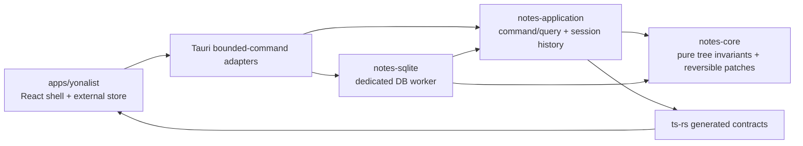
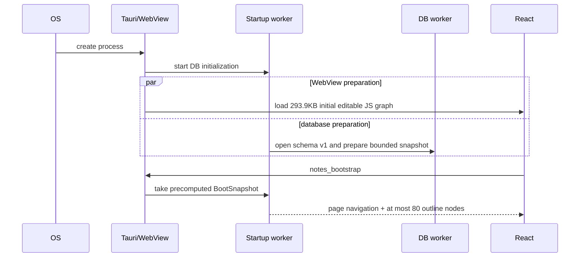
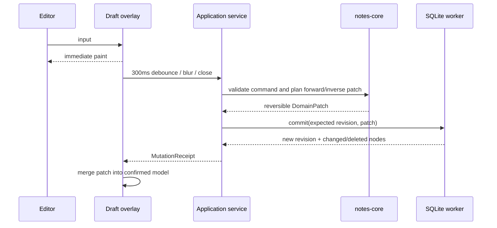

# Yonalist v2 architecture

## Dependency direction

The domain does not import SQLite, Tauri, React, or platform APIs. SQLite implements the
application storage port. A separate image-asset port owns content-addressed files. Tauri
translates the fixed eight-command Notes core plus bounded image/file actions and owns the
desktop lifecycle.

## Startup sequence

SQLite connection ownership never crosses the DB worker thread. Startup does not execute
`PRAGMA optimize`; optimization is only requested by `notes_close_session`.

## Mutation sequence

Commands with the same non-empty `historyGroup` are coalesced into one session Undo entry.
Receipts expose bounded Undo/Redo depths so the React interaction timeline can interleave
Rust mutation entries with pane-only navigation. A navigation fence closes the current
typing group. Request IDs are idempotent and stale revisions return a stable retryable
conflict. Session memory is bounded to the most recent 1,000 Undo entries, 256 mutations
per coalesced entry, and 4,096 idempotency receipts.

## File responsibilities

| Path | Responsibility |
|---|---|
| `crates/notes-core` | Node IDs/kinds, tree and image-metadata invariants, ordering, reversible commands |
| `crates/notes-application` | IPC DTO source, storage/asset ports, revision/session/history authority |
| `crates/notes-sqlite` | Schema v1, bounded queries, atomic mutations, FTS5, derived indexes, content-addressed image assets, DB worker |
| `apps/yonalist/src-tauri` | Fixed Notes API, bounded image/file actions, background startup, single-instance and close/optimize lifecycle |
| `apps/yonalist/src` | Current-design shell, confirmed model, draft overlay, pane sessions, interaction history, lazy image UI |
| `packages/contracts/generated` | `ts-rs` output; never edited by hand |

Production files have an advisory 500-line limit, tests 800 lines, and crates have a
20-direct-dependency advisory. Dependency cycles and reversed Rust crate dependencies fail
the architecture check.

## Database schema v1

- `notes_meta`: monotonically increasing revision.
- `notes_nodes`: page/bullet hierarchy and flags.
- `notes_images`: image-node metadata and a content hash referring to the
  content-addressed asset directory.
- `notes_tags`: transactionally derived normalized `#`/`@` tokens.
- `notes_dates`: transactionally derived ISO date keys.
- `notes_fts`: FTS5 content and update triggers.
- `notes_ui_state`: last opened page and bounded UI state.

There are no migration, repair, generic-attachment, export, or synchronization tables.
Image bytes never enter SQLite, history patches, mutation receipts, or generated
TypeScript contracts.
Viewport paths encode the full signed `i64` sort-key domain in lexical numeric order, so
repeated prepend operations remain consistent with the domain tree and SQLite ordering.
`notes_query_forest` is an event-time, revisioned, 2,000-node bounded query used before
structural clipboard actions. Cut is refused unless that authoritative forest is complete.

## Desktop security and lifecycle

- A production CSP allows only the packaged app, required Tauri IPC endpoints, data/blob
  images, and HTTPS images.
- Tauri's official single-instance plugin is initialized before application state; a second
  invocation focuses the existing window instead of opening a competing SQLite session.
- The main window receives `core:default`, the fixed eight-command Notes core, seven bounded
  image actions, open/save dialogs, and the explicit `core:window:allow-destroy` capability
  needed after a successful close flush.
- Image reads are authorized against the active session and current database metadata;
  deleted nodes, stale ownership, malformed data, and broken symlink/reparse targets are
  rejected.
- `PRAGMA optimize` runs through the DB worker during `notes_close_session`, never on startup.
- Close reconciliation removes orphaned image files after the database has supplied its live
  content hashes. Startup intentionally does not scan the asset directory.
- `YONALIST_V2_DATA_DIR` selects an explicit database directory for isolated packaged-process
  verification; normal launches continue to use Tauri's application data directory.
