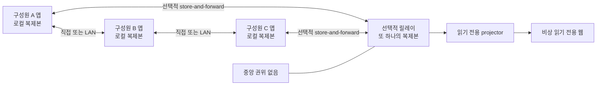
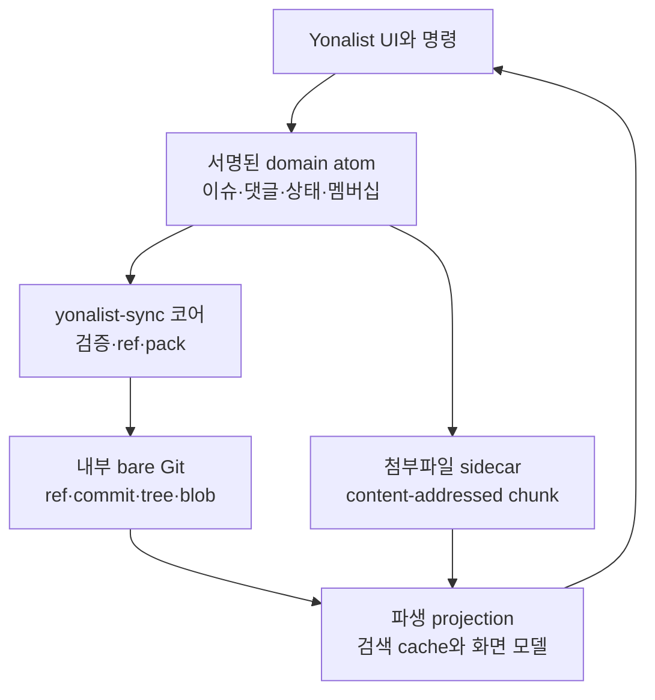
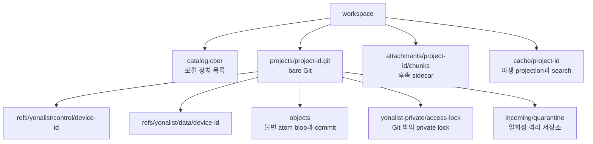
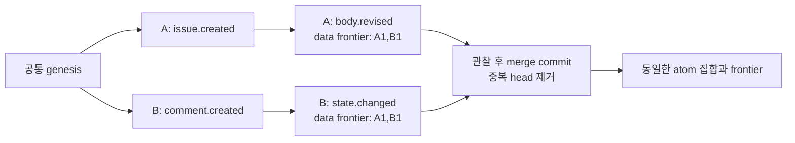
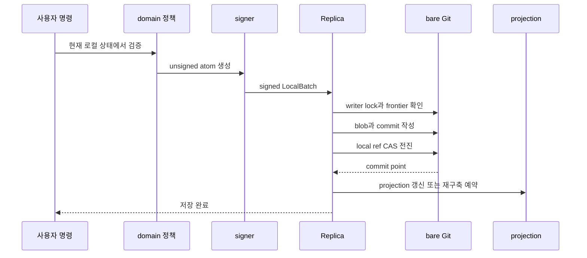
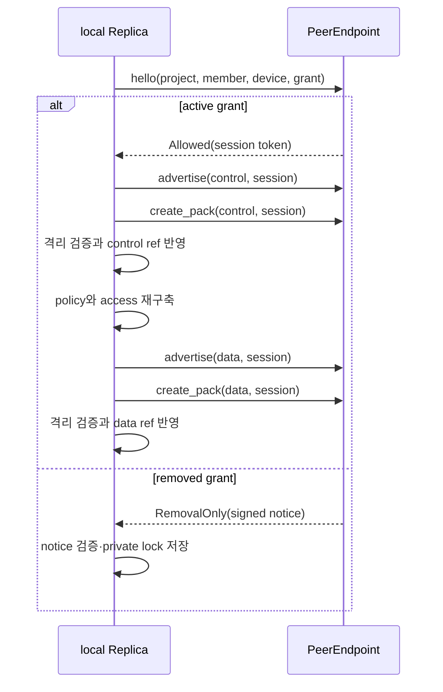
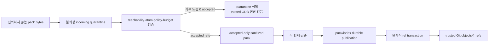
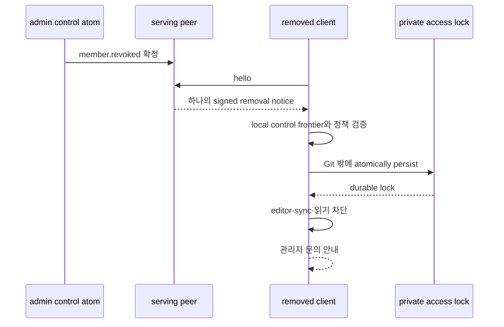
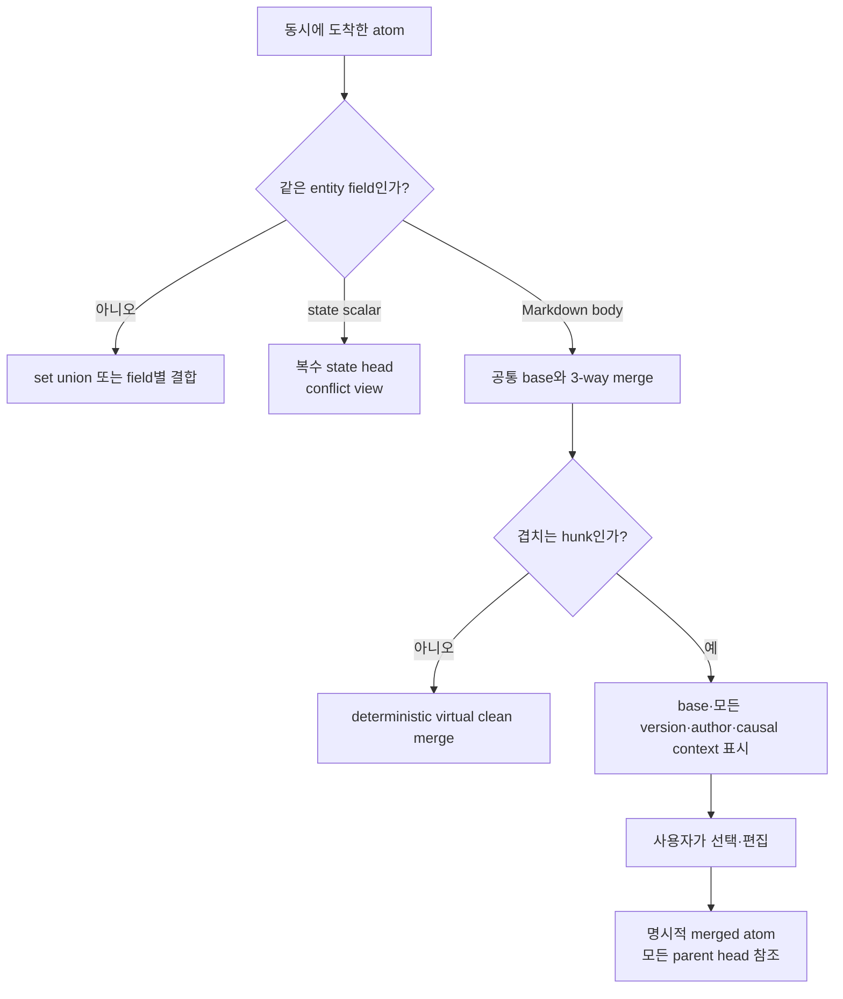
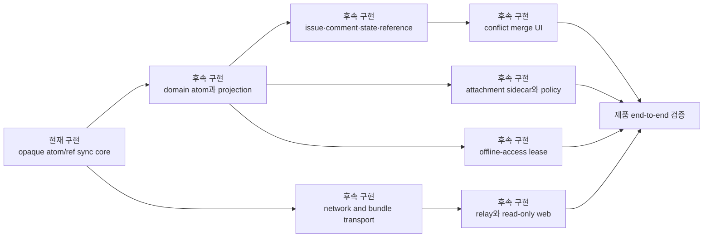

# Yonalist 분산 이슈 트래커 시스템 설계

> 이 문서는 목표 제품 아키텍처와 현재 `yonalist-sync` 코어의 구현 범위를 함께 설명한다.

- **현재 구현:** 코드와 자동화 테스트로 검증됨
- **상위 설계 확정:** 제품 설계는 승인됐지만 아직 코어 위에 구현되지 않음
- **후속 구현:** transport, projection, attachment, relay/web, UI 작업이 필요함

## 01. 요약

Yonalist의 목표는 네트워크 연결 여부와 무관하게 이슈·댓글·상태·참조·프로젝트 멤버십을 기록하고, 연결된 구성원 사이에서 이를 비동기적으로 수렴시키는 로컬 우선 이슈 트래커다. 프로젝트당 보통 20명, 많아도 100명 정도를 목표 범위로 삼는다. 소스 코드는 이 시스템의 복제 대상이 아니다.

**상위 설계 확정**에서 각 기기는 프로젝트의 로컬 복제본을 보유한다. 항상 켜진 중앙 서버는 필수가 아니며, 선택적 릴레이는 전달 가능성과 읽기 전용 비상 웹 화면을 높이는 또 하나의 복제본이다. 릴레이가 없어도 직접 연결, 같은 로컬 네트워크, 또는 번들 교환이 가능하면 작업과 동기화가 계속된다.

**현재 구현**은 이 제품 전체가 아니라, 파일 기반 Git 저장소에서 서명된 불변 atom과 ref를 안전하게 교환하는 독립 실행형 동기화 코어다. 이 코어는 opaque atom/ref 수렴, pack 격리·검증, 제거 통지와 로컬 잠금이라는 기반을 검증한다. 이슈를 화면에 투영하거나 실제 인터넷으로 피어를 연결하지는 않는다.

그 경계를 먼저 분명히 해야 한다. 현재 통과한 동기화 테스트를 “이슈 트래커가 이미 완성되었다”는 증거로 해석하지 않고, 후속 제품 기능이 기대는 저장·검증 기반의 증거로 해석한다.

## 02. 목표와 비목표

### 목표

- 오프라인에서도 앱 안에서 즉시 변경을 저장한다.
- 앱만 내부 저장소를 쓰며, 내장 Git은 사용자 워크플로가 아니라 저장·전송 엔진으로 쓴다.
- 활성 멤버의 이슈 데이터와 멤버십을 복제하고, 충돌을 숨기지 않는다.
- owner 또는 admin이 초대·제거·역할 변경을 할 수 있게 한다.
- 제거 사실을 알게 된 앱은 공유와 노출을 멈추고 관리자 문의 안내를 보인다.
- 선택적 릴레이와 읽기 전용 웹은 가용성을 높이되 진실의 원천이 되지 않게 한다.

### 비목표와 정직한 경계

| 항목 | 상위 설계 확정 | 현재 구현 |
| --- | --- | --- |
| 소스 코드 저장소 복제 | 명시적으로 제외 | 구현하지 않음 |
| 중앙 서버가 유일한 권위 | 제외 | 중앙 권위 없음 |
| 내부 Git을 일반 Git 클라이언트로 편집 | 제외 | 앱 전용 writer 경계 |
| 이미 복사된 자료의 회수·삭제 보장 | 제외 | 협력적 제거만 제공 |
| epoch 키 회전 | 제외 | 구현하지 않음 |
| 실시간 글자 단위 공동 편집 | 1차 버전에서 제외 | 구현하지 않음 |
| 실제 P2P·WebSocket·HTTP 연결 | 후속 구현 | 구현하지 않음 |
| 이슈 projection·첨부파일 복제·충돌 UI | 후속 구현 | 구현하지 않음 |

제거는 DRM이 아니다. 권한이 있던 사용자가 이전에 얻은 바이트를 보관하거나 수정한 앱을 쓰는 것까지 막는다고 주장하지 않는다. 대신 정식 앱과 정식 피어가 제거를 학습한 뒤 새 데이터 교환과 앱 내 열람을 중단하도록 만든다.

## 03. 전체 토폴로지

연결은 여러 경로를 가질 수 있지만 권위는 한 곳에 모이지 않는다. 읽기 전용 웹은 신뢰된 릴레이가 만든 파생 projection일 뿐이며, 작성 API를 제공하지 않는다. 아래 그림의 실선은 상위 설계의 목표 연결이고, `현재 구현`의 `PeerEndpoint`는 이 가운데 동기화 호출 형태만 추상화한다.

<!-- diagram: 피어 앱과 선택적 릴레이 및 읽기 전용 웹의 비중앙 토폴로지 -->

릴레이가 중단되면 마지막으로 알려진 피어 상태와 웹 화면은 오래될 수 있다. 그러나 로컬 쓰기는 멈추지 않으며, 다른 연결 경로가 있을 때 피어 간 동기화도 계속 가능하다. 반대로 서로 도달할 수 없는 두 인터넷 기기를 마법처럼 연결해 주지는 않는다. 직접 도달성, 로컬 네트워크, 릴레이 또는 번들 중 하나는 필요하다.

## 04. 계층과 책임 경계

상위 설계는 사용자 명령을 불변 domain atom으로 바꾸고, Git과 첨부파일 저장소를 권위 있는 저장소로 둔다. projection과 검색 캐시는 언제든 지우고 다시 만들 수 있는 파생물이다.

<!-- diagram: 사용자 인터페이스부터 Git 저장소와 파생 projection까지의 계층 경계 -->

**현재 구현** 공개 surface는 `Replica`, `ProjectPolicy`, `PeerEndpoint`, `SignedAtom`, `PackLimits` 같은 동기화 계약이다. raw Git 저장소와 pack promotion 타입은 기본 기능의 공개 API에서 숨긴다. `Replica::append_local`은 이미 서명된 `LocalBatch`를 받고, `pull_from`은 동기식 endpoint 어댑터와 상호작용한다.

**상위 설계 확정**의 domain layer는 이슈·댓글·상태·멤버십의 의미를 `ProjectPolicy`와 reducer 위에 구체화해야 한다. 그러므로 현재 atom의 `payload: Vec<u8>`를 이슈 JSON이나 Markdown 편집기라고 오해해서는 안 된다. 코어는 payload를 opaque 바이트로 다루고, 정책 구현이 의미와 권한을 판정한다.

## 05. 저장소와 파일 시스템

상위 설계의 작업 공간은 파일 기반이다. SQLite는 필요해도 재생성 가능한 로컬 검색 cache에만 선택적으로 쓴다. 프로젝트의 권위 데이터는 bare Git과 첨부파일 sidecar이며, 동기화하지 않는 cache가 망가져도 원본 atom을 다시 접어 복구한다.

<!-- diagram: 프로젝트 bare Git의 control/data ref와 private lock 및 quarantine의 저장소 구조 -->

**상위 설계 확정**의 Git tree에는 `genesis/project.cbor`, `control-atoms/`, `data-atoms/`, Markdown `texts/`가 들어간다. 각 기기는 자기 control/data ref만 앞으로 전진시킨다. force update와 이력 재작성은 허용하지 않으며, commit은 이전 local head와 관찰한 최소 frontier를 부모로 갖는다. 불변 atom 경로의 합집합을 commit tree에 넣으므로 Git의 텍스트 자동 병합이 domain atom을 임의로 바꾸지 않는다.

**현재 구현**은 bare SHA-256 Git 저장소, 하나의 writer lock, private access lock을 사용한다. production Git 명령은 shell을 실행하지 않고, 사용자·시스템 Git 설정, hook, remote 명령을 읽거나 실행하지 않도록 고정 argv와 정리된 환경으로 구동한다. 이는 일반 사용자가 내부 저장소를 직접 편집하는 지원 경로가 없다는 제품 계약과 맞닿아 있다.

## 06. Atom 모델과 인과성

상위 설계의 공통 envelope에는 schema, event ID, project ID, entity 종류·ID, operation, actor member/device, membership grant, control/data frontier, 표시용 시간, typed payload 또는 Markdown 참조, 서명이 들어간다. event ID는 유일성만 보장하며 충돌 승자를 정하지 않는다. 시계 시간도 승자를 정하지 않는다.

**현재 구현**의 `UnsignedAtom`은 `schema`, `project_id`, `event_id`, `plane`, actor member/device, grant, 두 frontier, `display_time_ms`, opaque payload를 canonical CBOR로 인코딩하고 Ed25519 서명을 검증한다. control atom은 data frontier를 가질 수 없고, frontier는 정렬·중복 제거되어야 한다. 이 구조는 domain 의미가 아직 없는 상태에서도 원인 관계와 권한 판정 시점을 고정한다.

<!-- diagram: 두 장치가 만든 atom과 reduced frontier가 만드는 인과 DAG -->

각 control commit의 atom은 commit 부모에서 계산한 reduced control frontier와 정확히 같아야 한다. data commit도 data frontier에 같은 규칙을 적용하며, 선언한 control frontier는 신뢰된 control head에서 도달 가능하고 이미 reduced된 집합이어야 한다. 결과적으로 나중에 수신된 데이터가 예전 멤버십 cut에서 합법이었는지와, 이미 제거된 cut에서 불법인지가 구분된다.

## 07. 오프라인 로컬 쓰기

로컬 저장은 네트워크를 기다리지 않는다. 앱의 command handler가 현재 projection과 멤버십을 검증하고 atom을 서명한 다음, 내장 코어는 불변 파일을 commit에 넣고 자기 device ref를 compare-and-swap으로 전진시킨다. ref 갱신이 사용자가 저장되었다고 볼 commit point다.

<!-- diagram: 오프라인 명령이 정책 검증과 서명을 거쳐 local device ref를 원자적으로 전진시키는 순서 -->

**현재 구현**의 `Replica`는 production signer를 내부에 보유하지 않는다. 호출자가 signer로 `SignedAtom`을 만들고 `append_local`에 제공한다. 이 분리는 키 보관과 도메인 명령을 앱 계층의 책임으로 남긴다. ref 갱신 뒤 projection이 실패하면 저장을 되돌리지 않고 projection을 재구축한다는 동작은 **상위 설계 확정**의 제품 규칙이며, 실제 projection 자체는 **후속 구현**이다.

충돌 없이 재시도하려면 임의의 Git 수동 수정 대신 앱이 새 atom을 작성해야 한다. crash가 ref 갱신 전 일어나면 도달하지 않는 object가 남을 수 있지만 기존 ref는 바뀌지 않는다. Git maintenance가 나중에 orphan을 정리할 수 있다.

## 08. control-first 동기화와 세션

동기화에서는 control plane이 data plane보다 먼저다. membership이나 device 인증, 제거를 먼저 보고 현재 grant가 활성인지 판정한 다음에만 보통 데이터 ref와 pack을 교환한다. 이 순서는 제거된 멤버가 control history의 일부를 필터링해서 받는 방식보다 더 좁은 노출을 제공한다.

<!-- diagram: 인증된 연결에서 control을 먼저 받고 매 응답마다 session을 재검증하는 pull 순서 -->

**현재 구현**의 `PeerEndpoint`는 실제 소켓이 아닌 동기식 adapter boundary다. `SessionToken`은 연결 인증 그 자체가 아니라, 이미 인증한 연결에 묶인 32바이트의 불투명 권한 capability다. production transport는 암호학적으로 무작위인 바이트를 제공하고 project/member/device/grant 세션에 정확히 묶어야 한다. `advertise`와 `create_pack`은 매 호출마다 이 binding과 현재 멤버십을 다시 검증해야 한다.

따라서 **현재 구현**은 실제 P2P, 피어 검색, NAT traversal, WebSocket, HTTP, bundle transport를 제공하지 않는다. **후속 구현**이 그 transport들을 같은 endpoint 계약 뒤에 붙일 수 있다.

## 09. Pack 격리와 신뢰 저장소 승격

외부 pack 바이트는 처음부터 trusted object database에 쓰지 않는다. 전용 quarantine 저장소에서 Git reachability, append-only ref, project ID, 기기 ref 소유자, schema, signature, frontier, policy cut, payload 경로와 resource budget을 검증한다. 후보의 최대 유효 prefix만 받아들이고 invalid commit 및 자손은 막는다.

<!-- diagram: 신뢰하지 않는 pack이 두 번의 검증을 거쳐 accepted-only artifact로 승격되는 흐름 -->

**현재 구현**은 검증을 통과한 ref만 원자적으로 이동하고, rejected suffix 또는 accepted ref가 하나도 없는 import가 trusted object database에 peer object를 남기지 않도록 테스트한다. index는 pack보다 먼저 durable publication되며 ref는 두 artifact가 durable해진 뒤에만 이동한다. crash는 pack 없이 index만 남길 수 있고 이는 안전하게 후속 import로 회복할 수 있지만, 새 pack만 index 없이 노출되는 상태는 남기지 않는다.

이는 application 차원의 containment다. 압축 해제나 알고리즘 복잡도 기반의 모든 서비스 거부를 단독으로 물리치는 OS sandbox라고 주장하지 않는다. 배포 앱은 엄격한 Git CPU·RSS 제한이 필요하면 OS sandbox, job object, cgroup 또는 동등한 격리를 추가해야 한다.

## 10. 멤버십, 제거 통지, access lock

상위 설계에서 control log는 `member.granted`, `member.role.changed`, `member.revoked`, `device.certified`, `device.revoked` 같은 atom으로 구성한다. `owner`와 `admin`은 멤버 관리가 가능하고 owner 이전은 별도 atom만으로 가능하다. 같은 grant에서 제거와 역할 변경이 동시에 보이면 제거가 이기며, 재초대는 새 grant ID를 만든다.

**현재 구현**은 제거된 requester에게 control/data ref advertisement나 pack을 전혀 주지 않는다. 대신 `HelloAck::RemovalOnly`로 정확히 하나의 서명된 제거 atom을 보내고, receiver는 이미 신뢰한 local control cut에 대해 그 atom을 검증한다. 이는 전체 control history를 전달하는 capability가 아니다.

<!-- diagram: 제거 통지 하나가 Git 밖 private lock을 durable하게 기록하고 모든 live handle을 fail-closed로 만드는 흐름 -->

private lock은 Git ref, tree, object에 넣지 않는 비공유 파일이다. 앱을 다시 열 때도 lock을 읽고 검증해서 fail-closed 상태를 복구한다. live handle도 디스크 lock을 다시 확인하므로, 오래 열린 창이 제거 사실을 무시하고 `append_local`이나 `pull_from`을 계속하지 않게 한다. `access_state()`를 소비하는 앱 계층은 이 상태로 editor와 이슈 화면을 잠가야 한다. 현재 코어는 OS 파일 권한을 바꾸거나 이슈 UI를 구현하지 않으므로, `stored_atoms()` 같은 진단용 읽기 API만으로 콘텐츠 비노출을 보장한다고 주장하지 않는다. 잘못된 대상, 잘못된 signer, stale·앞선·중복 frontier의 notice는 거부하고 기존 access와 ref를 유지한다.

**후속 구현**의 offline-access lease는 이와 별개다. 마지막 성공 membership check 후 설정한 일수가 지나면 앱이 잠그는 제품 정책이며 기본값은 비활성이다. 현재 코어에는 lease, 날짜 기반 해제, 관련 UI가 없다.

## 11. 이슈 도메인과 참조

**상위 설계 확정**에서 이슈는 전역 project ID와 UUID를 합친 불변 ID를 갖는다. UI에는 짧은 Crockford Base32 별칭을 보여도 참조와 동기화는 항상 전체 ID를 쓴다. 따라서 오프라인 이슈 생성에 중앙 issue number allocator가 필요 없다.

| 영역 | 상위 설계의 atom 예 | 수렴 규칙 | 현재 상태 |
| --- | --- | --- | --- |
| 프로젝트 | `project.field.revised`, attachment/lease policy | 서로 다른 field는 자동 결합 | 후속 구현 |
| 멤버 | grant, role, revoke, device certificate | revoke 우선, 낮은 권한 우선 | generic policy hook만 현재 구현 |
| 이슈 | create, title/body revise, state change, tombstone | field별 독립 병합 | 후속 구현 |
| 댓글 | create, body revise, tombstone, body merge | 독립 생성은 set union | 후속 구현 |
| 관계 | relationship add/remove | source body에서 결정 | 후속 구현 |
| 참조 | `yonalist://project/issue-or-comment/id` | 모든 active body에서 파생 | 후속 구현 |

Markdown 본문의 issue/comment URI는 파생 reference edge의 원천이다. target이 아직 오지 않았으면 unresolved placeholder로 보이고, 수신되면 link가 살아난다. 본문 충돌 중에는 모든 active head의 edge를 conflict marker와 함께 인덱싱하며, 해결 뒤에는 선택된 본문만 active edge를 제공한다. 이 모든 reducer와 UI는 **후속 구현**이며, 현재 코어가 URI를 해석하거나 이슈 목록을 만들지는 않는다.

## 12. 충돌 해결 경험

서로 다른 entity나 서로 다른 field의 변경은 atom 집합의 합으로 안전하게 결합한다. 같은 body나 같은 scalar field에 동시에 쓴 경우에는 덮어쓰지 않는다. 공통 base가 있는 Markdown body에는 protocol-pinned `git-merge-file/myers/v1` 호환 3-way line merge를 적용한다. 겹치지 않는 변경은 virtual clean merge로 만들 수 있지만, 겹치는 hunk는 반드시 사람에게 보인다.

<!-- diagram: concurrent body와 state 변경을 자동 결합 또는 명시적 merge atom으로 분류하는 사용자 경험 -->

해결 화면은 common base, 각 완전한 authored version, 작성자와 인과 맥락, hunk별 A/B/둘 다/직접 편집을 함께 보여 준다. 사용자가 완료하면 `issue.body.merged` 또는 이에 준하는 명시 atom이 모든 해결 대상 revision head를 parent로 기록한다. 나중에 세 번째 concurrent head가 도착하면 기존 merge와 다시 같은 절차를 밟는다.

**현재 구현**은 이 conflict 분류, Git text merge fixture, explicit merge atom, editor UI를 제공하지 않는다. 대신 immutable atom, frontier, append-only ref 및 pack validation을 제공하여 이런 UX가 안전하게 구축될 기반을 마련한다.

## 13. 첨부파일과 자동 복제 정책

**상위 설계 확정**에서 attachment manifest는 Git atom이고, 실제 파일 바이트는 content-addressed sidecar chunk에 둔다. manifest는 소유 entity/body revision, 파일명, media type, 전체 SHA-256, chunk hash와 길이를 담는다. chunk는 temp path에서 hash 검증과 durability를 마친 뒤 원자적 rename으로 저장되어야 manifest가 commit될 수 있다.

기본 자동 복제 임계값은 **10 MiB**이며 admin이 프로젝트별로 바꿀 수 있다. 임계값 이하 파일은 멤버 장치에 자동 요청·복제한다. 더 큰 파일은 열거나 offline pin을 명시했을 때 내려받으며, 누락 chunk 단위로 재개하고 각 chunk hash를 확인한다. holder 수는 동기화된 사실이 아니라 순간적인 가용성 힌트다.

**현재 구현**에는 attachment manifest 해석, sidecar chunk 저장, 자동 복제, pin, 재개 전송이 없다. 코어의 4 MiB blob 제한은 Git pack 안의 단일 blob resource budget이며, 제품의 10 MiB 자동 첨부파일 정책과 같은 값도 같은 기능도 아니다.

## 14. 프로젝트 목록과 선택적 릴레이·웹

`catalog.cbor`은 장치별 저장소 위치와 presentation setting을 기록할 뿐 동기화하는 전역 프로젝트 목록이 아니다. **상위 설계 확정**의 보이는 목록은 이 장치에 존재하는 repository와 그 안의 membership projection에서 파생한다. active project는 정상 표시하고, revoked 또는 lease-locked project는 목록에 남길 수 있지만 내용을 노출하지 않는다.

릴레이는 같은 protocol peer의 persistent replica다. storage-only relay는 projection을 만들 필요가 없고, 신뢰된 배포에서는 `reader-service` membership을 부여해 projection과 비상 읽기 전용 웹을 만들 수 있다. 웹은 별도로 사용자를 인증하고 현재 membership에 매핑해야 하며 write endpoint를 제공하지 않는다. 페이지는 반영한 frontier 또는 마지막 동기화 시각을 보여 stale 상태를 현재처럼 보이게 하지 않는다.

**현재 구현**에는 relay daemon, 인증된 web server, web projection, bundle export/import가 없다. 이 그림은 **상위 설계 확정**의 목표와 이후 의존성을 설명한다.

## 15. 보안 경계와 실패 처리

### 보안 경계

버전 1의 상위 설계는 프로젝트 Git object와 attachment chunk를 앱 제어 workspace에 평문으로 저장한다. 프로젝트 수준 end-to-end encryption을 현재 제공한다고 주장하지 않는다. 데이터 at rest는 OS 계정 보호와 full-disk encryption에 의존하고, peer·relay 연결은 transport 계층에서 인증과 암호화를 제공해야 한다.

| 위협 또는 실패 | 현재 코어의 처리 | 남는 경계 |
| --- | --- | --- |
| 잘못된·악성 pack | quarantine 검증 후 거부, trusted ref/object 보호 | hard CPU/RSS sandbox는 OS 책임 |
| ref rewind·다른 project atom | causal/project/ref-owner 검증 후 거부 | 정책 의미는 caller 구현에 의존 |
| concurrent append/import | repository writer lock과 ref transaction | 실제 multi-process 배포 관찰은 후속 검증 |
| 제거된 정식 클라이언트 | exact notice, private lock, 새 공유·앱 열람 차단 | 이전에 복사된 data 회수 불가 |
| projection/search 손상 | 현재 projection 자체 없음 | 후속 reducer/cache는 Git에서 재구축 |
| relay outage | core는 relay에 의존하지 않음 | 실제 relay 복구·bundle은 후속 구현 |

Git object ID는 저장 무결성과 deduplication을 돕고, domain signature는 작성자·권한 판단을 분리한다. unknown schema는 부분 해석하지 말고 quarantine하여 앱 업데이트를 요구해야 한다. 현재 atom decoder는 schema와 canonical encoding, signature 형식을 검증하지만, entity별 invariants는 **후속 구현** policy/reducer의 책임이다.

### 회복 원칙

- ref update 전 disk full 또는 crash: 새 object는 도달 불가일 수 있으나 이전 ref는 유지한다.
- 잘못된 pack: peer 전용 quarantine을 지우고 다른 peer 또는 재시도로 회복한다.
- 제거 통지 수신: data 삭제가 아니라 app access lock으로 노출과 전송을 멈춘다.
- relay가 사라짐: 로컬 작업을 계속하고, 나중에 피어 또는 bundle에서 다시 만들 수 있게 설계한다.
- 모든 복제본과 backup 상실: 권위 있는 중앙본이 없으므로 복구할 수 없다.

## 16. 구현된 resource limit

다음 값은 **현재 구현** `PackLimits::default()`의 정확한 기본 ceiling이다. 모두 finite이며, caller가 낮출 수 있다. 기본값을 올리는 것은 명시적인 배포 판단이어야 하며 executor의 output/time cap을 우회해서는 안 된다.

| 대상 | 기본 ceiling |
| --- | ---: |
| 압축된 입력 pack | 16 MiB |
| advertised ref | 128 |
| commit | 1,024 |
| object | 8,192 |
| commit tree의 file entry | 1,024 |
| head 하나에서 도달 가능한 atom | 1,024 |
| 단일 blob | 4 MiB |
| 확장된 content 합계 | 64 MiB |
| parsed metadata 합계 | 4 MiB |

이 수치는 제품 첨부파일 자동 복제 임계값과 별개다. 특히 상위 설계의 10 MiB attachment 정책은 sidecar 전송을 만들 때 적용할 제품 정책이고, 여기의 4 MiB는 현재 Git pack 검증이 단일 blob에 거는 한도다.

Git 2.49 이상과 Rust 1.97.0이 독립 실행형 lab의 실행 전제다. Git subprocess의 stdout/stderr, wall time, pack metadata도 제한하며 overflow와 timeout은 typed error로 취급한다. 다만 cooperative boundary라는 한계는 앞서 설명한 대로 남는다.

## 17. 검증 근거와 한계

**현재 구현**은 공개 API contract, deterministic commit, bounded Git process, causal frontier·정책 cut, quarantine, revocation, writer serialization, mesh scenario를 자동 테스트한다. README의 `npm run test:sync`은 보통 suite이고, 느린 scale gate는 `npm run test:sync:scale`로 명시 실행한다.

| 근거 | 확인한 성질 | 해석 시 주의점 |
| --- | --- | --- |
| public contract test | raw Git/promotion 타입을 기본 공개 API에서 숨김 | 앱 도메인 기능의 완성 증명은 아님 |
| pack quarantine tests | limit 초과·invalid suffix·0 accepted가 trusted state를 오염시키지 않음 | hostile OS sandbox의 증명은 아님 |
| revocation tests | 하나의 exact signed notice, 0 advertise/pack, durable reopen lock | 과거에 복사한 data를 지우지 않음 |
| two-peer and mesh tests | partition 뒤 atom/ref 수렴과 deterministic scenario | 실제 인터넷 지연·NAT·TLS 테스트가 아님 |
| final scale gate | 100 peers, 500 events, 한 번 통과 | 처리량·latency benchmark가 아님 |

최종 deterministic scale gate는 100 peer와 500 event 조건에서 **한 번** 실행되어 **233.01초**에 통과했다. 이 결과는 100개의 격리된 Git repository와 production-pack 경로를 사용한 파일 기반 simulation의 회귀 gate다. 인터넷, 모바일 장치, 실제 relay, attachment, UI, 현실의 전송 지연이나 사용량을 대표하는 성능 수치는 아니다.

일반 suite에서 100/500 test는 의도적으로 ignored이며 explicit scale command만 해당 test를 실행한다. 또한 final verification은 format, Clippy warnings-denied, default/all-feature core tests, lab 시나리오, Tauri Rust tests, frontend tests, production build를 통과한 뒤 수행됐다. 이 증거는 “standalone file-backed sync core”의 범위를 넘어가지 않는다.

## 18. 후속 구현 로드맵

의존성은 저장·권한 기반 위에 domain projection과 UX를 올리고, 그 다음 외부 transport 및 가용성 기능을 연결하는 순서다. 아래의 연한 의미는 구현 상태가 아니라 의존 관계다.

<!-- diagram: 현재 sync core 위에 issue projection, conflict UI, transport, attachment, relay와 lease가 순서대로 올라가는 로드맵 -->

1. **domain atom과 reducer**: project/member/issue/comment/state/relationship의 typed payload, deterministic projection, rebuild와 cache frontier를 구현한다.
2. **이슈 UX와 충돌 해결**: offline create/edit, reference/backlink, state conflict, `git-merge-file/myers/v1` golden fixture와 explicit merge editor를 만든다.
3. **실제 transport**: authenticated·encrypted direct/LAN/relay adapter와 peer discovery, invite, bundle import/export를 endpoint 계약 뒤에 연결한다.
4. **첨부파일 sidecar**: chunk durability, manifest, 10 MiB 기본 자동 복제, pin, resume, holder warning을 구현한다.
5. **relay와 읽기 전용 web**: reader-service authorization, stale frontier 표시, read-only-only surface를 구현한다.
6. **offline lease와 운영 검증**: opt-in lease, lock UI, crash/fault injection, real-network E2E와 운영 모니터링을 추가한다.

각 단계는 앞 단계의 atom/ref 불변성을 다시 구현하지 않고, 현재 코어의 공개 `Replica`와 `ProjectPolicy` 경계를 사용해야 한다. 기능을 덧붙일수록 “모든 동시 변경을 자동으로 숨긴다”보다 “어떤 것은 자동 결합하고, 어떤 것은 이해 가능한 명시적 선택으로 남긴다”는 제품 원칙을 유지한다.

## 19. 참고 자료

- [승인된 분산 이슈 트래커 제품 설계](../superpowers/specs/2026-07-18-distributed-issue-tracker-design.md)
- [독립 실행형 sync hardening 구현 계획](../superpowers/plans/2026-07-18-standalone-sync-hardening.md)
- [독립 실행형 sync lab의 실행 방법과 한계](../../README.md)
- [`yonalist-sync` 공개 API](../../src-tauri/crates/yonalist-sync/src/lib.rs)
- [pack quarantine 계약 테스트](../../src-tauri/crates/yonalist-sync/tests/pack_quarantine.rs)
- [revocation 계약 테스트](../../src-tauri/crates/yonalist-sync/tests/revocation.rs)
- [100 peer / 500 event mesh gate](../../src-tauri/crates/yonalist-sync/tests/mesh_convergence.rs)
